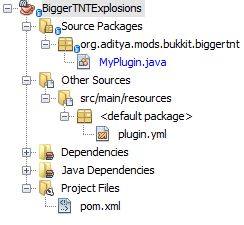

[[More_Listeners]]
== Bigger TNT Explosions

TNT is a block in Minecraft and can be lit with a Flint and Steel item. There are multiple other ways to light it as well. However once lit, it will then explode after 4 seconds. Normally, TNT has a blast radius of 4 blocks, which isn't that big. Bigger TNT explosions are more fun and so we will change that and make the explosions bigger. One cool thing you can do with TNT is to make cannons that shoot lit TNT for far distances.

As in previous chapters, we'll be using Listeners and Event Handlers to achieve this functionality.

=== Create the plugin

After making a few plugins, you should now be an expert in how to get started with creating a sample plugin. So, as always, we start with the Bukkit Recipe. The information that you enter in the plugin creation, once again, will be very similar to <<PlayerEntryExit_Plugin_Details_Image>>. <<BiggerTNT_plugin_values>> shows the values that needs to be updated.

[[BiggerTNT_plugin_values]]
.BiggerTNT plugin updated values
[options="header", cols="1,3"]
|====
| Field | Value
| Project Name | BiggerTNTExplosions
| Package | org.devoxx4kids.bukkit.plugins.biggertnt
|====

Click on `Finish' button to complete the plugin creation and open the project. The expanded directory should look like as shown in <<BiggerTNT_Directory_Structure_Expanded>>.

[[BiggerTNT_Directory_Structure_Expanded]]
.BiggetxrTNT expanded directory structure

This directory has `org.devoxx4kids.bukkit.plugins.biggertnt.MyPlugin` class which is the entry point of the plugin, `plugin.yml` that defines plugin configuration, and `pom.xml` that defines instructions on how to build and install the plugin.

=== Create the Listener

As in previous chapters, the plugin needs a listener where event handlers can be registered. Add the line from <<BiggerTNT_Register_Listener>> in the `onEnable` method of `MyPlugin.java`.

Remember you need to create space before this code can be added by placing your curson at the right place and pressing Enter keys. 

[[BiggerTNT_Register_Listener]]
.Registering the BiggerTNT Listener
====
[source, java]
----
getServer()
  .getPluginManager()
  .registerEvents(new TNTListener(),
    this);
----
====

This code registers the `TNTListener` class as the plugin's Listener. Notice that the name of the Listener is different, to match the purpose of this plugin.

Click on the stop sign and select the option shown in <<Creating_TNTListener_from_dropdown_menu>>.

[[Creating_TNTListener_from_dropdown_menu]]
.Creating the TNTListener from the drop-down menu
image::images/netbeans-create-plugin-biggertnt-create-listener.png[]

This will generate a new Java source file TNTListener.java and opens it in main window of NetBeans.

=== Add event handlers

The server generates an event when an entity explodes. This entity could be a creeper, a primed TNT, an ender crystal, or any other entity that can explode. Our event handler will listen for this event, check if the entity causing the event is a TNT, and then cause an explosion with the bigger radus.

Lets add the method shown in <<BiggerTNT_Listener_Method>> to the Listener.

[[BiggerTNT_Listener_Method]]
.BiggerTNT Listener method
====
[source, java]
----
@EventHandler
public void makeExplosion(EntityExplodeEvent event) { <1>
    World world = event.getEntity().getWorld(); <2>
    Location location = event.getEntity().getLocation();

    float power = 16.0F; <3>
    if (event.getEntityType() == EntityType.PRIMED_TNT) { <4>
        event.setCancelled(true);
        world.createExplosion(location, power);
    }
}
----
====

There are some important parts in this method:

<1> Server generated event is represented by `EntityExplodeEvent` Bukkit class and specified as the method parameter here. The parameter name, `event`, provides more information about the explosion such as list of blocks that would have been removed or were removed from the explosion, location where the explosion happened, and percentage of blocks to drop from this explosion. 
<2> Entity's world is retrieved by calling `event.getEntity().getWorld()` method and stored in `world` variable. Entity's current location is stored in `location` variable.
<3> A float variable with a value of 16.0 is created here. It is called `power` and will be used to determine how big the TNT explosion is. If you set it to a value over 16, it will make an explosion with a 16 block radius, because that is the limit defined in the game's source code.
+
Note its ok to use `f` or `F` to indicate that the number is a float.
+
<4> Check if the entity that caused the explosion is a primed TNT. `EntityType.PRIMED_TNT` is a predefined Bukkit class and the values are compared using `==` operator. If it is then its current explosion is cancelled by calling `setCancelled` method on the `event` variable. This is required so that a bigger TNT explosion of our desired choice can be made to happen. Finally a bigger explosion, with the power of the variable `power`, is created at the same location.

=== Install and verify

Now, the plugin must be built so that you can install it on your server. Right-click on the plugin and select ``Build''. The output that you get should look like <<BiggerTNT_Build_Output>>.

[[BiggerTNT_Build_Output]]
.BiggerTNT build output
====
[source, text]
....
[antrun:run]
Executing tasks
     [copy] Copying 1 file to C:\Users\Aditya\Desktop\craftbukkit\plugins
Executed tasks
------------------------------------------------------------------------
BUILD SUCCESS
------------------------------------------------------------------------
....
====

Lets try out this new plugin.

Place a TNT somewhere in the game, light it up with a Flint and Steel and move away from it. The explosion will now have a blast radius of 16 blocks. <<BiggerTNT_Explosions>> compares the size of a normal explosion to a enlarged one.

[[BiggerTNT_Explosions]]
.Comparison of TNT explosion sizes
image::images/netbeans-create-plugin-biggertnt-explosion-sizes.png[]

The areas that are not green have been blown up. The small explosion didn't reach to stone, so the crater is brown from dirt. The big explosion's crater is gray because it contains stone. The big crater also contains other blocks you can find under the stone, like ores and gravel.

=== Summary

This chapter explained another Event Handler to cause bigger TNT explosions. `EntityExplodeEvent` was used to listen for an entity explosion, checked if the explosion is caused by a primed TNT, and then a bigger explosion was caused in place of the current smaller explosion.

Refer to <<Bukkit_documentation>> on how to read Bukkit documentation. A complete list of all the classes that represent events generated by the server is listed there.