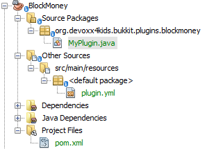

[[Block-Money-Chapter]]
== Creating In-game Money

Now that you know how to create a plugin, lets make our first fun plugin.

In this chapter, we will be using the Bukkit Recipe introduced in last chapter to create a new plugin. We will then use a Listener to reward a player with in-game money whenever he/she breaks or places a block.

=== Create the plugin

Again, we will be using the Bukkit Recipe to create the plugin. To reiterate the steps for creating a plugin are:

. Click on ``File'' then ``New Project...''.
. Select ``Maven'' then ``Project from Archetype''.
. Use the ``Search'' box to find ``bukkit-template'' and make sure the version is 1.5.
. Click ``Next'' to create the plugin.

The information that you enter in the plugin creation will be very similar to 
<<PlayerEntryExit_Plugin_Details_Image>>. <<BlockMoney_plugin_values>> shows the values that needs to be updated.

[[BlockMoney_plugin_values]]
.BlockMoney plugin updated values
[options="header", cols="1,3"]
|====
| Field | Value
| Project Name | BlockMoney
| Package | org.devoxx4kids.bukkit.plugins.blockmoney
|====

Click on `Finish' button to complete the plugin creation and open the project. The expanded directory should look like as shown in <<Block_Money_expanded_directory_structure>>.

[[Block_Money_expanded_directory_structure]]
.Block Money expanded directory structure

Note that the new values are reflected in first and fourth line of this image.

Just like Player Entry/Exit plugin directory structure explained in <<Expanded_Project_Structure_Player_EntryExit_Plugin_Image>>, this directory has `org.devoxx4kids.bukkit.plugins.blockmoney.MyPlugin` class which is the entry point of the plugin, `plugin.yml` that defines plugin configuration, and `pom.xml` that defines instructions on how to build and install the plugin.

=== Register and create the Listener

A new Listener, just like the one in Player Entry/Exit plugin, needs to be created. Open the generated `MyPlugin.java`, add the line shown in <<Block_Money_plugin_register_listener>> in `onEnable()` method. This can be done by placing your curson before the first occurrence of `}` after `onEnable` method and pressing Enter key couple of times to create empty lines to add this code. And then type or copy/paste this code in these newly added lines.

[[Block_Money_plugin_register_listener]]
.Register listener in MyPlugin class of Block Money plugin
====
[source,java]
----
getServer()
  .getPluginManager()
  .registerEvents(new MoneyListener(), 
    this);
----
====

This line registers the Listener, just like in <<Player_EntryExist_Register_Listener>>. Notice that the name of the Listener is different, to match the purpose of this plugin.

The updated method will look like as shown in <<Block_Money_plugin_onEnable_method>>.

[[Block_Money_plugin_onEnable_method]]
.onEnable method in BlockMoney plugin class
====
[source,java]
@Override
public void onEnable() {
    getLogger().log(Level.INFO, "{0}.onEnable()",
        this.getClass().getName());
    getServer().getPluginManager() <1>
        .registerEvents(new MoneyListener(), this);
}
====

The newly added code is highlighted in bold.

Again, click on the stop sign to see the drop-down menu as shown in <<Create_BlockMoney_Listener_From_DropDown_Menu>> and select the option that says `Create class 'BlockMoneyListener' in package org.devoxx4kids.bukkit.plugins.blockmoney`

[[Create_BlockMoney_Listener_From_DropDown_Menu]]
.Create the BlockMoneyListener class
image::images/netbeans-create-plugin-block-money-create-listener.png[]

This will create a new Java source file for you and opens it in NetBeans. Now the functionality can be added to the plugin. The generated class is shown in <<Generated_MoneyListener_class>>.

[[Generated_MoneyListener_class]]
.Generated MoneyListener class
====
[source,java]
----
class MoneyListener implements Listener {            

    public MoneyListener() {
    }

}
----
====

This is a Java class named `MoneyListener` with a constructor method.

=== Add event handlers

Open up the Listener class. Unlike Player Entry/Exit plugin, there is no need to change the constructor. However we need to store some values such as how much money to reward and how much money is accumulated by each player. These values are stored in _variables_. A variable needs a name, has a type, and is assigned a value using `=`. Java has lots of predefined types such as `int` for storing integer values, `boolean` for storing true or false values, and `String` for storing text values.

Add the code shown in <<BlockMoney_plugin_variables>> in the `BlockMoneyListener.java`.

[[BlockMoney_plugin_variables]]
.Variables in BlockMoney plugin
====
[source,java]
----
float moneyToReward = 0.10F; <1>
    
HashMap<String, Float> money = new HashMap(); <2>
            
public MoneyListener() {
}
----
====

These lines add two important variables:

. The first one is of the type __float__, another of the Java predefined types, and stores a decimal value. It is set to 0.10, and will be used to determine how much money each player will receive. By default, any decimal value in Java, 0.10 in our case, is stored such that it can accommodate really large decimal values. But since our decimal number is rather small, `f` or `F` can be added after the number to indicate otherwise.
+
Note no $ signs are stored as part of this value. Its our understanding that this variable will be used for storing money. And we'll show that symbol when we display the money earned.
+
. The second one is a `HashMap`, and will be used to store each player's money value. HashMap is a predefined Java class that store multiple records. Each record has a __key__ and a __value__ of different types. The key uniquely idenitfies a record. In our case, the key is the player's name, of the type `String`, and the corresponding value is the player's money, of the type `Float`. More details about HashMap are available in the javadocs at http://docs.oracle.com/javase/8/docs/api/java/util/HashMap.html.
+
An in-memory representation of a Java class needs to be created in order to run the program. This representation is called as an _instance_ and can be created using the `new` keyword in Java. Constructor of the class needs to be speified in order to create a new instance. We will create a new instance of HashMap to store the money earned by each player.

Now, we need to add methods to earn money. The methods are shown in <<BlockMoney_methods_to_earn_money>>.

[[BlockMoney_methods_to_earn_money]]
.BlockMoney plugin methods to earn money
====
[source,java]
----
@EventHandler
public void checkForNullMoney(PlayerJoinEvent event){ <1>
    if (!money.containsKey(event.getPlayer().getName())) { <2>
        money.put(event.getPlayer().getName(), 0F); <3>
    }
}
    
@EventHandler
public void rewardBlockPlace(BlockPlaceEvent event){ <4>
    money.put(event.getPlayer(), <5>
        money.get(event.getPlayer().getName())
        + moneyToReward);
    event.getPlayer().sendMessage(ChatColor.GOLD + "You now have " <6>
        + ChatColor.GREEN + "$"
        + String.format("%.2f", money.get(event.getPlayer())));
}
    
@EventHandler
public void rewardBlockBreak(BlockBreakEvent event){ <7>
    money.put(event.getPlayer(),
        money.get(event.getPlayer().getName()) 
        + moneyToReward);
    event.getPlayer().sendMessage(ChatColor.GOLD + "You now have " 
        + ChatColor.DARK_GREEN 
        + "$" + String.format("%.2f", money.get(event.getPlayer())));
}
----
====

All these methods are event handlers but probably look confusing to you, so here is an explanation:

<1> This method has `@EventHandler` above it, so it can listen for events. Minecraft generates an event when a player joins the server. This event is captured as `PlayerJoinEvent` in Bukkit. Using this class as Java method parameter type ensures that this method is called whenever a player joins the server.
+
As explained earlier, the name of the method does not matter, and just placing the `@EventHandler` above the method is sufficient to mark it as an event handler.
+
<2> `money.containsKey` is invoking the method `containsKey` on the `money` HashMap and returns true if it contains a specific key. In this case the key is player's name that is obtained by `event.getPlayer().getName()`. Note that the name returned will be of the player that caused the event. So if `money` HashMap contains the player's name then a true value is returned, false otherwise. The true and false values are defined by another predefined Java type known as _boolean_. A boolean type can have only true or false value.
+
`!` is a predefined Java symbol that negates the boolean value. So a true value is converted to false and false value is converted to true.
+
`if` in Java, another predefined symbol, behaves very much like English language. It takes a single boolean value; if the value returns true then it executes the program statements following the if statement, otherwise it skips them. Multiple statements may be grouped together using a starting `{` and an ending `}`. A single statement may have optional starting and closing braces as well.
<3> If the player's name does not exist in the `money` HashMap then a new one is created with a value of 0.
<4> This method also listens for events, but the event is `BlockPlaceEvent` in this case. This event is once again generated by the server and defined by the Bukkit API. This method will reward players with money when they place blocks.
<5> This line updates the player's money value in the HashMap.
<6> This line sends the player a message telling them how much money they now have. The money value is in the color GREEN to show that the player placed a block.
<7> This method does the same thing as the previous one, but is called when a player breaks a block. The money value is in DARK_GREEN to show that the player has broken a block.

=== Install and verify

Now, build and install the plugin as explained in <<Reloading_PlayerEntryExit_Plugin>>. To reiterate, right-click on your project and select `Build`. This will create the JAR file of your plugin that you can put in your server's ``plugins'' directory.

If there are no errors, NetBeans should show the message as shown in <<BlockMoney_NetBeans_Build>>. It will be the same as the message shown when you build the Player Entry/Exit plugin.

[[BlockMoney_NetBeans_Build]]
.NetBeans output window for BlockMoney plugin
====
[source, text]
....
[antrun:run]
Executing tasks
     [copy] Copying 1 file to C:\Users\Aditya\Desktop\craftbukkit\plugins <1>
Executed tasks
------------------------------------------------------------------------
BUILD SUCCESS
------------------------------------------------------------------------
....
====

Restart the CraftBukkit server as explained in <<Running_CraftBukkit_Server>>. Now when you play the game and try to place or break a block, the amount of money is shown in the game console as in <<BlockMoney_Money_earned_for_breaking_and_placing_blocks>>.

[[BlockMoney_Money_earned_for_breaking_and_placing_blocks]]
.Money earned for breaking and placing blocks
image::images/netbeans-create-plugin-block-money-minecraft-output.png[]

Notice that the player placed two blocks and broke one block. There are two light green messages for placing blocks and one dark green message for breaking blocks.

=== Summary

This chapter used concepts from the previous chapter to build a plugin that rewards players with ingame money whenever they place or break blocks. The Bukkit Recipe was used to create the plugin, `PlayerJoinEvent`, `BlockPlaceEvent`, and `BlockBreakEvent` event handlers were used in the listener.

Creating a new instance of a Java class, variables, data types, using HashMap to store key/value records, comparing two values of same type using `if` statement, and boolean conditions were also explained using examples from the code.

In the next chapter, we will be exploring even more ways to use Listeners.
