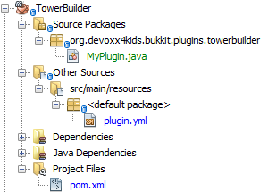

[[Building_New_Structures]]
== Building New Structures
Have you ever wanted an easy way to build a pre-set schematic of blocks? Something like a tower of iron or a quartz mansion? You can do that with Bukkit!

In this chapter, we will share some examples of plugins that build structures! First, we will make a plugin that makes removing water easier. When you place a sponge, it will replace all water directly adjacent to it with glass! It may not look like it builds a structure, but it is actually building a shell of glass around it. Next, we will make a plugin that lets you build towers with commands. You can specify the tower's height and material in the command.

New structures can be built either with Listeners or commands. The first plugin uses commands, while the second one will use a Listener.

=== Sponge Water

In the very early versions of Minecraft, sponges actually did absorb water. The sponges made an area of air around them to ward away water. This functionality was removed in later versions, so a lot of work was required if a player wanted to remove water. The only ways they could achieve that were very hard to do and usually did not work. This plugin will make sponges do what they used to do - absorb water.

==== Create the plugin

Like all other plugins, this one starts with the Bukkit Recipe. The plugin information should look like <<SpongeWater_Plugin_Information>>.

[[SpongeWater_Plugin_Information]]
.SpongeWater plugin information

The directory structure, not expanded, should look like <<SpongeWater_Directory_Structure>>.

[[SpongeWater_Directory_Structure]]
.SpongeWater directory structure

The expanded directory structure looks like <<SpongeWater_Directory_Structure_Expanded>>.

[[SpongeWater_Directory_Structure_Expanded]]
.SpongeWater expanded directory structure
image::images/netbeans-create-plugin-sponge-water-directory-structure-expanded.png[]

==== Register and create the Listener

First of all, a Listener will have to be registered for this plugin. The code for registering the Listener needs to be specified in `onEnable()` method of `MyPlugin.java` and can be found in <<SpongeWater_Registering_Listener>>.

[[SpongeWater_Registering_Listener]]
.Register the SpongeWater Listener
====
[source, java]
----
getServer().getPluginManager()
    .registerEvents(new SpongeListener(this), this);
----
====

Unlike the last plugins, instead of creating a default instance using `new SpongeListener()`, we are passing `this` as the parameter to the constructor. `this` is a Java keyword and refers to the __current object__, which is an instance of the `MyPlugin.java` class in our case. This allows the Listener to use the methods from `MyPlugin.java`, especially the plugin's logger.

Click on the stop sign next to the line in <<SpongeWater_Registering_Listener>> and choose the option shown in <<SpongeWater_Creating_Listener>> to create the Listener.

[[SpongeWater_Creating_Listener]]
.Creating the SpongeWater Listener
image::images/netbeans-create-plugin-sponge-water-create-listener.png[]

==== Adding event handlers

By default, the Listener doesn't do anything, so functionality will have to be added if the sponges are to work. The code from <<SpongeWater_Listener_Method>> will have to be added for it to work.

[[SpongeWater_Listener_Method]]
.SpongeWater Listener methods
====
[source, java]
----
@EventHandler
public void absorbWater(BlockPlaceEvent event) { <1>
    Block eventblock = event.getBlock(); <2>
    World world = eventblock.getWorld();
    if (eventblock.getType() != Material.SPONGE) { <3>
        return;
    }

    plugin.getLogger().info("Sponge place detected."); <4>

    int radius = 1; <5>

    int x = eventblock.getX();
    int y = eventblock.getY();
    int z = eventblock.getZ();

    int waterBlocksFound = 0;

    for (int xx = x - radius; xx <= x + radius; xx++) { <6>
        for (int yy = y - radius; yy <= y + radius; yy++) {
            for (int zz = z - radius; zz <= z + radius; zz++) {
                Block block = world.getBlockAt(xx, yy, zz);
                if (block.getType() == Material.WATER 
                || block.getType() == Material.STATIONARY_WATER) { <7>
                    block.setType(Material.GLASS);
                    waterBlocksFound++;
                }
            }
        }
    }
    plugin.getLogger().log(Level.INFO, 
    "Replaced {0} water blocks with glass.", waterBlocksFound); <8>
}
----
====

There are some important things in this code:

<1> This method is run on a `BlockPlaceEvent`, which is called when a block is placed by a player.
<2> Two variables are created, storing the event's block and the event's world.
<3> If the block is not a Sponge, then the method returns without doing anything because this method is looking for sponges. If the block is a Sponge, the method continues.
<4> A message is logged in the console saying that a sponge has been placed.
<5> A lot of variables are created here. The integer variable `radius` will be used to determine the radius of glass around the sponge. This value can be changed to your liking. Three variables are created for the block's x, y, and z coordinates. One more variable is created to store the amount of water blocks that were turned into glass.
<6> Three __nested for loops__ use the `x`, `y`, and `z` coordinate variables to go through every single block in a 1 block radius around the sponge.
+
Whenever the ``for'' loop containing the variable `xx` runs, the `yy` ``for'' loop nested inside does a complete loop. Similarly, whenever the ``for'' loop containing the variable `yy` runs, the `zz` ``for'' loop nested inside does a complete loop. These nested ``for'' loops ensure that all the coordinate values of the blocks around the sponge are covered.
+
<7> Each time the for loops find a block, an ``if'' statement checks if it is water. If it is, it is turned into glass. The variable `waterBlocksFound` is also incremented by 1 each time, keeping a count of the number of water blocks absorbed and turned into Glass.
<8> A message is logged in the server console that states the number of water blocks found and turned into Glass.

==== Build and install the plugin

This plugin is now complete! Build it and install it to your server to use it. You can change the `radius` variable to whatever you want the radius to be. It's a good idea to keep it under 4 because otherwise you could become trapped in the glass. You have to be under five blocks away from a block to place something on it, so if you are too close, the glass could be placed where you are standing, trapping you.

[[SpongeWater_Minecraft_Output]]
.SpongeWater sponges in water
image::images/netbeans-create-plugin-sponge-water-minecraft-output.png[]

<<SpongeWater_Minecraft_Output>> shows what happens if you put multiple sponges in a row. The yellow blocks are sponges, and they are surrounded by transparent glass. The glass is surrounded by blue water.

=== Tower Builder

Now that you have an idea of how to build a structure, we will make a plugin that allows you to create towers wherever you want. This plugin will add a command that creates a tower with whatever material and height that you want.

Towers like the ones created by this plugin can be created normally, but if you want to make really high towers, it could take a while. You would have to place eight blocks for each layer of the tower, so for a 100 block tower, you would have to place 800 blocks! That would be very time-consuming and not very fun either. This plugin lets you make towers with just one command, so you can focus on other fun aspects of Minecraft instead of spending your time building towers.

==== Create the plugin

First of all, like all other plugins, use the Bukkit Recipe to create a new plugin. The plugin information should look like <<Tower_Plugin_Information>>.

[[Tower_Plugin_Information]]
.TowerBuilder plugin information

The directory structure, not expanded, should look like <<Tower_Directory_Structure>>.

[[Tower_Directory_Structure]]
.TowerBuilder directory structure

The expanded directory structure looks like <<Tower_Directory_Structure_Expanded>>.

[[Tower_Directory_Structure_Expanded]]
.TowerBuilder expanded directory structure

==== Register the command

This plugin does not require a Listener, as it is command-only. First, the command will have to be registered. The registering code is shown in <<Tower_Registering_Command>> and should be put at the end of the generated `plugin.yml`.

[[Tower_Registering_Command]]
.Register tower command
====
[source, yaml]
----
commands:
  tower:
    description: make a tower of <material> that is <height> blocks tall.
    usage: /tower <material> <height>
----
====

==== Add command functionality

After the command is registered, functionality must be added to it with the `onCommand()` method in `MyPlugin.java`. The code for doing this is shown in <<Tower_Command_Method>> and must be added to the end of `MyPlugin.java`.

[[Tower_Command_Method]]
.Tower onCommand method
====
[source, java]
----
@Override
public boolean onCommand(CommandSender sender, Command cmd, String label, String[] args) {
    if (!(cmd.getName().equals("tower"))) { <1>
        return false;
    }
    if (!(sender instanceof Player)) {
        return false;
    }
    if (args.length != 2) {
        sender.sendMessage("Usage: /tower <material> <height>");
        return false;
    }

    Material material = Material.matchMaterial(args[0]); <2>
    
    if(material == null){
        sender.sendMessage(ChatColor.RED + args[0] 
            + ChatColor.DARK_RED + " is not a valid material!");
        return false;
    }
    
    int height; <3>
    
    try{
        height = Integer.parseInt(args[1]);
    } catch (NumberFormatException nfe){
        sender.sendMessage(ChatColor.RED + args[1] 
            + ChatColor.DARK_RED + " is not a valid number!");
        return false;
    }

    int x = ((Player) sender).getLocation().getBlockX(); <4>
    int y = ((Player) sender).getLocation().getBlockY();
    int z = ((Player) sender).getLocation().getBlockZ();

    int[] tower = { <5>
        x + 1, y, z,
        x - 1, y, z,
        x, y, z + 1,
        x, y, z - 1,
        x + 1, y, z + 1,
        x - 1, y, z - 1,
        x + 1, y, z - 1,
        x - 1, y, z + 1
    };

    World world = ((Player) sender).getWorld(); <6>

    int layer = 0;

    for (int i = 0; i < height; i++) { <7>
        for (int j = 0; j < tower.length; j += 3) {
            world.getBlockAt(tower[j], 
                tower[j + 1] + layer,
                tower[j + 2]).setType(material);
        }
        layer++;
    }

    sender.sendMessage(ChatColor.GREEN + "You made a tower of " <8>
        + material + " that is " + height + " blocks high."); 
    return true;
}
----
====

There are some important things in this code:

<1> If the command is `/tower`, a player is running it, and there are 2 arguments, the method continues. If not, it returns false.
<2> A variable called `material` is created to store the tower's material. The `matchMaterial()` method turns a String into a Material. If the String is not a valid Material, the method gives the value of `null` instead. `null` is a Java keyword that basically means ``nothing''. An ``if'' statement makes the method return false if the material variable is `null`, because a tower can't be built with nothing. The player is also notified that their material is not valid.
<3> The height variable, called `height`, is handled in a similar way as the material variable. If a `NumberFormatException` is thrown, the method returns false and the player is notified that their number is invalid.
<4> Three variables are created to store the coordinates of the player who ran the command. These variables will be used to locate the coordinates of the blocks where the tower will be built.
<5> An array is created that stores the location of all the blocks in one layer of the tower. The array has 24 elements, and every three elements define the coordinates of a location in the game. The coordinates are all relative to the player's position. For example, the first two sets of three elements are one x position in front of and one x position behind the player's current location. This is because the y and z positions are kept the same, but `x + 1` is one x position forwards, and `x - 1` is one x position backwards. Similarly, the next two sets of three elements are the same thing, but instead of changing the x position, the z position is changed. These four sets are on the sides of the player. The next four sets are the corners of the tower. If you were to place all the blocks in the array, they would surround the player.
<6> One last variable is created to store the world in which the command was run.
<7> This ``for'' loop will run through the array in increments of three because the coordinates of blocks are in groups of three. The array is used to find the right blocks and turn them into the material specified by the player. Since the blocks in the array surround the player, the whole tower will surround the player. The ``for'' loop runs for as many times as it takes to reach the height the player specified.
<8> The player is sent a message telling them what they made their tower out of and how tall it was.

==== Build and install the plugin

Now, you can build this plugin and install it to your server. The towers from the plugin are useful for building cool structures and spawnpoints. <<TowerBuilder_Minecraft_Output>> shows some of the different kinds of towers that can be created with this plugin. The tower on the left is made of COAL_ORE and is 2 blocks tall. The middle tower is made of DIAMOND_BLOCK and is 10 blocks tall. The tower on the right is made of IRON_BLOCK and is 5 blocks tall.

[[TowerBuilder_Minecraft_Output]]
.TowerBuilder towers
image::images/netbeans-create-plugin-tower-builder-minecraft-output.png[]

You can make towers with any blocks and with any heights. Note that you cannot have blocks over the Minecraft height limit, which is 256 blocks above the bottom of the world.

One fun thing you can do is make ``flaming blocks''. Make a tower of Mob Spawners (MOB_SPAWNER), then make a tower of the same height and at the same place, but with another block. Flame particles will appear around the second tower, making it look like its on fire.

=== Summary

In this chapter, you learned how to make new structures with plugins. First, you explored removing water with sponges. After learning how that worked, you moved on to building towers with commands.

These plugins are the last ones that will be explained in detail, but don't worry - there's more! The next chapter will show some examples of fun plugins that you can create, and it will provide code for them.
