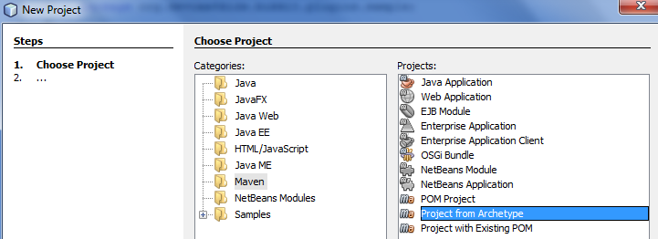
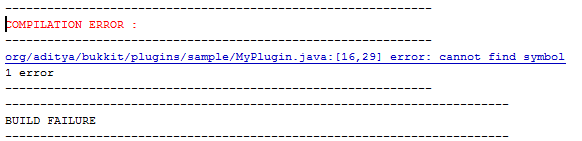

[[Your_First_Plugin]]
== Your First Plugin

In this chapter, we will make our first plugin. Exciting, isn't it?

The chapter will explain how a sample plugin can be easily generated using Maven and NetBeans. The generated directory structure and source files will then be explained. This plugin will then be installed on the CraftBukkit server. This is the first step towards building a simple plugin and will allow us to build more complex plugins in subsequent chapters.

[[Create_Sample_Plugin]]
=== Create the sample plugin

This book will explain lots of different kinds of plugins that can be made, and you probably already have an idea of what you want to make. But just like we need to learn to walk before we can run, we have to start with a simple plugin first. Our first plugin will just print a simple log message in server console that the plugin has been installed. Yes, it is simple because plugins are known to do all sorts of fun things, and this is just printing a message. But it is a very critical step because it ensures that we can apply the knowledge learned in previous chapters to build our plugin and it is recognized correctly by the CraftBukkit server. So lets understand how we can create this plugin.

A Bukkit plugin is a packaged JAR file and requires a specific directory structure, source, and configuration files in it. These files have a lot of similarities but also contain some basic differences like plugin name, different commands they offer, and of course the functionality itself. As explained in <<Tools_for_Authoring_Plugins>>, these directories and files can be manually created every time by going into Finder for Mac or Explorer for Winodws. That does help you understand the directory layout better and might be interesting for the first couple of times. However, we plan to write a lot of plugins in this book. So we need to think of an efficient way to create these directories and files. This will allow us to focus on the fun part of making a plugin.

As mentioned earlier, we'll be using Maven to create our plugins. As explained in <<Maven_Project_Structure>>, Maven provides a standard location for source and configuration files in a project. It also provides a mechanism to create a JAR file from the project using well-defined <<Maven_Lifecycle_Phases>>. This JAR file becomes our plugin and is installed in the CraftBukkit server.

Maven provides __archetypes__ that act like a cookie-cutter, only you can't use them to cut cookies. Instead, each archetype is used to create specific directories and files following a pre-defined . For creating our plugins, a Maven archetype that creates Bukkit sample plugins has already been created, so that you can focus on the interesting stuff, like building the plugins. We'll call this the __Bukkit Archetype__ through out the book. The Bukkit Archetype makes it very easy to get started with creating plugins.

NetBeans provides a simple and easy way to use Maven, which is helpful because we can use it to create our first plugin using the Bukkit Archetype.

.How to start NetBeans
[TIP]
====
NetBeans can be started by clicking on ``Start'', selecting the NetBeans group, and clicking on NetBeans icon. NetBeans icon image:images/netbeans-icon.png[height="32", width="32"]. In Macintosh, click on NetBeans icon in ``Applications''.  
====

1. Start NetBeans.
1. Create a new project by selecting ``File'', ``New Project...'' as shown in <<Create_new_project_in_NetBeans>>.
+
[[Create_new_project_in_NetBeans]]
.Create new project in NetBeans
image::images/netbeans-create-new-project.png[]
+
[NOTE]
====
The images are captured from a Windows machine and so the menu will look different if you are using a different operating system.
====
+
1. NetBeans allows you to create many different types of projects, but we want to create a project from a Maven Archetype. To do this, select ``Maven'' and ``Project from Archetype'' as shown in <<Create_new_project_in_NetBeans_from_Maven_archetype>>.
+
[[Create_new_project_in_NetBeans_from_Maven_archetype]]
.Create new project in NetBeans from Maven archetype

1. This will display a list of many archetypes, but we want an archetype that allows us to create Bukkit plugins. In the ``Search:'' box, type ``bukkit-template'', because that is the name of the archetype we will be using.
+
[[Select_Bukkit_archetype]]
.Select Bukkit archetype
image::images/netbeans-create-plugin-sample-archetype.png[]
+
IMPORTANT: Although NetBeans allows you to change other values, you must not change them, becuase if you do, the correct archetype will not be chosen.
+
At the time this book was written, the latest version of Bukkit was version 1.7.2-R0.3. The corresponding archetype version is 1.4. As newer versions of Bukkit are released, the archetype's version will change as well.
+
Click on ``Next'' to accept the default values and continue making the plugin.
1. This will take you to a screen where more information about your plugin can be entered.
+
[[Sample_plugin_information]]
.Sample plugin information

+
There are quite a few values shown in this page.
+
.. Change the ``Project Name'' to ``sample'', or whatever name you like. 
.. ``Project Location'' is the location of a directory where you would like to store all of your plugins. Its a recommended idea to define one directory where all the plugins will be stored.
.. ``Group Id'' uniquely identifies your plugin amongst all the plugins that you create. For example, you can change this value to ``org.yourname.bukkit.plugins''. Make sure to replace ``yourname'' with your name.
.. ``Version'' defines the first version of your plugin. The default value of this field follows the version naming convention used by Maven and typically does not need to be updated.
.. If the ``Group Id'' value is changed, then the ``Package'' value is accordingly updated. For simplicity, its better to accept this value.
.. In the ``Additional Creation Properties'', click in the text box under the ``Value'' column and type the directory name where your CraftBukkit server is running. This will be used to install the generated plugin JAR file to the plugins directory of your server. In <<Sample_plugin_information>>, the directory path shown is from a Windows machine. It will be different if you have a different operating system.
1. Clicking on ``Finish'' button creates your plugin project and shows the structure in <<Default_project_structure>>.
+
[[Default_project_structure]]
.Default project structure

+
If you click on the ``+'' signs next to ``Source Packages'', ``Other Sources'', or ``Project Files'', it will expand them to let you see what's inside. An expanded directory structure with those three packages open looks like <<Expanded_Project_Structure>>.
+
[[Expanded_Project_Structure]]
.Expanded project structure

+
You can also click on the ``-'' signs next to the packages to close them.
+
.. ``Source Packages'' shows the ``org.devoxx4kids.Bukkits.plugins.sample'' Java package and ``MyPlugin.java'' file in that package. This will be explained more in <<Sample_MyPlugin.java>>.
.. ``Other Sources'' has ``plugin.yml''. This file is used to provide basic information about the plugin such as plugin name, author, vesion, and the commands exposed by the plugin. This will be explained more in <<Sample_plugin.yml>>.
.. ``Project Files'' has ``pom.xml''. This is the Maven project file to build the plugin.

=== What's going on in the plugin?

The sample plugin is now generated. Lets try to understand what's going on in the plugin.

[[Sample_MyPlugin.java]]
==== MyPlugin.java

Click on ``MyPlugin.java'' to see code shown in <<MyPlugin_java>>.

[[MyPlugin_java]]
.MyPlugin.java
====
[source,java]
----
package org.devoxx4kids.bukkit.plugins.sample; <1>

import java.util.logging.Level; <2>
import org.Bukkit.plugin.java.JavaPlugin;

public class MyPlugin extends JavaPlugin { <3>
    // This code is called after the server starts and after the /reload command <4>
    @Override <5>
    public void onEnable() { <6>
        getLogger().log(Level.INFO, "{0}.onEnable()", <7>
            this.getClass().getName()); 
    }

    // This code is called before the server stops and after the /reload command
    @Override
    public void onDisable() { <8>
        getLogger().log(Level.INFO, "{0}.onDisable()", 
            this.getClass().getName());
    }
}
----
====

There are a few things in this code that are important to understand. This code will introduce several Java concepts so please be patient reading this explanation.

<1> `package` is a Java keyword and defines a concept that allows organizing one or more, but related, Java source files in different directories. For example, it would be much easier for an animal scientist to classify similar animals in one category instead of putting them all together. So zebra and horses belong to one category, snails and slugs in another, and salmon and tuna in another one. All these animals have similarity between them but yet different. 
+
For Java, package name is derived from the directory location of the Java source file where each directory is separated with a `.`. In this case, it is `org.devoxx4kids.bukkit.plugins.sample`. As explained in <<Maven>>, a pre-defined directory structure is used for everything in the project. All Java source files particularly go in `src/main/java` directory. In this case, `MyPlugin.java` is stored in the `src/main/java/org/devoxx4kids/bukkit/plugins/sample` directory. Its required to use all lowercase letters in the package name. However the directory name may contain blank space or capital letters.
+
Java clearly defines rules on how such a directory name is mapped to a package name. The class name qualified with the package name, such as `org.devoxx4kids.bukkit.plugins.sample.MyPlugin` is also referred as the fully-qualified class name. Alternatively, `MyPlugin` is the non-qualified class name.
+
<2> `import` is another Java keyword that allows you to access other classes, in other packages, without typing in their full name, from a class. For example, importing `java.util.logging.Level` allows you to use the `Level` class from this class. Otherwise fully-qualified name will have to be specified for every usage of this class. It is used in the lines starting with `getLogger()`. `Level.INFO` is one of the fields of the `Level` class and defines that this statement is going to print an informational message in the Minecraft server log. Because of this import statement explicitly defined at the top of the file, you can just refer to the field as `Level.INFO`. If there is no import statement then we need to refer to this field as `java.util.logging.Level.INFO`. 
+
.Import Statement at top of the class
[TIP]
====
It is strongly recommended to just import the class once at the top of the class file. This allows you to keep your code clean by not having to type in the full name, especially when you need to refer to the class multiple times.
====
+
<3> `extends` is another Java keyword, and is also an important Java concept (Wow, that's the third keyword in one class!). When a class __extends__ from another class, the class being extended from is called the __parent class__ and the class that is extending is the __child class__.
+
A simple analogy would be animals. All animals can walk, eat, and sleep. Cats are animals, and they can do what animals do, but they can do more than that, like purr and play with yarn. Spiders are also animals, and can do what all animals do, but they can also spin webs and catch flies. In this analogy, Animal is the parent class. Cat, Spider, and other types of animals are all child classes, extending from Animal. Because they extend from Animal, they can do everything that Animal does, but they have their own special characteristics as well. Because `MyPlugin` extends from `JavaPlugin`, it can do everything that `JavaPlugin` does, but it can also do more.
+
<4> This line is a __comment__ and is ignored by the compiler but useful for other programmers. Comments can be specified on a single line and start with `//`. Multiple line comments start with `/**`, and end with `*/` on the same or different line. Comments are usually used to provide more information about a certain part of a file. 
<5> Another important and related concept is __overriding methods__. Parent class can define several methods for different functionality, such as `walk()`, `eat()`, and `sleep()`. The child classes will differ from each other by providing a different functionality for each method. In Java parlance, this is called as overriding the method. 
+
`@Override` is an __annotation__. An annotation provides more information about the method that is right after it. Annotations have no direct effect on the operation of the code they annotate. In this case, it means that `MyPlugin` is overriding a method from `JavaPlugin`. When a method in a child class is overriding the same method in the parent class, the method in the child is executed by the JVM instead of the overridden method. In this case, the methods `onEnable()` and `onDisable()` are overriding their `JavaPlugin` counterparts.
+
<6> Some methods in certain classes fire only when a certain event happens. In `JavaPlugin`, the `onEnable()` method is fired when the plugin is enabled, but it does nothing. This method is overridden in `MyPlugin` and prints a log message in the Minecraft server log. The method signature, or name, return type, and parameters, has to be the same as in the parent class. In this case, the method singature is `public void onEnable()`.
<7> This line prints out a message in the server log. `Logger` is a Java class that has several methods to log messages. In this line, `getLogger()` gets the logger from JDK.
+
Methods are chained together to print the log message. For Minecraft, any message printed to this logger are redirected to server log. `log()` method is invoked to print the message. `Level.INFO` means the the message is an informational message. Another logging level you can use is `Level.WARNING` for warning messages. There are other logging levels, but those will not be explained here. You can read more about them at http://docs.oracle.com/javase/8/docs/api/java/util/logging/Level.html.
+
The actual message that is printed is `"{0}.onEnable()"`. `{0}` allows you to format the message by providing different arguments, in our case the complete class name is printed using `this.getClass().getName())` or `org.devoxx4kids.bukkit.plugins.sample.MyPlugin`. The value of `{0}` is then finally appended with `.onEnable()`. The message you would see from the server log would be something like: `[17:37:28 INFO]: [sample] org.devoxx4kids.Bukkit.plugins.sample.MyPlugin.onEnable()` The time would be shown at the beginning, with the logging level after it. Next, the plugin name is shown, then the actual message.
+
<8> This method is like the `onEnable()` method, but is fired when the plugin is disabled.

That's a lot of explanation, but next couple of files are easy to understand, and then we are ready to install the plugin.

[[Sample_plugin.yml]]
==== plugin.yml

The `plugin.yml` file in the ``Other Sources'' package is very simple. It should look like as shown in <<plugin_yml_for_sample_plugin>>.

[[plugin_yml_for_sample_plugin]]
.plugin.yml for sample plugin
====
[source, yaml]
----
name: sample <1>
version: "1.0-SNAPSHOT" <2>
author: Aditya Gupta <3>
main: org.devoxx4kids.bukkit.plugins.sample.MyPlugin <4>
----
====

This file defines configuration information about the plugin. Each line of the file starts with a configuration property name, followed by `:`, and then the property value name. In this case, it consists of four lines, or four name/value pairs:

<1> `name:` is the name of the plugin, which in this case is `sample`.
<2> `version:` is the version of the plugin. By default, maven conventions are followed. However you can make this anything you want, so optimize it for your needs.
<3> `author:` is the author of this plugin. Replace `Aditya Gupta` with your name.
<4> `main:` is the fully qualified name of the file, including the package name, that extends `JavaPlugin`. In our case, this is providing the complete name of `MyPlugin.java` in the package `org.devoxx4kids.bukkit.plugins.sample`.

This file is also useful for things like plugin description and commands. This will be discussed in detail in later chapters.

[[Sample_pom.xml]]
==== pom.xml

The last main file is `pom.xml`, which is located in the ``Project Files''. This file provide some information about the project as explained in <<Maven>>. The most important information is the version of CraftBukkit JAR file specified as &lt;dependency&gt;:

.Sample pom.xml
====
[source, xml]
----
<?xml version="1.0" encoding="UTF-8"?>
<project
  xmlns="http://maven.apache.org/POM/4.0.0" 
  xmlns:xsi="http://www.w3.org/2001/XMLSchema-instance" 
  xsi:schemaLocation="http://maven.apache.org/POM/4.0.0 
      http://maven.apache.org/xsd/maven-4.0.0.xsd">
    <modelVersion>4.0.0</modelVersion>

    <artifactId>sample</artifactId> <1>
    <groupId>org.devoxx4kids.bukkit.plugins</groupId>
    <version>1.0-SNAPSHOT</version>

    <!-- Repositories -->
    <repositories> <2>
        <repository>
            <id>bukkit-repo</id>
            <url>http://repo.bukkit.org/content/groups/public/</url>
        </repository>
    </repositories>

    <!-- Dependencies -->
    <dependencies>
        <dependency> <3>
            <groupId>org.bukkit</groupId>
            <artifactId>craftbukkit</artifactId>
            <version>1.7.2-R0.3</version>
            <scope>provided</scope>
            <type>jar</type>
        </dependency>
    </dependencies>

    <build> 
        <plugins> <4>
            <plugin> <5>
                <groupId>org.apache.maven.plugins</groupId>
                <artifactId>maven-compiler-plugin</artifactId>
                <version>2.3.2</version>
                <configuration>
                    <source>1.6</source>
                    <target>1.6</target>
                </configuration>
            </plugin>
            <plugin> <6>
                <artifactId>maven-antrun-plugin</artifactId>
                <configuration>
                    <tasks>
                        <copy
                            file="target/sample-1.0-SNAPSHOT.jar" 
                            todir="C:\Users\Aditya\Desktop\craftbukkit\plugins"/>
                    </tasks>
                </configuration>
                <executions>
                    <execution>
                        <phase>install</phase>
                        <goals>
                            <goal>run</goal>
                        </goals>
                    </execution>
                </executions>
            </plugin>
        </plugins>
    </build>
</project>
----
====

<1> &lt;artifactId&gt;, &lt;groupId&gt;, and &lt;version&gt; together uniquely identifies this particular plugin amongst all the plugins that you'll create. Typically there is no need to edit this after initial creation.
<2> Generally JAR files for different projects are stored in a central location called as __maven central repository__. For Bukkit, these JARs are stored in a different repository and so it has to be explicitly specified using &lt;repository&gt;. This section should not be edited.
<3> Bukkit API JAR version is specified as dependency. Specifically, `<version>1.7.2-R0.3</version>` tells you that the version of CraftBukkit being used is version 1.7.2-R0.3. In XML, the programming language this file is written in, `<>` marks a __tag__. In this case, `<version>` is a tag that describes the version. `</version>` is a closing tag because of the backslash in front of the word `version'. Anything between the opening tag and the closing tag is used to describe an object.
<4> All the work for Maven is done by __plugins__. In this section, different plugins are configured.
<5. The first plugin requires the JDK version to be at least 1.6. Even though a higher version of JDK is available but there are still plenty of CraftBukkit servers that are using JDK 1.6.
<6> As explained in <<Maven_Lifecycle_Phases>>, Maven has different lifecycle phases that are executed in a predefined order. It also allows customizing such that additional commands can be executed during different lifecycle phases. The ``install'' phase, particularly, is called after the ``package'' phase which creates the JAR file. Without getting into too much detail of Maven, this XML fragment between &lt;build&gt; and &lt;/build&gt;, copies the generated JAR file to the ``plugins'' directory of your server during the ``install'' phase.

.What is XML ?
[TIP]
====
XML is a markup language that defines a set of rules for encoding documents. The information in an XML document is captured using __tags__ where each tag has four parts: tag name, starting tag, value, and a closing tag. In our `pom.xml`, `version` is the tag name, `<version>` is the opening tag, `1.7.2-R0.3` is the value, and `</version>` is the closing tag.
====

[[Install_Sample_Plugin]]
=== Build and install the plugin

Now, we will have to install the plugin into your server.

We can't just put the plugin source directory into it; that wouldn't work. Computers undertand binary code, Java interpreter reads the binary `.class` files from the JAR file and generates the binary that is needed by the computer. So we'll need to perform a few steps in order to install the plugin:

. Create a JAR file from your plugin Java source files and configuration files.
. Copy that JAR file into the ``plugins'' directory in your server directory.
. Restart your server and check that the plugin is correctly installed.

This is not too hard, but you will have to pay attention so that you do not mess up.

First of all, you will have to turn the plugin source and configuration files into a JAR file. In NetBeans, if you right-click on your project in the Projects window, a drop-down menu will appear with many options on it as shown in <<Build_the_plugin>>.

[[Build_the_plugin]]
.Build the plugin
image::images/netbeans-create-plugin-sample-build.png["Build the plugin"]

The one you want is called ``Build'', so select that.

Clicking on ``Build'' will run the command `mvn install`. This is a standard Maven command which compiles the source code of the project, packages it in a JAR file, and installs it in the local repository. Because of the additional XML fragment between &lt;build&gt; and &lt;/build&gt;, as explained earlier, this generated JAR file is also copied to the ``plugins'' directory of your server.

[[NetBeans_command_to_Maven_lifecycle_phases_mapping]]
.NetBeans command to Maven lifecycle phases mapping

A lot of magic happens when you click on ``Build'' as shown in <<NetBeans_command_to_Maven_lifecycle_phases_mapping>>. Lets try to understand that.

. As explained in <<Sample_pom.xml>>, `pom.xml` has CraftBukkit remote repository and dependencies listed. First step is for Maven to resolve these dependencies so it can use them to build your plugin. As explained in <<Maven_Repository>>, Maven tries to resolve the dependency in your local repository first. If it can't find the JAR files specified in dependency there, it will look for it in the remote repository. In our case, an explicit remote repository is configured using &lt;repositories&gt; in <<Sample_pom.xml>>.
. After the dependency is resolved, it compiles all the source files and generates `.class` files from `.java` files.
. The generated classes and configuration files, `plugin.yml` in our case, is then packaged into a JAR file.
. Finally the generated JAR file is installed in the local repository, and additionally to the ``plugins'' directory of your server.

The generated JAR file structure is shown in <<Generated_JAR_file_content>>.

[[Generated_JAR_file_content]]
.Generated JAR file content
====
[source, text]
----
META-INF/ 
META-INF/MANIFEST.MF <1>
org/
org/devoxx4kids/
org/devoxx4kids/bukkit/
org/devoxx4kids/bukkit/plugins/
org/devoxx4kids/bukkit/plugins/sample/
org/devoxx4kids/bukkit/plugins/sample/MyPlugin.class <2>
plugin.yml <3>
META-INF/maven/ <4>
META-INF/maven/org.devoxx4kids.bukkit.plugins/
META-INF/maven/org.devoxx4kids.bukkit.plugins/sample/
META-INF/maven/org.devoxx4kids.bukkit.plugins/sample/pom.xml
META-INF/maven/org.devoxx4kids.bukkit.plugins/sample/pom.properties
----
====

<1> Every JAR file is packaged with a __manifest__ that provides information about the files packaged in the JAR file. Maven bundles a standard manifest in the JAR file. There is no need to modify this file.
<2> This is our plugin class. If there are other `.class` files then they are packaged here as well.
<3> This is our plugin configuration file. Other configuration files will be packaged here.
<4> Maven also bundle `pom.xml` that is used to create this JAR file and some other information in `pom.properties`. Like manifest, there is no need to modify these files.

When you click on ``Build'', a console window in NetBeans will pop up at the bottom of your screen as shown in <<NetBeans_console_window>>.

[[NetBeans_console_window]]
.NetBeans console window
image::images/netbeans-create-plugin-sample-console-window.png[]

.NetBeans output window
[TIP]
====
If NetBeans Output window does not show up or you accidentally closed it, then you can click on Window -> Projects menu to bring this window back.
====

Messages will start appearing in the log as the dependencies are resolved, the plugin JAR file is built, and installed in the ``plugins'' directory. If the plugin is successfully built, you should see the output as shown in <<Clean_and_build_log>>.

[[Clean_and_build_log]]
.Clean and build log
====
[source,text]
[listing]
...........................
[install:install]
Installing C:\Users\Aditya\Programming\bukkit-workshop\plugins\sample\target\sample-1.0-SNAPSHOT.jar to C:\Users\Aditya\.m2\repository\org\aditya\bukkit\plugins\sample\1.0-SNAPSHOT\sample-1.0-SNAPSHOT.jar <1>
Installing C:\Users\Aditya\Programming\bukkit-workshop\plugins\sample\pom.xml to C:\Users\Aditya\.m2\repository\org\aditya\bukkit\plugins\sample\1.0-SNAPSHOT\sample-1.0-SNAPSHOT.pom

[antrun:run]
Executing tasks
     [copy] Copying 1 file to C:\Users\Aditya\Desktop\craftbukkit\plugins
Executed tasks
------------------------------------------------------------------------
BUILD SUCCESS <2>
------------------------------------------------------------------------
...........................
====

There are two important things in this part of the log:

<1> This line tells you what directory where the plugin JAR file was generated.
<2> If this line says `BUILD SUCCESS`, then your plugin was built correctly. Otherwise, the plugin was not built correctly.

[WARNING]
====
Any errors during building the plugin JAR file are highlighted in the console window as shown in <<A_sample_error>>. By default, the generated sample plugin should work as is. But these errors could occur if you mistakenly typed something in the source files before clicking on ``Build''.
====

[[A_sample_error]]
.A sample error

The best way to fix it is to delete the plugin directory and regenerate it again using the instructions in <<Create_Sample_Plugin>>.

Clicking that one simple ``Build'' menu item created the JAR file and deployed it in the ``plugins'' directory of our server as well. We just need to restart our server now.

We can either stop and restart the CraftBukkit server as explained in <<Running_CraftBukkit_Server>>. Alternatively, we can just reload the plugins by giving the `reload` command in server console as shown in <<Reloading_Sample_Plugin>>. This will print the following message in the server console.

[[Reloading_Sample_Plugin]]
.Reloading sample plugin
====
[source, text]
----
>reload
[21:32:33 INFO]: [sample] Loading sample v1.0-SNAPSHOT <1>
[21:32:33 INFO]: [sample] Enabling sample v1.0-SNAPSHOT <2>
[21:32:33 INFO]: [sample] org.devoxx4kids.bukkit.plugins.sample.MyPlugin.onEnable() <3>
[21:32:33 INFO]: Server permissions file permissions.yml is empty, ignoring it
[21:32:33 INFO]: CONSOLE: Reload complete.
----
====

<1> This message is printed by CraftBukkit to indicate that the plugin is now loaded.
<2> This message is printed by CraftBukkit to indicate that the plugin is now enabled.
<3> This message is printed from the `onEnable` method of `MyPlugin` class.

Now that the plugin has been successfully installed, we can move forward and make plugins that do more fun things rather than just printing out a simple message.

Another way to confirm that the plugin is indeed installed on the server is by issuing the `plugins` command in server as shown in <<Check_the_list_of_installed_plugins_on_server>>.

[[Check_the_list_of_installed_plugins_on_server]]
.Check the list of installed plugins on server
====
[source, text]
----
>plugins
[15:23:06 INFO]: Plugins (1): sample
----
====

The list here shows that only ``sample'' plugin is installed. If you have moved ahead, and installed other plugins, then those will be shown here as well.

=== Summary

In this chapter, you learned how to create a basic plugin and the purpose of the generated files: `MyPlugin.java`, `plugin.yml`, and `pom.xml`. You learned how NetBeans can easily create a plugin JAR file and deploy it to the CraftBukkit server. Finally it showed how to verify that the plugin is indeed correctly installed in the server. In the next chapter, we will take a look at plugins with different functionality.
