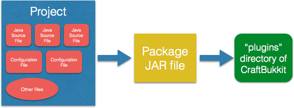
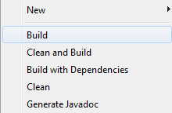
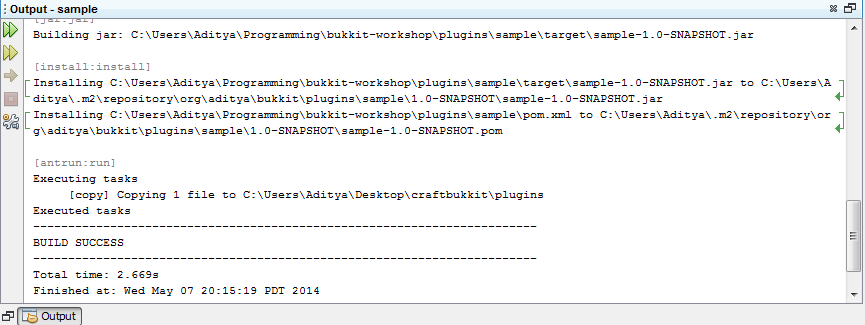

[[New_Chapter_1]]
== Your First Plugin

Minecraft is a 3D game about breaking and placing __blocks__ to obtain __materials__. These materials can then be used to build or __craft__ new __items__ and __tools__. These, in turn, can be used to harvest more types of
blocks. The game also contains __entities__, which are dynamic moving objects in Minecraft, for example, cow, pig, and horse. Some of the entities are hostile and called as __monsters__, for example, zombie and creeper. __Bosses__ are monsters that are very hard to defeat.

Playing the game itself is a lot of fun, but what makes the game more interesting and engaging is how it allows modifications (known as "mods" or "plugins"). These modifications can change the game from what it was originally written. They can add content to the game to alter gameplay. For example, new blocks, mobs, and abilities of the player can be added.

An individual player uses a __client__, think of it as a program downloaded on your machine, to connect to a __server__, think of it as a program running on your machine or a different machine on the Internet. This is called as __single player__. Minecraft also allows multiple players to join a server. This is called as __multiplayer__. This book will explain how to run your own Minecraft server, write plugins and install them on that server.

Its very common to have a server run with multiple plugins. There are almost an infinite number of plugins someone could do to make Minecraft a more amusing game to play. There is no official way to create these plugins, but there are several third-party vendors that provide that capability; Bukkit is one such way, and the most popular way. The ability to write plugins and alter the gameplay gives players more control over the game, and makes them more excited.

=== Spigot introduction

image:images/spigot-logo.png[] Spigot is a free, open-source, software project that provides the means to extend Minecraft multiplayer servers. It is not the official way to add mods to a server, nor is it supported by Mojang yet. However, it is one of the most popular ways to build server-side plugins, which are plugins that only work on servers. 

Spigot does NOT make mods. It makes plugins, which, contrary to popular belief, are not the same as mods.

.What is the difference between mods and plugins?
****
Mods involve __modifying__ the source code of Minecraft to do something or add additional functionality. Plugins are extra software that __plug__ into an application, instead of modifying the source code. Mods generally provide a framework that recognize plugins built using that framework. This makes mod free-standing, while plugins are generally built on the framework provided by mods.

For example, Spigot is a modded Minecraft server that recognizes plugins built using the Bukkit API.
****

The plugins you can make with Spigot don't actually modify your server. Instead, they just add on to it. For example, a mod would change the size of a TNT explosion by modifying the source code of Minecraft. In order to remove that modification and go back to the original game play, the source code needs to be modified back to the original one. A plugin can also make a bigger TNT explosion. They are called plugins because that is how you install them; you ``plug them in'' to your server.

There are so many currently existing plugins for Bukkit (over 10,000) that it can do pretty much anything! You can find all of these plugins at http://plugins.bukkit.org/. This book will teach you how to build plugins like that.

=== Download and install tools

In order to create plugins, we need to use a few tools. 

. Java Development Kit
. Spigot
. NetBeans

Lets learn about these tools and see how to download and install them.

==== Java

image:images/java-logo.png[width="75", height="137"] Markus "Notch" Persson (http://twitter.com[@notch]) wrote the game of Minecraft using the Java programming language. Java is one of the most popular programming languages. Game developers like Notch write computer programs as text files following the rules defined by Java. These text files are called as __Java source files__ or __class__ files, and end with a `.java` extension. These files are then converted into binary JAR files using the tools provided by Java Development Kit (JDK).

Before you can run your server, and later build plugins, you need to install JDK. JDK is like a swiss army knife for Java that provides a variety of tools. Another important tool provided by JDK is how these JAR files can be run on any machine.

Download JDK from http://www.oracle.com/technetwork/java/javase/downloads/index.html and install on your machine by following the instructions at http://docs.oracle.com/javase/8/docs/technotes/guides/install/install_overview.html.

.Is JDK already installed ?
[TIP]
====
If you are not sure that JDK is already installed on your machine then follow the installation instructions listed above. This will update to the latest version anyway and is the recommended version for this book. Either way, you'll need at least JDK 6.
====

==== Spigot

The __vanilla__, or un-modded server as downloaded from http://minecraft.net does not understand the plugins built using Bukkit. Spigot is a modified version of the vanilla server that does understand Bukkit plugins. It is available for download at https://hub.spigotmc.org/jenkins/job/BuildTools/lastSuccessfulBuild/artifact/target/BuildTools.jar at no cost at all. That is one of the many reasons that modders like to use it to make plugins for their servers.

.Difference between Bukkit, Spigot, and CraftBukkit
****
. Bukkit is the API used by developers to make plugins.
. CraftBukkit is the modded server that understands Bukkit API.
. Spigot API: https://github.com/arun-gupta/spigot-book/issues/1
. Spigot is an improved CraftBukkit that is much faster and more configurable.
****

To use the plugins you will make later on, you will need a server to put them on. This can be done by downloading `BuildTools.jar` and installing it. Detailed instructions to install Spigot are available at https://www.spigotmc.org/wiki/buildtools/#running-buildtools.

NOTE: This book will provide all the instructions assuming you are using a Mac OS X.

. Open a Terminal using Spotlight (Press `Cmd` and `Space` keys together and type "`terminal`" and hit Enter)
. Create a new directory '`spigot`' by typing the command `mkdir spigot`.
. Change to this directory by giving the command `cd spigot`.
. Download `BuildTools.jar` by giving the command `curl -o BuildTools.jar https://hub.spigotmc.org/jenkins/job/BuildTools/lastSuccessfulBuild/artifact/target/BuildTools.jar`
. Setup properties to generate the Spigot project by giving the command `export MAVEN_OPTS="-Xmx2G"`.
. Generate Spigot project by giving the command `java -Xmx2G -jar BuildTools.jar`. This will show the output:
+
[source, text]
----
spigot> java -Xmx2G -jar ~/Downloads/BuildTools.jar
Loading BuildTools version: git-BuildTools-1847da7-45 (#45)
arun-gupta
arun.gupta@gmail.com
Starting clone of https://hub.spigotmc.org/stash/scm/spigot/bukkit.git to Bukkit
Cloned git repository https://hub.spigotmc.org/stash/scm/spigot/bukkit.git to /Users/arungupta/tools/spigot/Bukkit. Current HEAD: 31d4f76a1510fa4810a917af05eeceec03d4b98a

. . .

Success! Everything compiled successfully. Copying final .jar files now.
Copying craftbukkit-1.8.8-R0.1-SNAPSHOT.jar to /Users/arungupta/tools/spigot/.
  - Saved as craftbukkit-1.8.8.jar
Copying spigot-1.8.8-R0.1-SNAPSHOT.jar to /Users/arungupta/tools/spigot/.
  - Saved as spigot-1.8.8.jar
----
+
This generates the following directories:
+
[source, text]
----
BuildData           Bukkit			Spigot			    craftbukkit-1.8.8.jar	work
BuildTools.log.txt	CraftBukkit		apache-maven-3.2.5	spigot-1.8.8.jar
----

==== NetBeans

 A Spigot plugin is a JAR file and requires a specific directory structure with Java and other files in it. These files have a lot of similarities but also contain some basic differences like plugin name, different commands they offer, and of course the functionality itself. These directories and files can be manually created every time by going into Explorer for Windows or Finder for Mac. That does help you understand the directory layout better, and might be interesting for the first couple of times. However, we plan to write quite a few plugins in this book. So we need to think of an efficient way to create these directories and files.

To create the plugin, we will be using a recipe to generate our __project__. The project contains the entire source code and other files to make the plugin. This recipe allows us to create a project to start with. We will call this recipe as the __Spigot Recipe__ throughout this book. It simplifies the task of making plugins so you can focus on the more important and fun stuff, such as bigger TNT explosions.

So, how do you use this recipe?

This can be accomplished with an __IDE__, or an __integrated development environment__. An IDE is a tool that has a way to edit files, a way to package and run those files, and a debugger for finding issues with the files. There are many IDEs available for use, but this book will use NetBeans IDE for creating our plugins.

The two important parts of an IDE are the file editor and the packager. The file editor lets you edit separate code files in the project, while the packager puts them together into one file. In our case, that file is the plugin JAR file.

NetBeans is a free tool that runs on Macintosh, Windows, Linux, and other operating systems that has JDK installed already. This book will use it for creating plugins.

Download NetBeans from https://netbeans.org/downloads/. Make sure to click on ``Download`' button in '`Java SE`' column as shown in <<NetBeans_download>>.

[[NetBeans_download]]
.NetBeans download
image::images/netbeans-download.png["NetBeans Download"]

Install NetBeans following the instructions at https://netbeans.org/community/releases/80/install.html.

If you do have a prior version of NetBeans, its recommended to install this new version anyway since it is much faster and easier to work with.

=== Start Minecraft server

Spigot JAR file (generated earlier) and JDK are required to start the modded Minecraft server.

. Go to '`spigot`' directory in a Command Prompt on a Windows machine or Terminal in Macintosh.
. Create a new directory '`server`' in this directory. This is required because starting the server later will generate several files and directories and this will keep all of them contained in a single directory. 
. Type in `java -jar ../spigot-1.8.8.jar`.
+
`java -jar <file name>` is the generic command for starting any JAR file. In this case, we are starting the server jar file, which starts the Minecraft server.
+
[TIP]
.java command not found
====
If running the server shows an error as `java: Command not found' or `java: No such file or directory' then you need to make sure the tools bundled with JDK can be invoked from Command Prompt or Terminal. Follow the instructions from http://docs.oracle.com/javase/tutorial/essential/environment/paths.html to set up PATH envinronment variable.
====
+
. Running this command will show the output:
+
[source, text]
----
Loading libraries, please wait...
[21:11:27 INFO]: Starting minecraft server version 1.8.8
[21:11:27 INFO]: Loading properties
[21:11:27 WARN]: server.properties does not exist
[21:11:27 INFO]: Generating new properties file
[21:11:27 WARN]: Failed to load eula.txt
[21:11:27 INFO]: You need to agree to the EULA in order to run the server. Go to eula.txt for more info.
[21:11:27 INFO]: Stopping server
----
+
. Edit `eula.txt` by giving the command `vi eula.txt` and change the line `eula=false` to `eula=true`.
. Give the command `java -jar ../spigot-1.8.8.jar` again in a Terminal.

Running this command will display a lot of messages in Terminal. It may look confusing at first but there is relevant for each and every line. However two messages in the output are important to understand, and are shown in <<Start_Server_Output>>.

[[Start_Server_Output]]
.Output from Minecraft server start
====
[source, text]
----
[21:15:37 INFO]: Starting minecraft server version 1.8.8 <1>
...
[21:15:37 INFO]: Default game type: SURVIVAL <2>
----
====

<1> Shows that Minecraft server version is 1.8.8. Note the exact version may differ if you have a more recent version of the JAR file.
<2> Shows the default game mode is Survival. It is much easier to test these plugins in Creative, but for now, you can stay in Survival.

Starting a server for the first time in a new directory will create some new directories and files. These are all important to the server, but the only one that is important to us is the `plugins` directory.

=== Join the Server

Now that the server has started, lets see how we can join this server. Without being able to log onto a server, you cannot test your plugins. To log onto the server: 

. Click on the '`Multiplayer`' tab in the Minecraft laucnher
. Click on '`Direct Connect`'
. Enter '`localhost`' in the '`Server Adress`' box
. Click '`Join Server`'

'`localhost`' is a special name reserved for everybody's local machine. What you are doing is telling Minecraft to join the server running on your computer. Plugins will be installed on this server later.

Lets create our plugin and see how this directory is used.

== Create a Plugin

This section will walk you through the steps of creating a plugin. Don't panic if they seem unfamiliar at first. We'll be using steps multiple times through out the book and you'll be an expert at them pretty quickly.

The steps are outlined in <<Steps_for_creating_a_plugin>>:

. Generate a project as a placeholder to contain different files
. Edit Java and other files, create new images, etc. in the project
. Package the project in a JAR file
. Copy the JAR file to CraftBukkit's `plugins` directory

[[Steps_for_creating_a_plugin]]
.Steps for creating a plugin

NetBeans helps us simplify all of these steps. Lets create our first plugin.

Our first plugin will send a message to the server console every time a player joins or leaves the server. Minecraft already does that, but the message contains many elements that may not be useful to whoever is reading it. These elements can make the message confusing. The message looks something like <<Player_Join_Server_Message>>.

[[Player_Join_Server_Message]]
.Message shown on player login
====
[source, text]
----
[17:31:18 INFO]: Adityagupta[/127.0.0.1:51180] logged in with entity id 462 at ([world] 19.27553977561729, 18.113231330555088, -68.8607335912105)
----
====

This plugin will make the console print another message, but it will be much simpler. Each plugin needs to have a name, this plugin will be called ``Player Entry/Exit''.

==== Generate project

NetBeans will be used to create the project.

.How to start NetBeans
[TIP]
====
On Windows, NetBeans can be started by clicking on ``Start'', selecting the NetBeans group, and clicking on NetBeans icon. NetBeans icon image:images/netbeans-icon.png[height="32", width="32"]. In Macintosh, click on NetBeans icon in ``Applications''.  
====

To create the project, start NetBeans, and create a new project by selecting ``File'', ``New Project...'' as shown in <<Create_new_project_in_NetBeans>>.

[[Create_new_project_in_NetBeans]]
.Create new project in NetBeans
image::images/netbeans-create-new-project.png[]

[NOTE]
====
The images are captured from a Windows machine and so the menu will look different if you are using a different operating system.
====

NetBeans allows you to create many different types of projects, but we want to create a project from Maven Archetype. This is what allows us to specify the recipe that has been precreated for you. You may wonder how and where this recipe is downloaded from. For curious readers, more details are available in <<Maven>>.

To do this, select ``Maven'' and ``Project from Archetype'' as shown in <<Create_new_project_in_NetBeans_from_Maven_archetype>>.

[[Create_new_project_in_NetBeans_from_Maven_archetype]]
.Create new project in NetBeans from Maven archetype
image::images/netbeans-create-project-from-archetype.png[]

This will display a list of many recipes, but we want to select our Bukkit Recipe. In the ``Search:'' box, type ``bukkit-template'', because that is the name of our recipe.

This recipe does not come with NetBeans. Instead, it is downloaded from Internet and installed on your machine. So make sure you are connected to the Internet when you try this step.

[[Select_Bukkit_archetype]]
.Select Bukkit archetype
image::images/netbeans-create-plugin-sample-archetype.png[]

IMPORTANT: Although NetBeans allows you to change other values, you must not change them, becuase if you do, the correct recipe will not be chosen.

At the time this book was written, the latest version of Bukkit was version 1.7.9-R0.2. The corresponding recipe version is 1.5. As newer versions of Bukkit are released, the recipe's version will change as well.

[WARNING]
.Bukkit Recipe version
====
If the version in the creation screen is incorrect, change it to 1.5.
====

Click on ``Next'' to accept the values and continue with the creation of the plugin. You should see a screen like <<PlayerEntryExit_Plugin_Details_Image>>.

[[PlayerEntryExit_Plugin_Details_Image]]
.PlayerEntryExit plugin details
image::images/netbeans-create-plugin-playerentryexit.png[]

There are many important values in this screen:

. Change the ``Project Name'' to ``PlayerEntryExit'', or whatever name you like. The Project Name defines the name of the plugin. Normally, you would keep the first letter of all words capital so you can distinguish between words. Spaces and characters like ``;'', ``.'', and ``)'' are not allowed in the name.
. ``Project Location'' is the location of a directory where you would like to store all of your plugins. It is recommended to define one directory where all the plugins will be stored. For convenience, create ``plugins'' directory `C:\` on Windows or `/Users/<name>` on Mac where <name> is your username.
+
[TIP]
====
Its recommended to keep all the plugins in the same directory. This makes it easy to zip them all together and share with your minecraft buddies.
====
+
. ``Group Id'' uniquely identifies your plugin amongst all the plugins that you create. For example, you can change this value to ``org.yourname.bukkit.plugins''. Make sure to replace ``yourname'' with your name. This value will be same for all plugins created in this book.
. ``Version'' defines the first version of your plugin. The default value of this field follows the standard version naming convention and typically does not need to be updated.
. If the ``Group Id'' value is changed, then the ``Package'' value is accordingly updated. For simplicity, its better to accept this value.
. In the ``Additional Creation Properties'', click in the text box under the ``Value'' column and type the value of craftbukkit directory from your machine. This will be used to install the generated plugin JAR file to the plugins directory of your server. This directory name must match the directory where your server was started, `C:\craftbukkit` or `\Users\<username>\craftbukkit` in our case.
+
The directory path shown is from a Windows machine. It will be different if your machine has a different operating system.

Clicking on ``Finish'' button creates your plugin project and shows the structure in <<Player_EntryExit_Plugin_Default_Structure_Image>>. It will be located on the left-hand side of the IDE.

[[Player_EntryExit_Plugin_Default_Structure_Image]]
.Player Entry/Exit plugin directory structure
image::images/netbeans-create-plugin-playerentryexit-directory-structure.png[]

This structure contains the files that make your plugin work. ``Source Packages'' contains the Java source files. ``Other Sources'' contains the configuration files. ``Project Files'' has some other files required for creating the JAR file.

If you click on the ``+'' signs next to ``Source Packages'', ``Other Sources'', or ``Project Files'', it will expand them to let you see what's inside. An expanded directory structure with those three directories open looks like as shown in <<Expanded_Project_Structure_Player_EntryExit_Plugin_Image>>.

[TIP]
====
You can also click on the ``-'' signs to close the structure.
====

[[Expanded_Project_Structure_Player_EntryExit_Plugin_Image]]
.Player Entry/Exit plugin expanded directory structure
image::images/netbeans-create-plugin-playerentryexit-directory-structure-expanded.png[]

The key points in <<Expanded_Project_Structure_Player_EntryExit_Plugin_Image>> are explained:

. ``Source Packages'' shows the ``org.devoxx4kids.Bukkits.plugins.playerentryexit'' Java _package_. Package is a Java concept that allows to keep similar Java files together. For example, Java files for entities can be in one package, all files for enchantments can be in a different package, and so on. This allows an easy organization of a large number of Java files easily. In our case, ``MyPlugin.java'' file is in the shown package.
+
[TIP]
====
Each Java file is a text-based file, and ends with `.java` extension.
====
+
. ``Other Sources'' has ``plugin.yml''. This file is used to provide basic information about the plugin such as plugin name, author, vesion, and the commands exposed by the plugin.
. ``Project Files'' has ``pom.xml''. This file provides some information about how the project will be turned into a single JAR file and how it can be installed on your server. The most important information is the version of the CraftBukkit JAR file being used.

Click on ``MyPlugin.java'' to see the code shown in <<PlayerEntryExit_MyPlugin_java>>. It is shown in the large middle section of the IDE.

[[PlayerEntryExit_MyPlugin_java]]
.MyPlugin.java in Player Entry/Exit plugin
====
[source,java]
----
package org.devoxx4kids.bukkit.plugins.playerentryexit;

import java.util.logging.Level;
import org.Bukkit.plugin.java.JavaPlugin;

public class MyPlugin extends JavaPlugin {
    // This code is called after the server starts and after the /reload command
    @Override
    public void onEnable() {
        getLogger().log(Level.INFO, "{0}.onEnable()",
            this.getClass().getName()); 
    }

    // This code is called before the server stops and after the /reload command
    @Override
    public void onDisable() {
        getLogger().log(Level.INFO, "{0}.onDisable()", 
            this.getClass().getName());
    }
}
----
====

Most of the code in this file is a Java _class_, which in this case is named `MyPlugin` (as you can see on the third line). This is our first Java class and follows the syntax defined by the Java programming langauge. There is no need to worry too much about different Java keywords, parentheses, and formatting in this code. 

The key part to understand is that this class contains two _methods_, which is where you keep the code that actually does something. The two methods in this class are called `onEnable()` and `onDisable()`. (Don't worry about the ``public void''"'' stuff; we'll explain that later.) Most method names are verbs, which indicate what the code in the method does. 

The two methods in this code are made to run when the plugin is enabled and disabled.

==== Register and create the listener

One of the ways Bukkit plugins are created is listening for different __events__ in __listeners__. Events are something that happens in your world such as player breaks a block, an entity explodes, or a recipe completed in a crafting table. These events are ``handled'' using Event Handlers in Listener classes. 

Event Handlers are methods written in a Java class bundled with the plugin. These methods perform the action required when the particular event occurs, such as displaying a message to the player when a particular block is placed or broken. The Java class itself is called the ``Listener'' because its methods are listening for the events. Lets create a Listener and add Event Handler to them.

We need to make sure that the listener is registered before the player can play the game. This will ensure that any events are correctly handled by the listener. We'll look at what these events little later in this chapter. For now, the appropriate place to add the listener would be in the `onEnable()` method, as this method is called when the plugin is enabled. Registering a listener requires us to add a little bit of Java code. Lets add that code first, and then we'll understand it.

Add the line shown in <<Player_EntryExist_Register_Listener>> to `onEnable()` method of `MyPlugin` class. Click after the `{` right next to `onEnable()`, then press Enter to make a new line. Copy and paste the code there.

[[Player_EntryExist_Register_Listener]]
.Registering the Player Entry/Exit Listener
====
[source,java]
----
getServer()
    .getPluginManager()
    .registerEvents(
        new PlayerEntryExitListener(getLogger()), 
        this);
----
====

This code may look confusing at first but it has been formatted so that you can read it easily. Don't worry about `()`, `.`, `this`, and `new` for now, this is explained in <<Getting_Started_with_Java>>. This method obtains the CraftBukkit server where the plugin is installed, gets a manager to interact with different plugins, and register the event listener named `PlayerEntryExitListener`. Simple, isn't it ?

The new listener class needs to be created next. NetBeans simplifies the creation of this file. Next to the line you just created, there should be a stop sign. 

[TIP]
====
The stop sign (
 or 
image:images/netbeans-error-stopsign-2.png[] ) is shown on the left side of your code to indicate a syntax error. That way, you can fix the error before building the plugin. The plugin cannot be built if it contains errors. Generally the error can be fixed by clicking on the stop sign to open a list of suggested fixes.
====

The purpose of the stop sign is to inform that there is an error. Click on the stop sign to open a drop-down menu with three options in it as shown in <<Creating_Player_EntryExit_Listener_From_DropDown_Menu>>. The one you want to select is `Create class 'PlayerEntryExitListener' with constructor "PlayerEntryExitListener(java.util.logging.Logger)" in package org.devoxx4kids.bukkit.plugins.playerentryexit`.

[[Creating_Player_EntryExit_Listener_From_DropDown_Menu]]
.Creating the PlayerEntryExitListener
image::images/netbeans-create-plugin-playerentryexit-create-listener.png[]

This will automatically create a new file `PlayerEntryExitListener` and opens it in the IDE. It looks like as shown in <<Player_EntryExist_Listener_Source_File>>.

[[Player_EntryExist_Listener_Source_File]]
.PlayerEntryExitListener Java source
====
[source,java]
----
package org.devoxx4kids.bukkit.plugins.playerentryexit; <1>

import java.util.logging.Logger; <2>
import org.bukkit.event.Listener;

class PlayerEntryExitListener implements Listener { <3>

    public PlayerEntryExitListener(Logger logger) { <4>
    }

}
----
====

Some key Java concepts to be understood in this code:

<1> Each class belongs to a package. This is identified using `package` keyword in Java, a space, followed by the package name, and ended by `;`.
<2> A Java class can use other Java classes from different packages. These classes need to be _imported_ so that they can be referred to within the code. This class is importing two classes, `java.util.logging.Logger` is from Java and `org.bukkit.event.Listener` is from Bukkit. Any package name starting with `java.` comes from Java and any package name starting with `org.bukkit.` comes from Bukkit.
<3> A special method is created in the class that has the exact same name as of the class. This method is called as _constructor_ of the class. This method also takes a _parameter_ (we'll explain this shortly), in this case `Logger` is a JDK class that allows to log statements.

When a file is created, it shows up in the middle part of the IDE. You can make changes to it there.

Lets change this code, or the constructor specifically, as shown in <<PlayerEntryExitListener_updated_method>>.

[[PlayerEntryExitListener_updated_method]]
.PlayerEntryExitListener updated method
====
[source,java]
package org.devoxx4kids.bukkit.plugins.playerentryexit;

import java.util.logging.Logger;
import org.Bukkit.event.Listener;

class PlayerEntryExitListener implements Listener {

	Logger logger; <1>

    public PlayerEntryExitListener(Logger logger) {
    	this.logger = logger; <2>
    }

}
====

This will allow us to log the message in Minecraft server log using `logger`.

Now, we will have to add some methods in the class so that it can listen for players joining and leaving the server.

==== Add event handlers

Finally, we will have to add the methods that ``listen'' for players joining and leaving the server in Listener. The events are generated by the server and identified by predefined Java classes in the Bukkit API. For example, `PlayerJoinEvent` is an event called when a player joins the server and `PlayerQuitEvent` is an event called when a player leaves the server. A complete list of these events is defined in Bukkit API but you don't need to worry about it for now. These will be explained in <<Bukkit_documentation>>.

For now, lets take a look at the methods that need to be added in <<PlayerEntryExit_Listener_methods>>.

[[PlayerEntryExit_Listener_methods]]
.Listener methods for Player Entry/Exit plugin
====
[source,java]
----
@EventHandler <1>
public void playerJoin(PlayerJoinEvent event){ <2>
    logger.log(Level.INFO, 
        "{0} has joined the server.", event.getPlayer().getName()); <3>
}
    
@EventHandler
public void playerLeave(PlayerQuitEvent event){ <4>
    logger.log(Level.INFO, 
        "{0} has left the server.", event.getPlayer().getName());
}
----
====

There are some important parts in this code:

<1> Any method of this class can be marked to ``listen'' for events. Such a method needs to be marked with `@EventHandler`. The `@` at the beginning indicates that this is a _Java annotation_ which allows Java to define special marks in the code. The exact behavior of the annotation is defined by Bukkit.
+
The name of the method, `playerJoin` in this case, does not matter, just placing the marker above the method is important.
+
Each Java method may optionally take _parameters_ and provide a slightly different behavior based upon their value. Each parameter has a type and a name associated with it. Multiple parameters are separated by a comma. All the parameters are specified between `(` and `)` after the method's name. So the method `playerJoin()` takes one parameter of the type `PlayerJoinEvent` with the parameter name `event`. This parameter name can be used through out the method to access the value passed by whoever invoked this method.
+
<2> This method is called when a player joins the server. This is identified by the `PlayerJoinEvent` parameter, which as explained earlier, is an event created by Minecraft server and captured as a Bukkit class.
<3> This line logs the message stating that a player has joined the server. The text is `playername has joined the server.` where `playername` is value returned from `event.getPlayer().getName()`.
<4> The second method does the same thing, but listens for a player leaving the server, as defined by the `PlayerQuitEvent` parameter. Of course, the message now says `playername has left the server`.

You are now done adding functionality to your Listener. The complete code should look like as shown in <<Player_EntryExit_complete_Listener>>.

[[Player_EntryExit_complete_Listener]]
.Player Entry/Exit plugin complete Listener
====
[source,java]
----
package org.devoxx4kids.bukkit.plugins.playerentryexit;

import java.util.logging.Level;
import java.util.logging.Logger;
import org.bukkit.entity.Player;
import org.bukkit.event.EventHandler;
import org.bukkit.event.Listener;
import org.bukkit.event.player.PlayerJoinEvent;
import org.bukkit.event.player.PlayerQuitEvent;

public class PlayerEntryExitListener implements Listener {
    
    Logger logger;

    public PlayerEntryExitListener(Logger logger) {
        this.logger = logger;
    }
    
    @EventHandler
    public void playerJoin(PlayerJoinEvent event){
        logger.log(Level.INFO, 
            "{0} has joined the server.", event.getPlayer().getName());
    }
    
    @EventHandler
    public void playerLeave(PlayerQuitEvent event){
        logger.log(Level.INFO,
            "{0} has left the server.", event.getPlayer().getName());
    }

}
----
====

==== Build and install the plugin

Now, we will have to install the plugin into your server.

We can't just put the plugin source directory into it; that wouldn't work. Computers undertand binary code. So we'll have to use JDK to generate the JAR file. This will require a few steps in order to install the plugin:

. Create a JAR file from your plugin Java source files and configuration files
. Copy that JAR file into the ``plugins'' directory in your server directory
. Restart your server and check that the plugin is correctly installed

Fortunately, this is not too hard, but you will have to pay attention!

First of all, you will have to turn the plugin source and configuration files into a JAR file. In NetBeans, if you right-click on your project in the Projects window, a drop-down menu will appear with many options on it as shown in <<Build_the_plugin>>.

[[Build_the_plugin]]
.Build the plugin

The one you want is called ``Build'', so select that.

Clicking on ``Build'' will generate the JAR file and also copy it to the ``plugins'' directory of your server.

When you click on ``Build'', a console window in NetBeans will pop up at the bottom of your screen as shown in <<NetBeans_console_window>>.

[[NetBeans_console_window]]
.NetBeans console window

.NetBeans output window
[TIP]
====
If NetBeans Output window does not show up or you accidentally closed it, then you can click on Window -> Projects menu to bring this window back.
====

Messages will start appearing in the log as the plugin JAR file is built and installed in the ``plugins'' directory. If the plugin is successfully built, you should see the output as shown in <<Clean_and_build_log>>.

[[Clean_and_build_log]]
.Clean and build log
====
[source,text]
[listing]
...........................
[antrun:run]
Executing tasks
     [copy] Copying 1 file to C:\Users\Aditya\Desktop\craftbukkit\plugins <1>
Executed tasks
------------------------------------------------------------------------
BUILD SUCCESS <2>
------------------------------------------------------------------------
...........................
====

There are two important things in this part of the log:

<1> Tells you that the generated plugin is installed in this directory.
<2> If this line says `BUILD SUCCESS`, then your plugin was built correctly. Otherwise, the plugin was not built correctly.

[WARNING]
====
Any errors during building the plugin JAR file are highlighted in the console window as shown in <<A_sample_error>>. By default, the generated sample plugin should work as is. But these errors could occur if you mistakenly typed something in the source files before clicking on ``Build''.
====

[[A_sample_error]]
.A sample error
image::images/netbeans-create-plugin-sample-error.png[]

The best way to fix it is to delete the plugin directory and regenerate it again using the instructions in <<Create_Sample_Plugin>>.

==== Verify that it works

Clicking that one simple ``Build'' menu item created the JAR file and deployed it in the ``plugins'' directory of our server as well. We just need to restart our server now.

The deployed plugin can be reloaded by giving the `reload` command in server console as shown in <<Reloading_PlayerEntryExit_Plugin>>. This will print the following message in the server console.

[[Reloading_PlayerEntryExit_Plugin]]
.Reloading your server
====
[source, text]
----
>reload
[21:32:33 INFO]: [sample] Loading playerentryexit v1.0-SNAPSHOT <1>
[21:32:33 INFO]: [sample] Enabling playerentryexit v1.0-SNAPSHOT <2>
[21:32:33 INFO]: [sample] org.devoxx4kids.bukkit.plugins.playerentryexit.MyPlugin.onEnable() <3>
[21:32:33 INFO]: Server permissions file permissions.yml is empty, ignoring it
[21:32:33 INFO]: CONSOLE: Reload complete.
----
====

<1> This message is printed by CraftBukkit to indicate that the plugin is now loaded.
<2> This message is printed by CraftBukkit to indicate that the plugin is now enabled.
<3> This message is printed from the `onEnable` method of `MyPlugin` class.

Now that the plugin has been successfully installed, lets make sure the plugin actually works. Join your server. You should see a message in the console saying that `playername joined the server` where `playername` should be your Minecraft account name.

Disconnect from the server and check for the message `playername has left the server` in the console. Connect to the server again to see the message `playername has joined the server`. Disconnect and connect a couple of times just to celebrate the creationf of your first plugin! Don't forget to check for messages in the console.

Another way to confirm that the plugin is indeed installed on the server is by issuing the `plugins` command in server as shown in <<Check_the_list_of_installed_plugins_on_server>>.

[[Check_the_list_of_installed_plugins_on_server]]
.Check the list of installed plugins on server
====
[source, text]
----
>plugins
[15:23:06 INFO]: Plugins (1): playerentryexit
----
====

The list here shows that only ``playerentryexit'' plugin is installed. If you have moved ahead, and installed other plugins, then those will be shown here as well.

=== Summary

This chapter explained the key components to create a plugin. Your machine was setup with the tools required to create a plugin. A simple CraftBukkit server was started and we explained how you can use Minecraft launcher to connect to this server. Bukkit Recipe and how it simplifies the creation of a plugin was introduced. This recipe will be used in subsequent chapters to create other plugins. Finally we packaged, installed, and verified the plugin to our server.

Even though this was a simple plugin but it showed the most important pieces to create a plugin. It also taught some fundamental Bukkit concepts like Listeners and Event Handlers. Basic Java concepts like annotations, methods, and method parameters were introduced as well.

Now that we know how to make a simple plugin, we can move on to build more advanced plugins. The next few chapters will be based upon this chapter and make more plugins. They will start off simple like this one, and get more complicated along the way.

Lets keep reading and make some fun plugins!
