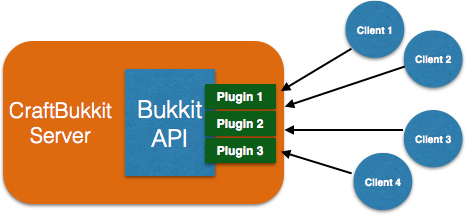
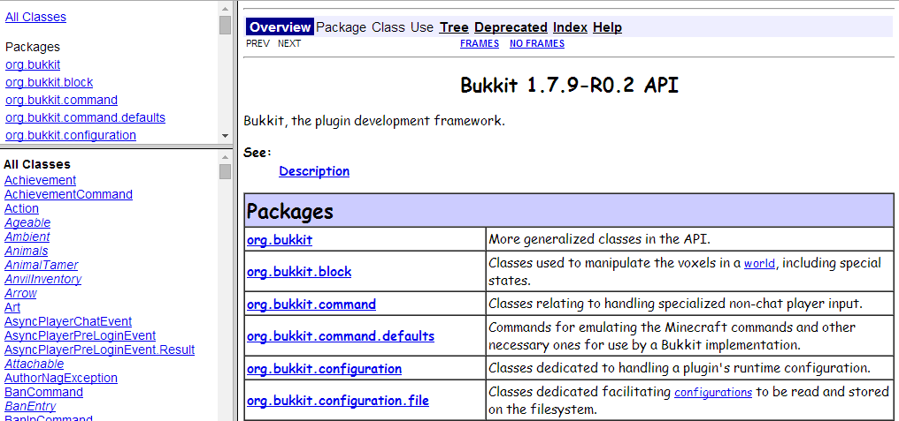
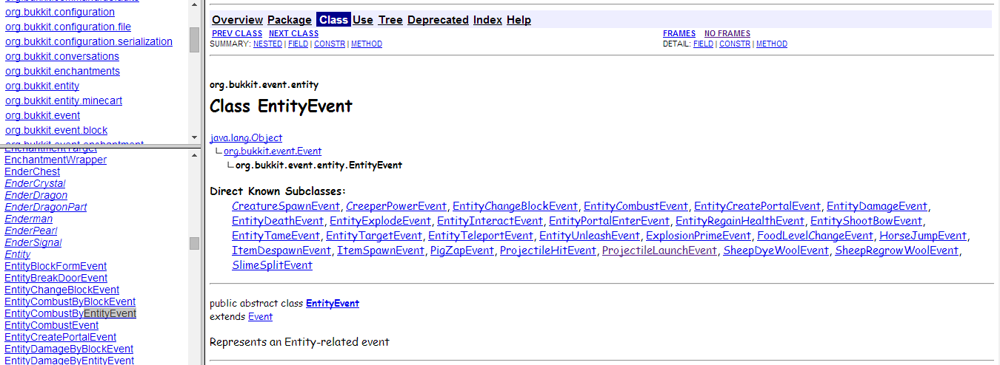

[[Managing_your_server_with_CraftBukkit]]
== Managing your CraftBukkit server

Part I of this book explained how to start your own Bukkit server and install plugins in it. The commands were simple and easy to understand. However you feel the need of taking control of your server and managing it more efficiently. This chapter will refresh the introduction to Bukkit and CraftBukkit and the difference between them. It will also explain how to run a Minecraft server using CraftBukkit and show basic commands for managing the server.

=== Bukkit API

Bukkit is a free, open-source, software project that provide the means to extend Minecraft multiplayer servers. It is neither the official modding Application Programming Interface (API) nor supported by Mojang, yet. However it is one of the most popular way to build server-side plugins, which are plugins that only work on servers. That means you cannot change any client-side functionality using Bukkit.

.What is the difference between mods and plugins?
****
Mods involve __modifying__ the source code of Minecraft to do something or add additional functionality. Plugins are extra software that __plug__ into an application, instead of modifying the source code. Mods generally provide a framework that recognize plugins built using that framework. This makes mod free-standing, while plugins are generally built on the framework provided by mods.

For example, CraftBukkit is a modded Minecraft server that recognizes plugins built using Bukkit API.
****

The ``vanilla'' or un-modded server as downloaded from http://minecraft.net does not understand the plugins built using Bukkit API. CraftBukkit is a ``modified'' or ``modded'' server that does understand this API. It is available for download at https://dl.bukkit.org/downloads/craftbukkit/ at no cost at all. So plugin builders use Bukkit API to build _plugins_ and install them on their CraftBukkit server.

.What is the difference between Bukkit and CraftBukkit?
****
Bukkit is the API used by developers to make plugins. CraftBukkit is the modded Minecraft server that understands plugins built using Bukkit API.
****

Multiple plugins with different functionalities can be easily installed on CraftBukkit server. Multiple clients can then connect to this server and all use the same plugins as shown in <<Bukkit_plugins>>.

[[Bukkit_plugins]]
.Bukkit Plugins

This book will teach you how to build Bukkit plugins and install them on CraftBukkit server.

[[Which_CraftBukkit_Build_to_use]]
=== Which CraftBukkit build to use ?

CraftBukkit can be downloaded from https://dl.bukkit.org/downloads/craftbukkit/. It is typically available in three different builds:

- Recommended
- Beta
- Development

These builds differ in terms of what version of Minecraft is supported and what items, blocks, and entities can be changed. For example, the support at the time of this writing is shown in <<Bukkit_Builds>>.

[[Bukkit_Builds]]
.Bukkit Builds
[width="50%"]
|====
| Build | Version

| Recommended | 1.6.4-R2.0
| Beta | 1.7.9-R0.2
| Development | 1.7.10-R0.1
|====

Each version is split into two parts, separated by a `-`. The first part indicates the supported Minecraft version. Multiple releases are made for each build as new functionality is added. The second part indicates the release number for that particular build. The first release for a build is typically labeled 0.1 and generally incremented by 0.1 with each release.

At the time of this writing, the `Recommended' build is most stable and tested with Minecraft 1.6.4. `Development' is where support for the latest Minecraft version is available, 1.7.10 in this case. As you can imagine, all the latest and cool features are added here first and so there might be some bugs with this build. `Beta' build is in between `Recommended' and `Development' and can be used if a more recent Minecraft version server is needed but with some stability.

[[Running_CraftBukkit_Server]]
=== Run a CraftBukkit server

Most of the publicly available Minecraft servers use Bukkit, because it is an easy solution to problems like world protection and minigame making. World protection is making sure certain players can't break blocks in certain areas. For example, you could specify that only you and people you trust can break blocks at your spawn area. Minigames are a fun part of some servers. They include things like Player vs. Player arenas where you fight with other players and Spleef arenas where you try to break blocks underneath other players. Some Bukkit plugins allow you to easily create miningames like that and make sure that they can't be broken or exploited.

There are so many plugins for Bukkit (over 10,000) that it can do pretty much anything! You can find all of these plugins at http://plugins.bukkit.org/.

It is extremely easy to install a Bukkit server, and very easy to install plugins after that. To do this, first go to https://dl.bukkit.org/downloads/craftbukkit/ and download one of the CraftBukkit builds. The recommended build is usually the most bug-free, and would probably be the best choice. The build is downloaded as a JAR file and server can be easily started using the command shown in <<Starting_CraftBukkit_Server>>.

[[Starting_CraftBukkit_Server]]
.Start a CraftBukkit server
====
[source,text]
----
java -jar <JAR FILE NAME>
----
====

As of this writing 1.6.4-R2.0 is the recommended build but we'll be using the beta build 1.7.9-R0.2 so that more recent functionality of the game can be used. So the command to start the server for us is shown in <<Starting_CraftBukkit_179_Server>>.

[[Starting_CraftBukkit_179_Server]]
.Start a CraftBukkit 1.7.9 Server
====
[source,text]
----
java -jar craftbukkit-1.7.9-R0.2.jar
----
====

.Starting the server in a separate directory
[TIP]
====
It is strongly recommended to copy this JAR file to a new directory and then start the server. This is because starting the server will generate a bunch of files and directories and this will keep your changes contained in a single directory. 
====

Starting the server shows output in <<CraftBukkit_server_log>>.

[[CraftBukkit_server_log]]
.CraftBukkit server log
====
[source,text]
[listing]
...................
Loading libraries, please wait...
[17:49:30 INFO]: Starting minecraft server version 1.7.9 <1>
[17:49:30 INFO]: Loading properties <2>
[17:49:30 WARN]: server.properties does not exist <3>
[17:49:30 INFO]: Generating new properties file <4>
[17:49:30 INFO]: Default game type: SURVIVAL <5>
[17:49:30 INFO]: Generating keypair
[17:49:30 INFO]: Starting Minecraft server on *:25565 <6>
[17:49:30 INFO]: This server is running CraftBukkit version git-Bukkit-1.7.9-R0.1-10-g8688bd4-b3092jnks (MC: 1.7.9) (Implementing API version 1.7.9-R0.2)
[17:49:30 WARN]: Failed to load user banlist: 
java.io.FileNotFoundException: banned-players.json (No such file or directory) <7>
	at java.io.FileInputStream.open(Native Method) ~[?:1.8.0_20]
	at java.io.FileInputStream.<init>(FileInputStream.java:138) ~[?:1.8.0_20]
	at net.minecraft.util.com.google.common.io.Files.newReader(Files.java:86) ~[craftbukkit-1.7.9-R0.2.jar:git-Bukkit-1.7.9-R0.1-10-g8688bd4-b3092jnks]
	at net.minecraft.server.v1_7_R3.JsonList.load(JsonList.java:147) ~[craftbukkit-1.7.9-R0.2.jar:git-Bukkit-1.7.9-R0.1-10-g8688bd4-b3092jnks]
	at net.minecraft.server.v1_7_R3.DedicatedPlayerList.y(SourceFile:99) [craftbukkit-1.7.9-R0.2.jar:git-Bukkit-1.7.9-R0.1-10-g8688bd4-b3092jnks]
	at net.minecraft.server.v1_7_R3.DedicatedPlayerList.<init>(SourceFile:25) [craftbukkit-1.7.9-R0.2.jar:git-Bukkit-1.7.9-R0.1-10-g8688bd4-b3092jnks]
	at net.minecraft.server.v1_7_R3.DedicatedServer.init(DedicatedServer.java:126) [craftbukkit-1.7.9-R0.2.jar:git-Bukkit-1.7.9-R0.1-10-g8688bd4-b3092jnks]
	at net.minecraft.server.v1_7_R3.MinecraftServer.run(MinecraftServer.java:436) [craftbukkit-1.7.9-R0.2.jar:git-Bukkit-1.7.9-R0.1-10-g8688bd4-b3092jnks]
	at net.minecraft.server.v1_7_R3.ThreadServerApplication.run(SourceFile:628) [craftbukkit-1.7.9-R0.2.jar:git-Bukkit-1.7.9-R0.1-10-g8688bd4-b3092jnks]
[17:49:30 WARN]: Failed to load ip banlist: 
java.io.FileNotFoundException: banned-ips.json (No such file or directory) <8>
	at java.io.FileInputStream.open(Native Method) ~[?:1.8.0_20]
	at java.io.FileInputStream.<init>(FileInputStream.java:138) ~[?:1.8.0_20]
	at net.minecraft.util.com.google.common.io.Files.newReader(Files.java:86) ~[craftbukkit-1.7.9-R0.2.jar:git-Bukkit-1.7.9-R0.1-10-g8688bd4-b3092jnks]
	at net.minecraft.server.v1_7_R3.JsonList.load(JsonList.java:147) ~[craftbukkit-1.7.9-R0.2.jar:git-Bukkit-1.7.9-R0.1-10-g8688bd4-b3092jnks]
	at net.minecraft.server.v1_7_R3.DedicatedPlayerList.x(SourceFile:91) [craftbukkit-1.7.9-R0.2.jar:git-Bukkit-1.7.9-R0.1-10-g8688bd4-b3092jnks]
	at net.minecraft.server.v1_7_R3.DedicatedPlayerList.<init>(SourceFile:27) [craftbukkit-1.7.9-R0.2.jar:git-Bukkit-1.7.9-R0.1-10-g8688bd4-b3092jnks]
	at net.minecraft.server.v1_7_R3.DedicatedServer.init(DedicatedServer.java:126) [craftbukkit-1.7.9-R0.2.jar:git-Bukkit-1.7.9-R0.1-10-g8688bd4-b3092jnks]
	at net.minecraft.server.v1_7_R3.MinecraftServer.run(MinecraftServer.java:436) [craftbukkit-1.7.9-R0.2.jar:git-Bukkit-1.7.9-R0.1-10-g8688bd4-b3092jnks]
	at net.minecraft.server.v1_7_R3.ThreadServerApplication.run(SourceFile:628) [craftbukkit-1.7.9-R0.2.jar:git-Bukkit-1.7.9-R0.1-10-g8688bd4-b3092jnks]
[17:49:30 WARN]: Failed to load operators list: 
java.io.FileNotFoundException: ops.json (No such file or directory) <9>
	at java.io.FileInputStream.open(Native Method) ~[?:1.8.0_20]
	at java.io.FileInputStream.<init>(FileInputStream.java:138) ~[?:1.8.0_20]
	at net.minecraft.util.com.google.common.io.Files.newReader(Files.java:86) ~[craftbukkit-1.7.9-R0.2.jar:git-Bukkit-1.7.9-R0.1-10-g8688bd4-b3092jnks]
	at net.minecraft.server.v1_7_R3.JsonList.load(JsonList.java:147) ~[craftbukkit-1.7.9-R0.2.jar:git-Bukkit-1.7.9-R0.1-10-g8688bd4-b3092jnks]
	at net.minecraft.server.v1_7_R3.DedicatedPlayerList.z(SourceFile:107) [craftbukkit-1.7.9-R0.2.jar:git-Bukkit-1.7.9-R0.1-10-g8688bd4-b3092jnks]
	at net.minecraft.server.v1_7_R3.DedicatedPlayerList.<init>(SourceFile:29) [craftbukkit-1.7.9-R0.2.jar:git-Bukkit-1.7.9-R0.1-10-g8688bd4-b3092jnks]
	at net.minecraft.server.v1_7_R3.DedicatedServer.init(DedicatedServer.java:126) [craftbukkit-1.7.9-R0.2.jar:git-Bukkit-1.7.9-R0.1-10-g8688bd4-b3092jnks]
	at net.minecraft.server.v1_7_R3.MinecraftServer.run(MinecraftServer.java:436) [craftbukkit-1.7.9-R0.2.jar:git-Bukkit-1.7.9-R0.1-10-g8688bd4-b3092jnks]
	at net.minecraft.server.v1_7_R3.ThreadServerApplication.run(SourceFile:628) [craftbukkit-1.7.9-R0.2.jar:git-Bukkit-1.7.9-R0.1-10-g8688bd4-b3092jnks]
[17:49:30 WARN]: Failed to load white-list: 
java.io.FileNotFoundException: whitelist.json (No such file or directory) <10>
	at java.io.FileInputStream.open(Native Method) ~[?:1.8.0_20]
	at java.io.FileInputStream.<init>(FileInputStream.java:138) ~[?:1.8.0_20]
	at net.minecraft.util.com.google.common.io.Files.newReader(Files.java:86) ~[craftbukkit-1.7.9-R0.2.jar:git-Bukkit-1.7.9-R0.1-10-g8688bd4-b3092jnks]
	at net.minecraft.server.v1_7_R3.JsonList.load(JsonList.java:147) ~[craftbukkit-1.7.9-R0.2.jar:git-Bukkit-1.7.9-R0.1-10-g8688bd4-b3092jnks]
	at net.minecraft.server.v1_7_R3.DedicatedPlayerList.B(SourceFile:123) [craftbukkit-1.7.9-R0.2.jar:git-Bukkit-1.7.9-R0.1-10-g8688bd4-b3092jnks]
	at net.minecraft.server.v1_7_R3.DedicatedPlayerList.<init>(SourceFile:30) [craftbukkit-1.7.9-R0.2.jar:git-Bukkit-1.7.9-R0.1-10-g8688bd4-b3092jnks]
	at net.minecraft.server.v1_7_R3.DedicatedServer.init(DedicatedServer.java:126) [craftbukkit-1.7.9-R0.2.jar:git-Bukkit-1.7.9-R0.1-10-g8688bd4-b3092jnks]
	at net.minecraft.server.v1_7_R3.MinecraftServer.run(MinecraftServer.java:436) [craftbukkit-1.7.9-R0.2.jar:git-Bukkit-1.7.9-R0.1-10-g8688bd4-b3092jnks]
	at net.minecraft.server.v1_7_R3.ThreadServerApplication.run(SourceFile:628) [craftbukkit-1.7.9-R0.2.jar:git-Bukkit-1.7.9-R0.1-10-g8688bd4-b3092jnks]
[17:49:30 INFO]: Preparing level "world" <11>
[17:49:30 WARN]: Unable to find spawn biome
[17:49:31 INFO]: Preparing start region for level 0 (Seed: 180975645564076834)
[17:49:31 INFO]: ----- Bukkit Auto Updater -----
[17:49:31 INFO]: It appears that you're running a Beta Build, when you've specified in bukkit.yml that you prefer to run Recommended Builds.
[17:49:31 INFO]: If you would like to be kept informed about new Beta Build releases, it is recommended that you change 'preferred-channel' in your bukkit.yml to 'beta'.
[17:49:31 INFO]: With that set, you will be told whenever a new version is available for download, so that you can always keep up to date and secure with the latest fixes.
[17:49:31 INFO]: If you would like to disable this warning, simply set 'suggest-channels' to false in bukkit.yml.
[17:49:31 INFO]: ----- ------------------- -----
[17:49:32 INFO]: Preparing spawn area: 16%
[17:49:33 INFO]: Preparing spawn area: 40%
[17:49:34 INFO]: Preparing spawn area: 61%
[17:49:35 INFO]: Preparing spawn area: 84%
[17:49:35 INFO]: Preparing start region for level 1 (Seed: 180975645564076834)
[17:49:36 INFO]: Preparing spawn area: 30%
[17:49:37 INFO]: Preparing spawn area: 59%
[17:49:38 INFO]: Preparing spawn area: 97%
[17:49:39 INFO]: Preparing start region for level 2 (Seed: 180975645564076834)
[17:49:40 INFO]: Done (9.175s)! For help, type "help" or "?"
...................
====

It also opens up the Minecraft console for giving any commands on the server. Your output may look slightly different based upon the version of JAR file. Lets understand what happened during server startup.

<1> This line tells you which version of Minecraft you are running. In this case, it is version 1.7.9.
<2> Tries to load `server.properties` file. This file stores all the settings for a multiplayer server (very self-explanatory!) using `name=value` format where `name` is the name of the property and `value` is the value of the property. For example, `max-players=20` define the maximum number of players that can play on the server at the same time. The property name is fixed and the property values can be edited. Any changes to this file require a server restart or reload. Some other properties that it includes, but is not limited to, whether the nether is allowed, whether command blocks are allowed, and whether generated structures appear in the world.
+
Complete list of properties and an explanation of their values that can be specified in this file are explained at http://minecraft.gamepedia.com/Server.properties.
+
<3> Indicates that the file can not be found. This is expected because we are running in a directory with no prior contents.
<4> This line indicates that the server is creating a new `server.properties` file. Subsequent runs of the server will reuse this file.
<5> Defines the gamemode to be creative, survival, hardcore, or spectator. The default mode is surival.
<6> Shows the port on which Minecraft is running. By default, Minecraft starts on port 25565. It can be started on a different port as shown in <<Running_Minecraft_on_a_different_port>>.
+
[[Running_Minecraft_on_a_different_port]]
.Running Minecraft on a different port
====
[source,text]
----
java -jar craftbukkit-1.7.9-R0.2.jar -p 8080
----
====
+
This will start Minecraft on port 8080.
+
<7> This line says `banned-players.json` is not found. This file contain information about player names that are banned on the server. This file is created during first run of the server and reused during subsequent runs.
+
A player can be banned using the `ban` command as shown in <<Minecraft_ban_player_command>>:
+
[[Minecraft_ban_player_command]]
.Minecraft ban player command
====
[source,text]
----
ban <playername>
----
====
+
Banning a player with name ``Bob'' will update the file and it will look like as shown in <<Minecraft_banned_player_updated_file>>.
+
[[Minecraft_banned_player_updated_file]]
.Minecraft banned-player.json updated file
====
[source,text]
----
[
  {
    "uuid": "9b15dea6-606e-47a4-a241-420251703c59",
    "name": "Bob",
    "created": "2014-08-27 21:30:32 -0700",
    "source": "CONSOLE",
    "expires": "forever",
    "reason": "Banned by an operator."
  }
]
----
====
+
Next few lines, up to the next marked line, is the error message shown by Java and can be ignored.
+
<8> This line says `banned-ips.json` is not found. This file contain information about IP address of the machines that are banned on the server. This means no player from that IP address can join the server. Like `banned-players.json`, this file is created during first run and used during subsequent runs.
+
An IP address can be banned using the `ban-ip` command as shown in <<Minecraft_ban_ip_command>>.
+
[[Minecraft_ban_ip_command]]
.Minecraft ban IP command
====
[source,text]
----
ban-ip <IP address>
----
====
+
Banning a computer with IP address ``10.0.0.62'' will update the file and it will look like as shown in <Minecraft_banned_ips_updated_file>.
+
[[Minecraft_banned_ips_updated_file]]
.Minecraft banned-ips.json updated file
====
[source,text]
----
[
  {
    "ip": "10.0.0.62",
    "created": "2014-08-27 21:39:12 -0700",
    "source": "CONSOLE",
    "expires": "forever",
    "reason": "Banned by an operator."
  }
]
----
====
+
Next few lines, up to the next marked line, is the error message shown by Java and can be ignored.
+
<9> This line says `ops.json` file is not found. This file contain information about operators on the server, and like `server.properties`, does not exist on this newly created server. Like previous files, this file is also created during first run of the server and reused during subsequent runs.
+
Operator, also known as moderator, is a player who can moderate a multiplayer server. Operators have access to a variety server commands that allow them to keep control of the server. They can do commands that normal players can not do. For example, an operator can change the game mode for a particular player using the command shown in <<Minecraft_operator_gamemode_command>>.
+
[[Minecraft_operator_gamemode_command]]
.Minecraft operator gamemode command
====
[source,text]
----
gamemode <survival | creative | adventure | hardcore | spectator> playername
----
====
+
An operator can also kill a player or entity using the command shown in <<Minecraft_operator_kill_command>>.
+
[[Minecraft_operator_kill_command]]
.Minecraft operator kill command
====
[source,text]
----
kill <playername | entity>
----
====
+
Complete list of operator commands are explained at http://minecraft.gamepedia.com/Commands#Operator-only_commands.
+
Next few lines, up to the next marked line, is the error message shown by Java and can be ignored.
+
<10> This line says `white-list.json` file does not exist. This is yet again very similar to `server.properties` and `ops.json`. This file contains the server whitelist and is a way to make sure only a certain set of players can join a server. If you aren't on the whitelist and it is turned on, you can't join the server.
+
By default, whitelist is turned off and can be turned on as shown in <<Minecraft_operator_whitelist_on_command>>.
+
[[Minecraft_operator_whitelist_on_command]]
.Minecraft operator whitelist on command
====
[source,text]
----
whitelist on
----
====
+
The list can be turned off in the console as shown in <<Minecraft_operator_whitelist_off_command>>.
+
[[Minecraft_operator_whitelist_off_command]]
.Minecraft operator whitelist off command
====
[source,text]
----
whitelist off
----
====
+
Similarly, new players can be added using `whitelist add <PLAYER>` and removed using `whitelist remove <PLAYER>` commands.
+
Next few lines, up to the next marked line, is the error message shown by Java and can be ignored.
+
<11> The last few lines talk about preparing the spawn area. The first few lines with `Preparing spawn area:` are for the Overworld. Levels 1 and 2 are the Nether and The End, respectively. These lines are printed when the server is preparing the start area in the world.

The empty directory is populated with the files and directories as shown in <<Bukkit_Server_Directory_Structure>>.

[[Bukkit_Server_Directory_Structure]]
.Bukkit server directory structure
image::images/bukkit-1.7.2-directory.png[]

The purpose of each file and directory and how to use it is explained in <<Bukkit_server_directory_explanation>>.

[[Bukkit_server_directory_explanation]]
.Bukkit Server Directory Explanation
[options="header", cols="1,3,3"]
|====
| Name
| Purpose
| How to use it

| banned-ips.json
| This file contains the list of IP addresses banned from your server.
| Use the `ban-ip` command shown in <<Minecraft_ban_ip_command>>.

| banned-players.json
| This file contains the list of players are banned from your server.
| Use the `ban` command shown in <<Minecraft_ban_player_command>>.

| bukkit.yml
| This file is the main configuration file for Bukkit.
| Do not change this file.

| help.yml
| This file configures how help messages are shown when you use /help for certain commands.
| Do not change this file.

| logs
| This directory contains all of your server logs. Server logs tell you what happened on the server on a specific day.
| Do not change any of the logs in this directory as they can be useful for figuring out server crashes or glitches.

| ops.json
| This file tells you which players are operators on the server.
| To op someone on your server, use <<Making_a_player_an_operator>> command.

| permissions.yml
| This file tells you what commands specific players can do.
| Do not change this file. The server will automatically change it.

| plugins
| This directory contains all of the plugins you have installed on your server. 
| When you want to install a new plugin, put it in this folder. When you want to delete a plugin from your server, delete it from this directory.

| server.properties
| This file contains the server properties as explained earlier.
| You can change this to your liking using any text editor. Server restarts are required if this file is changed.

| white-list.json
| This file contains information about the whitelist on the server.
| To add someone to the whitelist, use `whitelist add <PLAYER>` command.

| world
| This directory contains the information for the overworld dimension in your server.
| Do not change this directory unless your world is corrupted. If your world is corrupted, delete this folder and run your server again to regenerate the world.

| world_nether
| This directory contains the information for the nether dimension in your server.
| Do not change this directory unless your nether dimension is corrupted. If your world is corrupted, delete this folder and run your server again to regenerate the world.

| world_the_end
| This directory contains the information for the end dimension in your server.
| Do not change this directory unless your end dimension is corrupted. If your world is corrupted, delete this folder and run your server again to regenerate the world.
|====

This book will mostly deal with the `plugins` directory as that's where the plugins are installed. Note that this directory is created only after the server is started at least once.

Minecraft server can also be started by specifying certain options during the startup. Complete list of options can be found by specifying `-help` when starting the server as shown in <<Start_Minecraft_server_with_options>>.

[[Start_Minecraft_server_with_options]]
.Start Minecraft server with options
====
[source,text]
....
~> java -jar ~/Downloads/craftbukkit-1.7.9-R0.2.jar -help
Option                                  Description                            
------                                  -----------                            
-?, --help                              Show the help                          
-C, --commands-settings <File: Yml      File for command settings (default:    
  file>                                   commands.yml)                        
-P, --plugins <File: Plugin directory>  Plugin directory to use (default:      
                                          plugins)                             
-W, --universe, --world-container, --   World container                        
  world-dir <File: Directory                                                   
  containing worlds>                                                           
-b, --bukkit-settings <File: Yml file>  File for bukkit settings (default:     
                                          bukkit.yml)                          
-c, --config <File: Properties file>    Properties file to use (default:       
                                          server.properties)                   
-d, --date-format <SimpleDateFormat:    Format of the date to display in the   
  Log date format>                        console (for log entries)            
--demo                                  Demo mode                              
-h, --host, --server-ip <Hostname or    Host to listen on                      
  IP>                                                                          
--log-append <Boolean: Log append>      Whether to append to the log file      
                                          (default: true)                      
--log-count <Integer: Log count>        Specified how many log files to cycle  
                                          through (default: 1)                 
--log-limit <Integer: Max log size>     Limits the maximum size of the log     
                                          file (0 = unlimited) (default: 0)    
--log-pattern <Log filename>            Specfies the log filename pattern      
                                          (default: server.log)                
--log-strip-color                       Strips color codes from log file       
--noconsole                             Disables the console                   
--nojline                               Disables jline and emulates the        
                                          vanilla console                      
-o, --online-mode <Boolean:             Whether to use online authentication   
  Authentication>                                                              
-p, --port, --server-port <Integer:     Port to listen on                      
  Port>                                                                        
-s, --max-players, --size <Integer:     Maximum amount of players              
  Server size>                                                                 
-v, --version                           Show the CraftBukkit Version           
-w, --level-name, --world <World name>  World name
....
====

The values specified on the command line when starting the server override the values specified in `server.properties` file. For example, Bukkit servers require an Internet connection to authenticate usernames with Mojang. By default, the game cannot be played if there is no Internet connection. However the server can be started in an `offline' mode where this authentication is disabled. Typically players will set the `offline-mode` property to `false` in `server.properties` to run the server in offline mode. Now this can alternatively be achieved by running the server as shown in <<Start_Bukkit_server_in_offline_mode>>.

[[Start_Bukkit_server_in_offline_mode]]
.Start Bukkit server in offline mode
====
[source,text]
----
java -jar craftbukkit-1.7.2-R0.3.jar -o false
----
====

[[Manage_CraftBukkit_Server]]
=== Manage a CraftBukkit Server

Several commands are available to manage your CraftBukkit server. Some of them are explained below. 

The server can be stopped by giving the `stop` command in the console as shown in <<Stop_CraftBukkit_server>>.

[[Stop_CraftBukkit_server]]
.Stop CraftBukkit server
====
[source,text]
----
[13:31:14 INFO]: CONSOLE: Stopping the server.
[13:31:14 INFO]: Stopping server
[13:31:14 INFO]: Saving players
[13:31:14 INFO]: Saving worlds
[13:31:14 INFO]: Saving chunks for level 'world'/Overworld
[13:31:14 INFO]: Saving chunks for level 'world_nether'/Nether
[13:31:14 INFO]: Saving chunks for level 'world_the_end'/The End
[13:31:14 INFO]: Stopping server
----
====

All the plugins can be reloaded by giving the `reload` command in the console as shown in <<Reload_plugins_and_CraftBukkit_server_configuration>>. There is no need to stop and restart the server in this case. In addition, this also loads `permissions.yml` which define the permissions assigned to each player.

[[Reload_plugins_and_CraftBukkit_server_configuration]]
.Reload plugins and CraftBukkit server configuration
====
[source,text]
----
>reload
[13:31:30 INFO]: Server permissions file permissions.yml is empty, ignoring it
[13:31:30 INFO]: CONSOLE: Reload complete.
----
====

The log message indicate that the server does not have any `permissions.yml` file and so no permissions are assigned to any user yet. Also, no plugins have been installed in the server yet and so no message is shown for them. Later chapters will show more detailed messages when the server is reloaded with plugins installed.

The complete list of commands can be seen by typing `help` in the console and see the output as shown in <<CraftBukkit_help_command>>.

[[CraftBukkit_help_command]]
.CraftBukkit help command
====
[source,text]
[listing]
...................
>help
[21:41:33 INFO]: --------- Help: Index ---------------------------
[21:41:33 INFO]: Use /help [n] to get page n of help.
[21:41:33 INFO]: Aliases: Lists command aliases
[21:41:33 INFO]: Bukkit: All commands for Bukkit
[21:41:33 INFO]: Minecraft: All commands for Minecraft
[21:41:33 INFO]: /achievement: Gives the specified player an achievement or changes a statistic value. Use '*' to give all achievements.
[21:41:33 INFO]: /ban: Prevents the specified player from using this server
[21:41:33 INFO]: /ban-ip: Prevents the specified IP address from using this server
[21:41:33 INFO]: /banlist: View all players banned from this server
[21:41:33 INFO]: /clear: Clears the player's inventory. Can specify item and data filters too.
[21:41:33 INFO]: /defaultgamemode: Set the default gamemode
[21:41:33 INFO]: /deop: Takes the specified player's operator status
[21:41:33 INFO]: /difficulty: Sets the game difficulty
[21:41:33 INFO]: /effect: Adds/Removes effects on players
[21:41:33 INFO]: /enchant: Adds enchantments to the item the player is currently holding. Specify 0 for the level to remove an enchantment. Specify force to ignore normal enchantment restrictions
[21:41:33 INFO]: /gamemode: Changes the player to a specific game mode
[21:41:33 INFO]: /gamerule: Sets a server's game rules
[21:41:33 INFO]: /give: Gives the specified player a certain amount of items
[21:41:33 INFO]: /help: Shows the help menu
[21:41:33 INFO]: /kick: Removes the specified player from the server
[21:41:33 INFO]: /kill: Commits suicide, only usable as a player
[21:41:33 INFO]: /list: Lists all online players
[21:41:33 INFO]: /me: Performs the specified action in chat
[21:41:33 INFO]: /minecraft:achievement: A Mojang provided command.
[21:41:33 INFO]: /minecraft:ban: A Mojang provided command.
[21:41:33 INFO]: /minecraft:ban-ip: A Mojang provided command.
[21:41:33 INFO]: /minecraft:banlist: A Mojang provided command.
[21:41:33 INFO]: /minecraft:clear: A Mojang provided command.
[21:41:33 INFO]: /minecraft:defaultgamemode: A Mojang provided command.
[21:41:33 INFO]: /minecraft:deop: A Mojang provided command.
[21:41:33 INFO]: /minecraft:difficulty: A Mojang provided command.
[21:41:33 INFO]: /minecraft:effect: A Mojang provided command.
[21:41:33 INFO]: /minecraft:enchant: A Mojang provided command.
[21:41:33 INFO]: /minecraft:gamemode: A Mojang provided command.
[21:41:33 INFO]: /minecraft:gamerule: A Mojang provided command.
[21:41:33 INFO]: /minecraft:give: A Mojang provided command.
[21:41:33 INFO]: /minecraft:help: A Mojang provided command.
[21:41:33 INFO]: /minecraft:kick: A Mojang provided command.
[21:41:33 INFO]: /minecraft:kill: A Mojang provided command.
[21:41:33 INFO]: /minecraft:list: A Mojang provided command.
[21:41:33 INFO]: /minecraft:me: A Mojang provided command.
[21:41:33 INFO]: /minecraft:op: A Mojang provided command.
[21:41:33 INFO]: /minecraft:pardon: A Mojang provided command.
[21:41:33 INFO]: /minecraft:pardon-ip: A Mojang provided command.
[21:41:33 INFO]: /minecraft:playsound: A Mojang provided command.
[21:41:33 INFO]: /minecraft:say: A Mojang provided command.
[21:41:33 INFO]: /minecraft:scoreboard: A Mojang provided command.
[21:41:33 INFO]: /minecraft:seed: A Mojang provided command.
[21:41:33 INFO]: /minecraft:setidletimeout: A Mojang provided command.
[21:41:33 INFO]: /minecraft:setworldspawn: A Mojang provided command.
[21:41:33 INFO]: /minecraft:spawnpoint: A Mojang provided command.
[21:41:33 INFO]: /minecraft:spreadplayers: A Mojang provided command.
[21:41:33 INFO]: /minecraft:tell: A Mojang provided command.
[21:41:33 INFO]: /minecraft:testfor: A Mojang provided command.
[21:41:33 INFO]: /minecraft:time: A Mojang provided command.
[21:41:33 INFO]: /minecraft:toggledownfall: A Mojang provided command.
[21:41:33 INFO]: /minecraft:tp: A Mojang provided command.
[21:41:33 INFO]: /minecraft:weather: A Mojang provided command.
[21:41:33 INFO]: /minecraft:whitelist: A Mojang provided command.
[21:41:33 INFO]: /minecraft:xp: A Mojang provided command.
[21:41:33 INFO]: /netstat: A Mojang provided command.
[21:41:33 INFO]: /op: Gives the specified player operator status
[21:41:33 INFO]: /pardon: Allows the specified player to use this server
[21:41:33 INFO]: /pardon-ip: Allows the specified IP address to use this server
[21:41:33 INFO]: /playsound: Plays a sound to a given player
[21:41:33 INFO]: /plugins: Gets a list of plugins running on the server
[21:41:33 INFO]: /reload: Reloads the server configuration and plugins
[21:41:33 INFO]: /save-all: Saves the server to disk
[21:41:33 INFO]: /save-off: Disables server autosaving
[21:41:33 INFO]: /save-on: Enables server autosaving
[21:41:33 INFO]: /say: Broadcasts the given message as the sender
[21:41:33 INFO]: /scoreboard: Scoreboard control
[21:41:33 INFO]: /seed: Shows the world seed
[21:41:33 INFO]: /setblock: A Mojang provided command.
[21:41:33 INFO]: /setidletimeout: Sets the server's idle timeout
[21:41:33 INFO]: /setworldspawn: Sets a worlds's spawn point. If no coordinates are specified, the player's coordinates will be used.
[21:41:33 INFO]: /spawnpoint: Sets a player's spawn point
[21:41:33 INFO]: /spreadplayers: Spreads players around a point
[21:41:33 INFO]: /stop: Stops the server with optional reason
[21:41:33 INFO]: /summon: A Mojang provided command.
[21:41:33 INFO]: /tell: Sends a private message to the given player
[21:41:33 INFO]: /tellraw: A Mojang provided command.
[21:41:33 INFO]: /testfor: Tests whether a specifed player is online
[21:41:33 INFO]: /testforblock: A Mojang provided command.
[21:41:33 INFO]: /time: Changes the time on each world
[21:41:33 INFO]: /timings: Records timings for all plugin events
[21:41:33 INFO]: /toggledownfall: Toggles rain on/off on a given world
[21:41:33 INFO]: /tp: Teleports the given player (or yourself) to another player or coordinates
[21:41:33 INFO]: /version: Gets the version of this server including any plugins in use
[21:41:33 INFO]: /weather: Changes the weather
[21:41:33 INFO]: /whitelist: Manages the list of players allowed to use this server
[21:41:33 INFO]: /xp: Gives the specified player a certain amount of experience. Specify <amount>L to give levels instead, with a negative amount resulting in taking levels.
...................
====

More details about each command can be obtained by typing `help <COMMAND NAME>` in the console. Complete list of commands is also explained at http://wiki.bukkit.org/CraftBukkit_Commands.

Does it feel powerful to run your own Minecraft server? Make yourself more powerful by becoming an ``operator''. To do this, give the `op` command as shown in <<Making_a_player_an_operator>>.

[[Making_a_player_an_operator]]
.Making a player an operator
====
[source,text]
----
>op YOUR USERNAME
[19:19:21 INFO]: CONSOLE: Opped YOUR USERNAME
----
====

Learn more about administrating a CraftBukkit server at http://wiki.bukkit.org/Administering_A_Craftbukkit_Server.

[[Bukkit_documentation]]
=== Bukkit documentation

The documentation for any Java API is available in HTML format, and is called a __javadoc__. For example, the javadocs for all Java APIs are available at http://docs.oracle.com/javase/8/docs/api/java/.

Javadocs for all Bukkit builds are available at http://jd.bukkit.org. Javadocs for the latest beta build (1.7.9-R0.2 as of this writing) are at http://jd.bukkit.org/beta/apidocs/ and shown in <<Bukkit_Javadocs>>.

[[Bukkit_Javadocs]]
.Bukkit Javadocs

The page is divided in three sections. The top left section shows all Java packages in the API, bottom left section shows all classes in all the packages, and right section shows the documentation for the selected package or class. You'll learn about Java packages and classes in <<Getting_Started_with_Java>>.

The usual flow will be to select a package in the top left section, which shows all classes in that package in the bottom left section. Then selecting a class in the bottom left section shows documentation for that class in the right section. For example, <<Bukkit_Entity_Event_Javadocs>> shows `org.bukkit.event.entity` package is selected on the top left, classes in that package are shown in the bottom left, and `EntityEvent` class documentation is shown in the right section.

[[Bukkit_Entity_Event_Javadocs]]
.Bukkit EntityEvent javadocs

A full documentation of the Bukkit API can be found at 

[[Bukkit_javadoc_links]]
.Bukkit Javadocs for different builds
[options="header", cols="1,4"]
|====
| Build
| Javadocs

| Recommended
| http://jd.bukkit.org/rb/apidocs/

| Beta
| http://jd.bukkit.org/beta/apidocs/

| Development
| http://jd.bukkit.org/dev/apidocs/

|====

=== Summary

This chapter introduced Bukkit and CraftBukkit. It explained the difference between different CraftBukkit builds and which one to use. It showed how to read Bukkit API using javadocs. It explained how to run your own Minecraft server using CraftBukkit and explained basic commands for administrating the server.

The next chapter will introduce Java programming language and related tools that will be used to create plugins.
