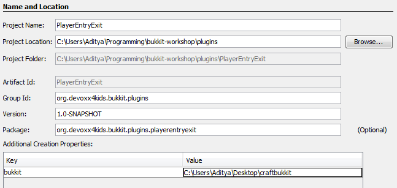
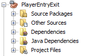
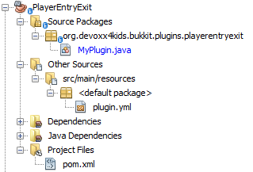
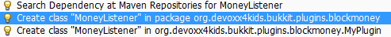

[[Listeners_and_EventHandlers]]
== Listeners and Event Handlers

One of the ways Bukkit plugins can be created is listening for different Events in Listeners. Events are something that happens in your world such as player breaks a block, an entity explodes, or recipe completed in a crafting table. These events are ``handled'' using Event Handlers in Listener classes. 

Event Handlers are methods written in a Java class bundled with the plugin. These methods perform the action required when the particular event occurs, such as displaying a message to the player when a particular block is placed or broken. The Java class itself is called the ``Listener'' because its methods are listening for the events. This chapter will also explain how to create these Listener classes and add Event Handlers to them.

The previous chapter explained how to create a simple plugin. That plugin wasn't doing much, just verifying and announcing that it was installed correctly. This chapter will use the concepts explained there to build two new plugins: one that that will print a message in the server log when a player joins or leaves the server, and another that rewards you with game money as the blocks are placed or broken. In the process, it will show you to add listener and event handlers to plugin.

=== Player Entry/Exit

When a player joins a server, their joining is announced in the console. The resulting message looks something like <<Player_Login_Message>>.

[[Player_Login_Message]]
.Player login message
====
[source, text]
----
[11:15:29 INFO]: Adityagupta[/127.0.0.1:56060] logged in with entity id 513 at ([world] -10.331896430797418, 77.98319966750057, 46.767098106728625)
----
====

This message contains a lot of details that may not be very important to whoever is looking at it. These unneccesary details can make the message confusing.

This plugin will print a simpler message in the console window whenever a player joins or leaves the server. It will only say who joined and how many players are now on the server.

==== Create the plugin

1. As explained in <<Create_Sample_Plugin>> section, create a new project using the Bukkit Archetype. This is a new plugin and so the plugin information will be different as shown in <<PlayerEntryExit_Plugin_Details_Image>>.
+
[[PlayerEntryExit_Plugin_Details_Image]]
.PlayerEntryExit plugin details

+
The values in <<PlayerEntryExit_Plugin_Details_Image>> are explained:
+
.. The ``Project Name'' is ``PlayerEntryExit''. You are free to choose another alternative name.
+
[TIP]
====
Its important to define a simple naming convention for the projects. This will make it easier to remember them later.
====
+
.. ``Project Location'' is the directory where the plugin directory is going to be created. It can be the same, or different, as in the previous chapters.
+
[TIP]
====
Its recommended to keep all the plugins in the same directory. This makes it easy to zip them all together and share with your minecraft buddies.
====
+
.. ``Group Id'' uniquely identifies your plugin amongst all the plugins that you create. For example, you can change this value to ``org.yourname.bukkit.plugins''. Make sure to replace ``yourname'' with your name. This value is the same as in the previous chapter.
.. ``Version'' defines the first version of your plugin. The default value of this field follows the version naming convention used by Maven and typically does not need to be updated. This value is the same as in the last chapter.
.. If the ``Group Id'' value is changed, then the ``Package'' value is accordingly updated. For simplicity, its better to accept this value.
.. In the ``Additional Creation Properties'', click in the text box under the ``Value'' column and type the directory name where your CraftBukkit server is running. This will be used to install the generated plugin JAR file to the plugins directory of your server. In <<Sample_plugin_information>>, the directory path shown is from a Windows machine. It will be different if you have a different operating system.
1. Clicking on ``Finish'' button creates your plugin project and shows the structure in <<Player_EntryExit_Plugin_Default_Structure_Image>>.
+
[[Player_EntryExit_Plugin_Default_Structure_Image]]
.Player Entry/Exit default structure

+
The directory structure in this plugin will be the same as the sample plugin. As earlier, you can click on the ``+'' signs next to ``Source Packages'', ``Other Sources'', or ``Project Files'' to see an expanded project structure as shown in <<Expanded_Project_Structure_Player_EntryExit_Plugin_Image>>.
+
[[Expanded_Project_Structure_Player_EntryExit_Plugin_Image]]
.Player Entry/Exit expanded directory structure

+
This is very similar to the one as shown in <<Expanded_Project_Structure>>, except for a couple of name changes. Particularly, the package name is now changed to ``org.devoxx4kids.bukkit.plugins.playerentryexit''. As discussed in <<Sample_MyPlugin.java>>, the uppercase directory names are converted to lowercase letters.
+
In addition, `plugin.yml` is shown in <<Player_EntryExit_Plugin_Plugin_Yml>>.
+
[[Player_EntryExit_Plugin_Plugin_Yml]]
.Player Entry/Exit plugin.yml
====
[source,yaml]
----
name: PlayerEntryExit
version: "1.0-SNAPSHOT"
author: Aditya Gupta
main: org.devoxx4kids.bukkit.plugins.playerentryexit.MyPlugin
----
====
+
This is very similar to <<Sample_plugin.yml>> but with two differences:
+
. Plugin name is derived from the project name that was selected during the creation.
+
In the sample plugin, the name was `Sample` because that was the suggested name of the plugin. In this plugin, it is `PlayerEntryExit` as that is the suggested name.
+
. Fully qualified class name is different, of course, because its in a different Java package. Most of the package name is same, just the last part of the package name is different, which will be the plugin name in lowercase letters. In the sample plugin, it was `org.devoxx4kids.bukkit.plugins.sample.MyPlugin`. In this plugin, it is `org.devoxx4kids.bukkit.plugins.playerentryexit.MyPlugin`

As discussed in the previous chapter, this plugin only prints a log message on the server when it is enabled and disabled. To add more functionality, you will have to create a Listener and Event Handlers as explained in <<Event_Handlers>>. And then we'll need to register the listener with the main entry point of our plugin, i.e. `MyPlugin` class.

==== Register and create the Listener

We need to make sure that the listener is registered before the player can play the game. This will ensure that any events are correctly handled by the listener. So the appropriate place to add the listener would be `onEnable()` method as this method is called when the plugin is enabled. Registering a listener requires us to add a little bit of Java code. Lets add that code first, and then we'll understand it.

Add the line shown in <<Player_EntryExist_Register_Listener>> to `onEnable()` method of `MyPlugin` class.

[[Player_EntryExist_Register_Listener]]
.Registering the Player Entry/Exit Listener
====
[source,java]
----
getServer() <1>
    .getPluginManager() <2>
    .registerEvents( <3>
        new PlayerEntryExitListener(getLogger()), <4>
        this); <5>
----
====
<1> This method returns the CraftBukkit Server instance that is running this plugin
<2> Returns the instance of `PluginManager` class for interacting with different plugins
<3> Register all events in the given listener class
<4> `PlayerEntryExitListner` is the new listener class, and will be created next
<5> `this` is a Java keyword and refers to the instance of current class
+
One of the nice things about Java language is that the code can be mostly read like English language. So this code can be read as getting an instance of CraftBukkit server and register all events in the `PlayerEntryExitListener` class. Simple, isn't it ?
+
The new listener class needs to be created next. NetBeans simplifies the creation of this file. Next to the line you just created, there should be a stop sign. 

[TIP]
====
The stop sign (
image:images/netbeans-error-stopsign-1.png[] or 
 ) is shown on the left side of your code to indicate a syntax error. That way, you can fix the error before building the plugin. The plugin cannot be built if it contains errors. Generally the error can be fixed by clicking on the stop sign to open a list of suggested fixes.
====

The purpose of the stop sign is to inform that there is an error. Click on the stop sign to open a drop-down menu with three options in it as shown in <<Creating_Player_EntryExit_Listener_From_DropDown_Menu>>. The one you want to select is `Create class 'PlayerEntryExitListener' in package [the name you gave in plugin.yml]`.

[[Creating_Player_EntryExit_Listener_From_DropDown_Menu]]
.Creating the PlayerEntryExitListener
image::images/netbeans-create-plugin-playerentryexit-create-listener.png[]

This will automatically create the new class `PlayerEntryExitListener` in the same package as MyPlugin.java. It looks like as shown in <<Player_EntryExist_Listener_Source_File>>:

[[Player_EntryExist_Listener_Source_File]]
.PlayerEntryExitListener Java source
====
[source,java]
----
package [your package name here];

import org.Bukkit.event.Listener;

/**
 * @author Aditya Gupta <1>
 */
class PlayerEntryExitListener implements Listener {

    public PlayerEntryExitListener() { <1>
    }

}
----
====

There are a few important parts in this file:

<1> This comment is using a special tag `@author` that identifies you as the author of this class.
<2> This code defines a constructor. A constructor defines how a class instance should be created in other classes. In this case, the constructor doesn't take any parameters, so you can refer to this class as `new PlayerEntryExitListener();`.
+
You can pass parameters to the constructor, just like you can to a method. For example, you could make the constructor require an integer value that defines the number of times the log message is printed.

Now, we will have to add some methods in the class so that it can listen for players joining and leaving the server.

First of all, we need to make the constructor take a `Logger` parameter. `MyPlugin.java` has a `Logger` and can log messages on it, but our new Listener class does not. We will use the `Logger` parameter to access `MyPlugin.java`'s Logger in our Listener. To add this parameter to the constructor, add the code `Logger logger` in between the parentheses in the constructor. It should now look like as shown in <<Logger_parameter_Player_EntryExit_Listener_Constructor>>.

[[Logger_parameter_Player_EntryExit_Listener_Constructor]]
.Logger parameter in the constructor of Player Entry/Exit plugin
====
[source,java]
----
public PlayerEntryExitListener(Logger logger) {
}
----
====

The parameter is defined like a variable. The first `Logger` is the type of the variable, which in this case is the `java.util.logging.Logger` class. The second `logger` is the name of the variable.

[NOTE]
====
Only the short class name is used in the method parameter as NetBeans automatically resolves the package name and adds `import` statement at the top of the class.
====

You will now have to add some code into and around the constructor to create a Logger variable that can be used to log messages. To do this, you will have to change your constructor so it looks like as shown in <<Updated_PlayerEntryExitListener_constructor>>.

[[Updated_PlayerEntryExitListener_constructor]]
.Updated PlayerEntryExitListener constructor
====
[source,java]
----
Logger logger; <1>

public PlayerEntryExitListener(Logger logger) {
    this.logger = logger; <2>
}
----
====

<1> Variables can be defined for each class and are of two types: __instance variables__ or __class variables__. 
+
Instance variables store unique values for each instance. Class-level variables are shared amongst all instances of the class and need to be prefixed with the `static` keyword. All class-level variables are shared by different methods of the class.
+
Variables can also be defined inside a method in which case they are called as __local variables__ and are accessible only within that method. This line is creating a instance variable `logger`. This will be used to log messages in all methods of this class.
+
<2> This line sets the value of `logger` to the logger we have recieved from `MyPlugin.java`. `this.logger` refers to the class instance variable. `logger` refers to the parameter passed in the constructor of `MyPlugin.java`. Remember, `this` refers to instance of the current class.

Your entire Listener class should look like as shown in <<PlayerEntryExitListener_with_updated_constructor>>.

[[PlayerEntryExitListener_with_updated_constructor]]
.Player Entry/Exit plugin listener with updated constructor
====
[source,java]
----
package org.devoxx4kids.bukkit.plugins.playerentryexit;

import java.util.logging.Level;
import java.util.logging.Logger;

/**
 * @author Aditya Gupta
 */
class PlayerEntryExitListener implements Listener {
    
    Logger logger;

    public PlayerEntryExitListener(Logger logger) {
        this.logger = logger;
    }

}
----
====

==== Add event handlers

Finally, we will have to add the methods that ``listen'' for players joining and leaving the server. They will look like as shown in <<Listener_methods_for_Player_EntryExit>>.

[[Listener_methods_for_Player_EntryExit]]
.Listener methods for Player Entry/Exit plugin
====
[source,java]
----
@EventHandler <1>
public void playerJoin(PlayerJoinEvent event){ <2>
    Player player = event.getPlayer(); <3>
    String playername = player.getName(); <4>
    logger.log(Level.INFO, 
        "{0} has joined the server.", playername); <5>
}
    
@EventHandler
public void playerLeave(PlayerQuitEvent event){ <6>
    Player player = event.getPlayer();
    String playername = player.getName();
    logger.log(Level.INFO, 
        "{0} has left the server.", playername);
}
----
====

There are some important parts in this code:

<1> Any method of this class can be marked to ``listen'' for events. Such a method needs to be annotated with `@EventHandler` annotation. The name of the method does not matter, just placing the annotation at the right place is important.
<2> This method has one parameter of the type `PlayerJoinEvent`. A method with a parameter of this type is called when a player joins the server. 
<3> This line makes a new method-level variable called `player`, of the type `Player`, that stores the player who joined the server. Note once again, the complete name of the class is `org.bukkit.entity.Player` but only a short name is used in the method.
<4> This line makes a new method-level variable called `playername`, of the type `String`, and stores the name of the player.
<5> This line logs the message stating that a player has joined the server. This is a informational message and so `Level.INFO` is used. The text is `playername has joined the server.` where `playername` is value of playername variable. It is referred to as `{0}`. The zero points to the parameters after it. In this case, the parameter at index 0 (the first one) is `playername`, so in the log message, `{0}` is replaced with the `playername` variable.
<6> The second method does the same thing, but listens for a player leaving the server, as defined by the parameter of type `PlayerQuitEvent`.

You are now done adding functionality to your Listener. It should look like as shown in <<Player_EntryExit_complete_Listener>>.

[[Player_EntryExit_complete_Listener]]
.Player Entry/Exit plugin complete Listener
====
[source,java]
----
package org.devoxx4kids.bukkit.plugins.playerentryexit;

import java.util.logging.Level;
import java.util.logging.Logger;
import org.bukkit.entity.Player;
import org.bukkit.event.EventHandler;
import org.bukkit.event.Listener;
import org.bukkit.event.player.PlayerJoinEvent;
import org.bukkit.event.player.PlayerQuitEvent;

/**
 * @author Aditya Gupta
 */
class PlayerEntryExitListener implements Listener {
    
    Logger logger;

    public PlayerEntryExitListener(Logger logger) {
        this.logger = logger;
    }
    
    @EventHandler
    public void playerJoin(PlayerJoinEvent event){
        Player player = event.getPlayer();
        String playername = player.getName();
        logger.log(Level.INFO, 
            "{0} has joined the server.", playername);
    }
    
    @EventHandler
    public void playerLeave(PlayerQuitEvent event){
        Player player = event.getPlayer();
        String playername = player.getName();
        logger.log(Level.INFO,
            "{0} has left the server.", playername);
    }

}
----
====

==== Build and install the plugin

Now, build and install the plugin as explained in <<Install_Sample_Plugin>>. To reiterate, right-click on your project and select `Build`. This will create the JAR file using all class and configuration files and deploy in the `plugins' directory of your CraftBukkit instalation. If there are no syntax errors or any other errors, NetBeans should show the message as shown in <<Player_EntryExit_NetBeans_Build>>.

[[Player_EntryExit_NetBeans_Build]]
.NetBeans output window for Player Entry/Exit plugin
====
[source, text]
....
[antrun:run]
Executing tasks
     [copy] Copying 1 file to C:\Users\Aditya\Desktop\craftbukkit\plugins <1>
Executed tasks
------------------------------------------------------------------------
BUILD SUCCESS
------------------------------------------------------------------------
....
====

Now, you just need to restart the CraftBukkit server as explained in <<Running_CraftBukkit_Server>>. After this, the server should show a message every time someone joins or leaves your server.

When a player joins the server, the message in <<Log_Message_Player_Join_Server>> is printed.

[[Log_Message_Player_Join_Server]]
.Log message printed when a player joins the server
====
[source,text]
----
[20:25:34 INFO]: [PlayerEntryExit] Adityagupta has joined the server.
----
====

Likewise, when a player leaves the server, the message in <<Log_Message_Player_Leave_Server>> is printed.

[[Log_Message_Player_Leave_Server]]
.Log message printed when a player leaves the server
====
[source,text]
----
[20:26:21 INFO]: [PlayerEntryExit] Adityagupta has left the server.
----
====

NOTE: `Adityagupta` will be replaced with the player's name.

=== Block Money

Now that you have an idea about how Listeners work, it is time to move on to another plugin. Currently, nothing happens when you place or break a block in the game. This plugin will reward you with game ``money'' whenever you break or place a block. It will use a Listener to look for the events that happen when a player breaks or places a block and reward the player with money.

==== Create the plugin

Again, we will be using the Bukkit Archetype to create the plugin. The information that you enter in the plugin creation should look like the information in <<Block_Money_plugin_creation>>

[[Block_Money_plugin_creation]]
.Block Money plugin creation information

Finish the plugin creation and open the plugin project. Take a look at the directory structure. If you expand the ``Source Packages'', ``Other Sources'', and ``Project Files'' packages, it should look like the directory structure shown in <<Block_Money_expanded_directory_structure>>.

[[Block_Money_expanded_directory_structure]]
.Block Money expanded directory structure
image::images/netbeans-create-plugin-block-money-directory-structure-expanded.png[]

Just like Player Entry/Exit plugin directory structure explained in <<Expanded_Project_Structure_Player_EntryExit_Plugin_Image>>, this directory has `org.devoxx4kids.bukkit.plugins.blockmoney.MyPlugin` class which is the entry point of the plugin, `plugin.yml` that defines plugin configuration, and `pom.xml` that defines instructions on how to build and install the plugin.

==== Register and create the Listener

A new Listener, just like the one in Player Entry/Exit plugin, needs to be created. Open the generated `MyPlugin.java`, add the line shown in <<Block_Money_plugin_register_listener>> in `onEnable()` method.

[[Block_Money_plugin_register_listener]]
.Register listener in MyPlugin class of Block Money plugin
====
[source,java]
----
getServer().getPluginManager()
.registerEvents(new MoneyListener(), this);
----
====

This line registers the Listener, just like in <<Player_EntryExist_Register_Listener>>. Notice that the name of the Listener is different, because this is a different plugin. This code gets an instance of CraftBukkit server and register all events in the `MoneyListener` class.

The updated method will look like as shown in <<Block_Money_plugin_onEnable_method>>.

[[Block_Money_plugin_onEnable_method]]
.onEnable method in Block Money plugin class
====
[source,java]
----
@Override
public void onEnable() {
    getLogger().log(Level.INFO, "{0}.onEnable()",
        this.getClass().getName());
    getServer().getPluginManager()
        .registerEvents(new MoneyListener(), this);
}
----
====

Again, click on the stop sign to see the drop-down menu as shown in <<Create_BlockMoney_Listener_From_DropDown_Menu>> and select the option that says `Create class 'BlockMoneyListener' in package [the name you gave in plugin.yml]`

[[Create_BlockMoney_Listener_From_DropDown_Menu]]
.Create the BlockMoneyListener class

This will create the Listener class for you in the same package and now the functionality can be added to the plugin.

==== Add event handlers

Open up the Listener class. Unlike Player Entry/Exit plugin, there is no need to pass any parameters to the constructor. Some variables and methods need to be added though. Add the code shown in <<BlockMoney_plugin_variables>> in the `BlockMoneyListener.java`.

[[BlockMoney_plugin_variables]]
.Variables in BlockMoney plugin
====
[source,java]
----
    float moneyToReward = 0.10F; <1>
    
    HashMap<String, Float> money = new HashMap(); <2>
            
    public MoneyListener() {
    }
----
====

These lines add two important variables:

<1> This variable is of the type __float__ which is a pre-defined type in Java. A float variable is used for storing decimal numbers. Its value is initialized to 0.10. The `F` at the end designates it as a float, otherwise it would be treated as an integer which is the default for any number. This variable will be the amount of money given to players when a block is placed or broken.
<2> This variable is of the type __HashMap__. A HashMap is like a table with two columns that maps __keys__ to __values__. The first column is for storing the keys and the second column for the corresponding values. THe data type for each column, or the key and the value, need to be specified when creating a HashMap.
+
In this HashMap, we have said that objects of the type `String` will go in the first column, and objects of the type `Float` will go in the second one. Methods are defined to set and get the value for a corresponding key. Invoking `put(key, value);` method on the HashMap instance will put the `value` for the key `key`. So, if you wanted to put the value of `potato` under the key of `vegetable` in the HashMap `foods`, you would write `foods.put(vegetable, potato);`. The value can be obtained using the `get(key);` method.
+
Our plugin will use this HashMap to store the money earned by each player where the player's name will be the key and the money will be the corresponding value.
+
More details about HashMap are available in the javadocs at http://docs.oracle.com/javase/8/docs/api/java/util/HashMap.html. 

Now, we need to add methods to earn money. The methods are shown in <<BlockMoney_methods_to_earn_money>>.

[[BlockMoney_methods_to_earn_money]]
.BlockMoney plugin methods to earn money
====
[source,java]
----
@EventHandler
public void checkForNullMoney(PlayerJoinEvent event){ <1>
    if (!money.containsKey(event.getPlayer().getName())) { <2>
        money.put(event.getPlayer().getName(), 0F); <3>
    }
}
    
@EventHandler
public void rewardBlockPlace(BlockPlaceEvent event){ <4>
    money.put(event.getPlayer(), <5>
        money.get(event.getPlayer().getName())  <6>
        + moneyToReward); <7>
    event.getPlayer().sendMessage(ChatColor.GOLD + "You now have " <8>
        + ChatColor.GREEN + "$"
        + String.format("%.2f", money.get(event.getPlayer()))); <9>
}
    
@EventHandler
public void rewardBlockBreak(BlockBreakEvent event){ <10>
    money.put(event.getPlayer(),
        money.get(event.getPlayer().getName()) 
        + moneyToReward);
    event.getPlayer().sendMessage(ChatColor.GOLD + "You now have " 
        + ChatColor.DARK_GREEN 
        + "$" + String.format("%.2f", money.get(event.getPlayer()))); <11>
}
----
====

All these methods are event handlers but probably look confusing to you, so here is an explanation:

<1> This method will be called when a player joins the server. This is the same event that was used in the Player Entry/Exit plugin.
<2> This line is an __if statement__. If statements are conditional statements that are only run if a certain condition is met. The `!` negates any condition. So this if statement will return true if the HashMap does not contain an entry for the player who is joining the game.
<3> If the entry does not exist then it creates a new entry and put 0 money in the HashMap for that player. This is like opening a new bank account with 0 balance. The player will earn money as he plays the game.
<4> This method is called when a block is placed by a player. More details such as which block was placed are obtained from `BlockPlaceEvent`.
<5> Start of the method that puts an entry in the HashMap. The key will be the player that placed the block.
<6> This line gets the current entry in the HashMap for the player. It will return the money accumulated by the player so far.
<7> `moneyToReward` is added to the money accrued by the player so far. Now, the value being entered in the HashMap will be the player's money plus some more money, defined by `moneyToReward` for breaking the block. The value in the HashMap for the Player key will be overriden.
<8> Sends a message to the player. It starts with the words ``You now have '' in gold letters. `ChatColor.GOLD` makes it show in gold letters. The `+` joins the ChatColor statement with the words so that the words are golden.
<9> Adds some more meaningful statement to the message. The new words, this time in green letters, as identified by `ChatColor.GREEN`, shows the total money earned by the player so far. So, if the player that placed the block had $0.90 to begin with, the messsage sent would be ``You now have $1.00.'' The method `String.format("&.2f", money.get(event.getPlayer()))` gets the players money but also formats it so that it doesn't go above 2 decimal places.
<10> This method does the same thing as the last one, but is run when a player breaks a block, not places one. The message here is displayed in green letters, as identified by `ChatColor.GREEN`.
<11> The color in this line is dark green instead of green so that you can identify if you placed or broke a block.

==== Build and install the plugin

Now, build and install the plugin as explained in <<Install_Sample_Plugin>>. To reiterate, right-click on your project and select `Build`. This will create the JAR file using all class and configuration files and deploy in the `plugins' directory of your CraftBukkit instalation. If there are no syntax errors or any other errors, NetBeans should show the message as shown in <<BlockMoney_NetBeans_Build>>. It will be the same as he message shown when you build the Player Entry/Exit plugin.

[[BlockMoney_NetBeans_Build]]
.NetBeans output window for BlockMoney plugin
====
[source, text]
....
[antrun:run]
Executing tasks
     [copy] Copying 1 file to C:\Users\Aditya\Desktop\craftbukkit\plugins <1>
Executed tasks
------------------------------------------------------------------------
BUILD SUCCESS
------------------------------------------------------------------------
....
====

Restart the CraftBukkit server as explained in <<Running_CraftBukkit_Server>>. Now when you play the game and try to place or break a block, the amount of money is shown in the game console as in <<BlockMoney_Money_earned_for_breaking_and_placing_blocks>>.

[[BlockMoney_Money_earned_for_breaking_and_placing_blocks]]
.Money earned for breaking and placing blocks
image::images/netbeans-create-plugin-block-money-minecraft-output.png[]

Notice that the player placed two blocks and broke one block. There are two light green messages for placing blocks and one dark green message for breaking blocks.

=== Summary

This chapter explained listeners and event handlers by creating two simple plugins. The first one showed how to display a message when a player joins or leaves the server. The second plugin showed how a player can earn game money as he breaks or places a block. In the process, we learned how plugins have a similar directory structure and files and multiple event handlers can be registered in a listener to achieve different functionalities. We also learned how messages can be displayed on the Minecraft console using different colors. We also learned some Java concepts like `if` statement, String formatting, `Map` and `HashMap`. The next chapter will introduce two more plugins using different aspects of Bukkit and Java.

