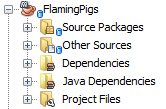
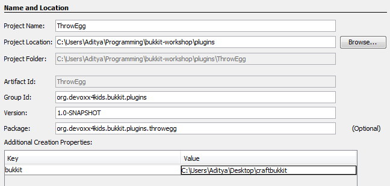
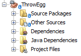

[[Making_New_Commands]]
== Making New Commands

Have you ever wanted to add new commands to Minecraft? With Bukkit, you can do that. In this chapter, we will learn how to add new commands to the game. 

First, we will make a plugin that adds a command that summons any number of pigs where you are. The pigs will be on fire, to add to the fun. Then, we will make a more complicated plugin that utilizes both commands and a Listener to change the mob that spawns when an egg hits the ground.

=== Flaming Pigs

Pigs aren't normally on fire. The only way to ignite them is to push them into a fire block or into lava. The first plugin will add a command that lets you spawn whatever number you want of pigs that are all on fire. It isn't really very useful, just funny to see a bunch of pigs on fire.

==== Create the plugin

Like all other plugins, the Bukkit Archetype will be used to create this plugin. The information that you enter should look like the information in <<FlamingPigs_Plugin_Creation>>.

[[FlamingPigs_Plugin_Creation]]
.FlamingPigs plugin information
image::images/netbeans-create-plugin-flaming-pigs.png[]

Click on ``Finish'' to create the plugin.

The directory structure, not expanded, should look like <<FlamingPigs_Directory_Structure>>.

[[FlamingPigs_Directory_Structure]]
.FlamingPigs directory structure

When you open the ``Source Packages'', ``Other Sources'', and ``Project Files'' packages, it should look like as shown in <<FlamingPigs_Expanded_Directory_Structure>>.

[[FlamingPigs_Expanded_Directory_Structure]]
.FlamingPigs expanded directory structure
image::images/netbeans-create-plugin-flaming-pigs-directory-structure-expanded.png[]

A Listener is not required for this plugin, as commands are not registered in a Listener. Instead, you register them in `plugin.yml` and define what they do in `MyPlugin.java`.

==== Register the command

First, we will register the command in `plugin.yml`. The file should currently look like <<FlamingPigs_plugin_yml>>.

[[FlamingPigs_plugin_yml]]
.FlamingPigs plugin.yml
====
[source, yaml]
----
name: FlamingPigs
version: "1.0-SNAPSHOT"
author: Aditya Gupta
main: org.devoxx4kids.bukkit.plugins.flamingpigs.MyPlugin
----
====

The code you will have to add is pretty simple. It looks like <<FlamingPigs_Registering_Command>>, and should be added at the end of the file.

[[FlamingPigs_Registering_Command]]
.Register the flamingpigs command
====
[source, yaml]
----
commands: <1>
  flamingpigs: <2>
    description: spawn a certain number of flaming pigs where you are, which are on fire for 30 seconds. <3>
    usage: /flamingpigs <number of pigs>
    aliases: fp
----
====

[NOTE]
====
YAML is a simple, easy to understand language used commonly in configuration files. It uses spaces and indents to categorize different items.
====

There are a few important things in this file:

<1> `commands:` tells you that everything under it is a command.
<2> `flamingpigs:` registers a command under the name of ``/flamingpigs''. The ``/'' is automatically added to the beginning of the command name.
<3> The description, usage and aliases of the command are set here. Description is what the command does, usage is how it should be used, and aliases registers other commands that will do the same thing as this one.

Your `plugin.yml` file should now look like <<FlamingPigs_Finished_plugin_yml>>.

[[FlamingPigs_Finished_plugin_yml]]
.Finished plugin.yml
====
[source, yaml]
----
name: FlamingPigs
version: "1.0-SNAPSHOT"
author: Aditya Gupta
main: org.devoxx4kids.bukkit.plugins.flamingpigs.MyPlugin
commands:
  flamingpigs:
    description: spawn a certain number of flaming pigs where you are, which are on fire for 30 seconds.
    usage: /flamingpigs <number of pigs>
    aliases: fp
----
====

==== Add command functionality

Now your command is registered, but it doesn't do anything. Functionality can be added in `MyPlugin.java`. It should look like <<FlamingPigs_MyPlugin_java>>.

[[FlamingPigs_MyPlugin_java]]
.FlamingPigs MyPlugin.java
====
[source, java]
----
package org.devoxx4kids.bukkit.plugins.flamingpigs;

import java.util.logging.Level;
import org.bukkit.plugin.java.JavaPlugin;

public class MyPlugin extends JavaPlugin {

    // This code is called after the server starts and after the /reload command
    @Override
    public void onEnable() {
        getLogger().log(Level.INFO, "{0}.onEnable()", 
            this.getClass().getName());
    }

    // This code is called before the server stops and after the /reload command
    @Override
    public void onDisable() {
        getLogger().log(Level.INFO, "{0}.onDisable()",
            this.getClass().getName());
    }
}
----
====

You will have to add the method in <<FlamingPigs_onCommand_Method>> to `MyPlugin.java` so that the command functions properly. The method is called when a command is run.

[[FlamingPigs_onCommand_Method]]
.FlamingPigs onCommand method
====
[source, java]
----
	@Override <1>
    public boolean onCommand(CommandSender sender, Command cmd, String label, String[] args) { <2>
        if (cmd.getName().equals("flamingpigs")) {<3>
        	return false;
        } 
        if (!(sender instanceof Player)) {
            return false;
        }

        if (args.length != 1) {
            sender.sendMessage(ChatColor.DARK_RED + cmd.getUsage());
            return false;
        }

        Location location = ((Player) sender).getLocation(); <4>
            
        int numberOfPigs;

        try { <5>
            numberOfPigs = Integer.parseInt(args[0]);
        } catch (NumberFormatException nfe){
            sender.sendMessage(ChatColor.RED + args[1] + 
                ChatColor.DARK_RED + " is not a valid number!");
            return false;
        }

        for(int i = 0; i < numberOfPigs; i++){ <6>
            Entity pig = ((Player) sender).getWorld()
                .spawnEntity(location, EntityType.PIG);
            pig.setFireTicks(6000);
        }  
        return true; <7>
    }
----
====

This method uses many Java concepts, and there are many important things in it:

<1> The `@Override` annotation means that this method will override the same method in `JavaPlugin`, which this file extends to.
<2> The method `onCommand()` is called when a command is run. There are four arguments: the command's sender, the command itself, the alias used, and the arguments.
<3> If the command is not ``/flamingpigs'' the method stops running. It will also stop running if the sender is not a player, or if there is more or less than one argument.
<4> Two variables are created. The first one stores the player's location and the second one stores the number of pigs. Currently, the variable for the number of pigs, called `numberOfPigs`, does not have a value.
<5> The argument of the command is converted into a number and assigned to `numberOfPigs`. If the argument is not a valid number, the player is notified of this and the method stops.
<6> The number of pigs specified are spawned where the player is. When each one is spawned, it is set on fire.
<7> A value of `true` is given if the method successfully executed.

Your finished `MyPlugin.java` should look like <<FlamingPigs_Finished_MyPlugin_java>>

[[FlamingPigs_Finished_MyPlugin_java]]
.Finished MyPlugin.java
====
[source, java]
----
package org.devoxx4kids.bukkit.plugins.flamingpigs;

import java.util.logging.Level;
import org.bukkit.ChatColor;
import org.bukkit.Location;
import org.bukkit.command.Command;
import org.bukkit.command.CommandSender;
import org.bukkit.entity.Entity;
import org.bukkit.entity.EntityType;
import org.bukkit.entity.Player;
import org.bukkit.plugin.java.JavaPlugin;

public class MyPlugin extends JavaPlugin {

    // This code is called after the server starts and after the /reload command
    @Override
    public void onEnable() {
        getLogger().log(Level.INFO, "{0}.onEnable()", 
            this.getClass().getName());
    }

    // This code is called before the server stops and after the /reload command
    @Override
    public void onDisable() {
        getLogger().log(Level.INFO, "{0}.onDisable()", 
            this.getClass().getName());
    }

    @Override
    public boolean onCommand(CommandSender sender, Command cmd, String label, String[] args) {
        if (!(cmd.getName().equals("flamingpigs"))) {
            return false;
        }
        if (!(sender instanceof Player)) {
            return false;
        }

        Location location = ((Player) sender).getLocation();

        if (args.length != 1) {
            sender.sendMessage(ChatColor.DARK_RED + cmd.getUsage());
            return false;
        }

        int numberOfPigs;

        try{
            numberOfPigs = Integer.parseInt(args[0]);
        } catch (NumberFormatException nfe){
            sender.sendMessage(ChatColor.RED + args[1] + 
                ChatColor.DARK_RED + " is not a valid number!");
            return false;
        }

        for (int i = 0; i < numberOfPigs; i++) {
            Entity pig = ((Player) sender).getWorld()
                .spawnEntity(location, EntityType.PIG);
            pig.setFireTicks(6000);
        }
        return true;
    }
}

----
====

==== Build and install the plugin

Like the other plugins, you will have to build the plugin before it can be used. If it successfully builds, it should output the message in <<Building_FlamingPigs>>.

[[Building_FlamingPigs]]
.Building the FlamingPigs plugin
====
[source, text]
....
[antrun:run]
Executing tasks
     [copy] Copying 1 file to C:\Users\Aditya\Desktop\craftbukkit\plugins
Executed tasks
------------------------------------------------------------------------
BUILD SUCCESS
------------------------------------------------------------------------
....
====

Restart your server and try out the new command! One fun thing you can do with it is fly up into the air about 10 blocks and type in the command in <<FlamingPigs_Command>>. 

[[FlamingPigs_Command]]
.FlamingPigs command
====
[source, text]
----
/fp 200
----
====

200 pigs will drop down and they will take damage from falling. When they drop, they will spread out. Since they are on fire, they will die in a few seconds. When they die, the particles created from their deaths will make a ``cloud''. <<FlamingPigs_Cloud>> shows a picture of the ``cloud''.

[[FlamingPigs_Cloud]]
.FlamingPigs cloud
image::images/flaming-pigs-cloud.png[]

If you spawn pigs on the ground and they are running around crazily, they probably look something like <<FlamingPigs>>.

[[FlamingPigs]]
.Flaming pigs
image::images/flaming-pigs.png[]

=== Throw Egg

This plugin is more practical. When you right-click with an egg item, it gets thrown, and on landing, it has a 12.5% chance of spawning a baby chicken. This plugin will add a command that controls what spawns when the egg lands, so instead of chickens, it could spawn zombies, pigs, or whatever you want it to. You can also configure how many of that mob will be spawned.

==== Create the plugin

Now that you know how to add a new command, this next plugin will utilize commands and a Listener to change what spawns when an egg lands on the ground. First of all, like all other plugins, use the Bukkit Archetype to create a new plugin. The information should look like <<ThrowEgg_Plugin_Information>>.

[[ThrowEgg_Plugin_Information]]
.ThrowEgg plugin information

The directory structure, not expanded, should look like <<ThrowEgg_Directory_Structure>>.

[[ThrowEgg_Directory_Structure]]
.ThrowEgg directory structure

When you open the ``Source Packages'', ``Other Sources'', and ``Project Files'' packages, it should look like as shown in <<ThrowEgg_Expanded_Directory_Structure>>.

[[ThrowEgg_Expanded_Directory_Structure]]
.ThrowEgg expanded directory structure
image::images/netbeans-create-plugin-throw-egg-directory-structure-expanded.png[]

==== Register the command

Like the last plugin, you will need to register a new command in `plugin.yml`. The new code for registering the command looks like <<ThrowEgg_Registering_Command>> and will be added to the end of the file.

[[ThrowEgg_Registering_Command]]
.Registering the command
====
[source, yaml]
----
commands:
  eggconfig:
    description: control what hatches from an egg and how many of it hatches.
    usage: /eggconfig <entity to hatch> <number of entities to hatch>
    aliases: /ec
----
====

Your finished `plugin.yml` file should look like <<ThrowEgg_Finished_plugin_yml>>.

[[ThrowEgg_Finished_plugin_yml]]
.Finished ThrowEgg plugin.yml
====
[source, yaml]
----
name: ThrowEgg
version: "1.0-SNAPSHOT"
author: Aditya Gupta
main: org.devoxx4kids.bukkit.plugins.throwegg.MyPlugin
commands:
  eggconfig:
    description: control what hatches from an egg and how many of it hatches.
    usage: /eggconfig <entity to hatch> <number of entities to hatch>
    aliases: /ec
----
====

==== Add command functionality

Now, like the last plugin, the command is registered, but doesn't do anything. Functionality will have to be added in `MyPlugin.java`.

First of all, some variables will need to be added. These will store the entity and number of entities chosen when a player runs the command. These variables are shown in <<ThrowEgg_Variables_To_Add>>

[[ThrowEgg_Variables_To_Add]]
.Variables to add in ThrowEgg MyPlugin.java
====
[source, java]
----
public static EntityType entityType; <1>
public static int numberOfEntities; <2>
----
====
<1> This variable stores an `EntityType`, which is a type defined by Bukkit. It is used in methods that spawn entities to determine what entity should be spawned.
<2> This variable is an integer variable that will store the number of entities that should be spawned.

These variables do not have any use right now, so code will have to be added to use them. This code is shown in <<ThrowEgg_Command_Method>> and should be written at the end of the file.

[[ThrowEgg_Command_Method]]
.ThrowEgg command method
====
[source, java]
----
@Override
public boolean onCommand(CommandSender sender, <1>
                         Command cmd, 
                         String label, 
                         String[] args) { 
    if (!(cmd.getName().equals("eggconfig"))) { <2>
        return false;
    }
    if (args.length != 2) {
        sender.sendMessage(ChatColor.DARK_RED + cmd.getUsage()); 
        return false;
    }
    
    try{ <3>
        entityType = EntityType.valueOf(args[0]
                                        .toString()
                                        .toUpperCase());
    } catch (NullPointerException npe){
        sender.sendMessage(ChatColor.RED + 
            entityType.toString() + ChatColor.DARK_RED + 
            " is not a valid entity!");
        return false;
    }
    
    try{
        numberOfEntities = Integer.parseInt(args[1]);
    } catch (NumberFormatException nfe){
        sender.sendMessage(ChatColor.RED + args[1] 
            + ChatColor.DARK_RED + " is not a valid number!");
        return false;
    }
    
    sender.sendMessage(ChatColor.GREEN + "Eggs will now hatch " <4>
        + numberOfEntities + " " + entityType + "(s)."); 
    
    return true; <5>
}
----
====

This code has a few important parts in it:

<1> Like the last plugin, this method is the `onCommand()` method used for commands.
<2> If the command is not `eggconfig` or one of its aliases, this method will stop running. The method will also stop running if the number of arguments is not 2.
<3> The variables `entityType` and `numberOfEntites` are set to the values given by the player. If either value is invalid, the player is notified of that and the method stops running.
<4> The player is sent a message confirming the change.
<5> If the command ran successfully, the method will return a value of true.

Now, the command sets the variables to whatever the player inputs. The variables' values still are not used anywhere, so a Listener will have to be added. The Listener will check for a chicken being hatched from an egg and change the chicken to the entity in `entityType`.

==== Register and create the Listener

In `MyPlugin.java`, add a line in the `onEnable()` method that looks like <<ThrowEgg_Register_Listener>> to register the Listener.

[[ThrowEgg_Register_Listener]]
.Register the ThrowEgg Listener
====
[source, java]
----
getServer().getPluginManager()
    .registerEvents(new EggListener(), this);
----
====

Click on the stop sign next to this line and select the option shown in <<ThrowEgg_Create_Listener>>.

[[ThrowEgg_Create_Listener]]
.Create the ThrowEgg Listener
image::images/netbeans-create-plugin-throw-egg-create-listener.png[]

==== Add event handlers

First of all, delete the constructor in the Listener. The constructor looks like <<ThrowEgg_Listener_Constructor>>.

[[ThrowEgg_Listener_Constructor]]
.ThrowEgg Listener constructor
====
[source, java]
----
public EggListener() {
}
----
====

The code in <<ThrowEgg_Listener_Method>> will have to be added into the Listener for it to work.

[[ThrowEgg_Listener_Method]]
.ThrowEgg Listener method
====
[source, java]
----
@EventHandler
public void hatchEntity(CreatureSpawnEvent event) { <1>
    Entity entity = event.getEntity(); <2>
    Location location = entity.getLocation();
    World world = entity.getWorld();

    if (event.getSpawnReason() == SpawnReason.EGG <3>
    && event.getEntityType() == EntityType.CHICKEN) {
        entity.remove(); <4>
        for (int i = 0 ; i < MyPlugin.numberOfEntities ; i++) {
            world.spawnEntity(location, MyPlugin.entityType);
        }
    }
}
----
====

There are some important things in this code:

<1> This method is run when a entity spawns (`CreatureSpawnEvent`) In this case, we will be using it to check for a chicken spwaning from a thrown eggs.
<2> The entity spawned, its location, and its world are stored in variables called `entity`, `location`, and `world`, respectively.
<3> The method only continues if the entity spawned was a chicken and it spawned from a thrown egg.
<4> The chicken is removed from the world. `numberOfEntites` entities are spawned at the location of the now dead chicken. They all match the type in `entityType`.

==== Build and install the plugin

Now, you can build the plugin and restart your server to install it. Use the command in <<ThrowEgg_Command>> to change what the egg spawns.

[[ThrowEgg_Command]]
.ThrowEgg command
====
[source, text]
----
/ec <entity type> <number of entities>
----
====

Some fun things you can do are:

. Make the egg spawn 100 BAT and make a ``bat cloud''
. Make the egg spawn 1 PRIMED_TNT and make explosive eggs
. Make the egg spawn 100 ZOMBIE and make a zombie apocalypse

There are lots of fun things you can do with this plugin!

<<ThrowEgg_Command_Output>> shows the output that comes when you do the command.

[[ThrowEgg_Command_Output]]
.ThrowEgg command output
image::images/netbeans-create-plugin-throw-egg-minecraft-output.png[]

The player set eggs to hatch 5 ZOMBIEs, then 50 BATs, then 17 WITCHes.

=== Summary

This chapter taught you how to make new commands in the game. First, you made a command that lets you spawn any number of flaming pigs where you are. Next, you made a command that lets you configure what a thrown egg should hatch when it hits the ground. It utilized both commands and a Listener. In the next chapter, you will learn how to make new structures with plugins.
