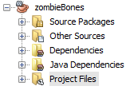
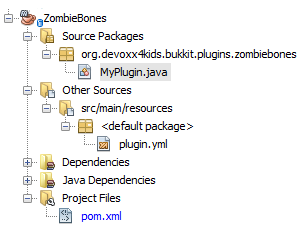
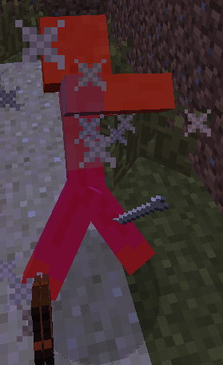
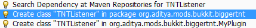
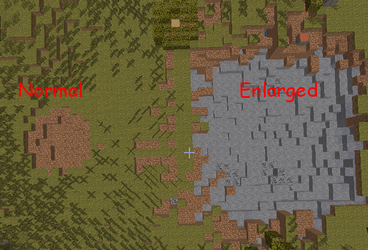

[[More_Listeners]]
== More Listeners

The last chapter explained how you can ``listen'' for events and do something when you find them. In this chapter, we will be exploring more events that you can use and more things you can do on them. First, we will make zombies drop bones. Next, we will make a plugin that makes TNT explosions much larger! Both of these plugins will use Listeners.

=== Zombies Dropping Bones

Let's start with the plugin that makes zombies drop bones. Normally, in Minecraft, zombies are the most common hostile mob, and they are also probably the most complicated. For example, they can wear armor and hold items/blocks. They also drop a lot of items. Normally, they drop rotten flesh, and sometimes they drop other items like carrots and potatoes. In the first part of this chapter, we will make a new plugin that makes them drop bones as well.

==== Create the plugin

Like all other plugins, the Bukkit Archetype will be used to create this plugin. The information that you enter should look like the information in <<ZombieBones_Plugin_Creation>>.

[[ZombieBones_Plugin_Creation]]
.ZombieBones plugin information

Click on ``Finish'' to create the plugin.

The directory structure, not expanded, should look like <<ZombieBones_Directory_Structure>>.

[[ZombieBones_Directory_Structure]]
.ZombieBones directory structure

When you open the ``Source Packages'', ``Other Sources'', and ``Project Files'' packages, it should look like as shown in <<ZombieBones_Expanded_Directory_Structure>>.

[[ZombieBones_Expanded_Directory_Structure]]
.ZombieBones expanded directory structure

Notice the initial structure of the plugins created so far is quite similar to the plugins created in earlier chapters. This directory has `org.devoxx4kids.bukkit.plugins.zombiebones.MyPlugin` class which is the entry point of the plugin, `plugin.yml` that defines plugin configuration, and `pom.xml` that defines instructions on how to build and install the plugin.

==== Register and create the Listener

Now, the plugin needs a Listener. Like Player Entry/Exit and Block Money, add a line in the `onEnable()` method in `MyPlugin.java` as shown in <<Registering_ZombieBones_Listener>>. It is similar to the registering lines of previous plugins.

[[Registering_ZombieBones_Listener]]
.Registering the ZombieBones Listener
====
[source,java]
----
getServer().getPluginManager()
.registerEvents(new BoneListener(), this);
----
====

This line registers the Listener, just like in previous chapters. Notice that the name of the Listener is different, because this is a different plugin. This code gets an instance of CraftBukkit server and register all events in the `BoneListener` class.

Click on the stop sign to show the drop-down menu in <<ZombieBones_Listener_Creation>>.

[[ZombieBones_Listener_Creation]]
.Creating the ZombieBones Listener
image::images/netbeans-create-plugin-zombie-bones-create-listener.png[]

The new Listener should look like <<ZombieBones_Listener>>.

[[ZombieBones_Listener]]
.ZombieBones Listener
====
[source, java]
----
package org.devoxx4kids.bukkit.plugins.zombiebones;

import org.bukkit.event.Listener;

/**
 * @author Aditya Gupta
 */
class BoneListener implements Listener {

    public BoneListener() {
    }

}
----
====

==== Adding event handlers

Only one method will have to be added, but it is not a short one, and looks like as shown in <<Listener_method_for_ZombieBones>>. It does all the work in this plugin.

[[Listener_method_for_ZombieBones]]
.Listener method for ZombieBones plugin
====
[source, java]
----
@EventHandler <1>
public void dropBones(EntityDeathEvent e) { <2>
    if (e.getEntityType() != EntityType.ZOMBIE){ <3>
        return;
    }
    Location location = e.getEntity().getLocation(); <4>
    World world = e.getEntity().getWorld(); <5>
        
    Random random = new Random(); <6>
    int i = random.nextInt(3); <7>
        
    world.dropItem(location, new ItemStack(Material.BONE, i)); <8>
}
----
====

This method has some important parts:

<1> As in plugins created so far, `@EventHandler` marks the method `dropBones` as listener.
<2> The method parameter `EntityDeathEvent` indicates that this method is called when an entity dies.
<3> `==` is used in an `if` statement to compare if two sides of the statement have equal values, and thus looking for the condition being true. The `!=` makes the `if` statement check for a condition being false. In this statement, if the entity is NOT a zombie, it will return, or stop running the method. `return` is another Java keyword, and the line that says `return;` is the one that stops the method.
<4> Makes a new variable called `location` that stores the entity's location. The variable is of the type `Location`, which is a type defined by Bukkit API and represents a 3-dimensional position in a world.
<5> Defines `world` variable of the type `World`. It stores the world that the entity is in. `World` is also defined by Bukkit API.
<6> Defines yet another variable, but this one is defined by standard Java programming language. It is called `random` and is of the type `java.util.Random`. An instance of this class is used to generate a stream of pesudorandom numbers.
<7> The `Random` variable is used here to get a random integer between 3 and 0. The value is assigned to an integer variable called `i`.
<8> This line actually drops the item in the world. The method is being called on the `world` variable, so it will drop in that world. The parameters of the variable are `location` and `new ItemStack(Material.BONE, i)`. `location` is the location of the entity, so it drops where the entity died. `new ItemStack(Material.BONE, i)` creates a new instance `ItemStack`, which is a stack of items. It is of the type `BONE`, and contains `i` number of items. 

The finished Listener should look like <<Finished_ZombieBones_Listener>>.

[[Finished_ZombieBones_Listener]]
.Finished ZombieBones Listener
====
[source, java]
----
package org.devoxx4kids.bukkit.plugins.zombiebones;

import java.util.Random;
import org.bukkit.Location;
import org.bukkit.Material;
import org.bukkit.World;
import org.bukkit.entity.EntityType;
import org.bukkit.event.EventHandler;
import org.bukkit.event.Listener;
import org.bukkit.event.entity.EntityDeathEvent;
import org.bukkit.inventory.ItemStack;

/**
 * @author Aditya Gupta
 */
class BoneListener implements Listener {

    public BoneListener() {
    }

    @EventHandler
    public void dropBones(EntityDeathEvent e) {
        if(e.getEntityType() != EntityType.ZOMBIE){
            return;
        }
        Location location = e.getEntity().getLocation();
        World world = e.getEntity().getWorld();
        
        Random random = new Random();
        int i = random.nextInt(3);
        
        world.dropItem(location, new ItemStack(Material.BONE, i));
    }
}

----
====

[NOTE]
====
You can remove the part that says `BONE` and press `Ctrl + SPACE` to show you a list of all the blocks/items the zombie can drop. Scroll through the list until you find the one that you want. Some of the names will be confusing (for example, diamond horse armor is called DIAMOND_BARDING). <<Control_Space_Item_List>> shows what the list of items looks like.
====

[[Control_Space_Item_List]]
.List of items from Ctrl + SPACE
image::images/netbeans-ctrl-space-item-list.png[]

==== Build and install the plugin

Like the other plugins, you will have to build the plugin by clicking on `Build' menu item before it can be used. If it successfully builds, it should output the message in <<Building_ZombieBones>>.

[[Building_ZombieBones]]
.Building the ZombieBones plugin
====
[source, text]
....
[antrun:run]
Executing tasks
     [copy] Copying 1 file to C:\Users\Aditya\Desktop\craftbukkit\plugins
Executed tasks
------------------------------------------------------------------------
BUILD SUCCESS
------------------------------------------------------------------------
....
====

Now, whenever you see a zombie and need some bones, you can kill it and get some! <<Zombie_Dropping_Bones>> shows a red-colored zombie dead on the floor. The white thing in the middle of the image is a bone that was dropped by the zombie.

[[Zombie_Dropping_Bones]]
.Zombie dropping a bone

NOTE: Sometimes, the zombie will drop ``ghost items'', which are items that cannot be picked up. If all of the dropped items are ghost items, you will just have to spawn and kill another zombie.

=== Bigger TNT Explosions

Next, we will make a plugin that makes bigger TNT explosions. TNT is a block in Minecraft and can be lit with a Flint and Steel item. There are multiple other ways to light it as well. However once lit, it will then explode after 4 seconds. Normally, TNT has a blast radius of 4 blocks, which isn't that big. Bigger TNT explosions are more fun and so we will change that and make the explosions bigger. One cool thing you can do with TNT is make cannons that shoot lit TNT for far distances.

==== Create the plugin

After making a few plugins, you should now be an expert in how to get started with creating a sample plugin. So, as always, we start with the Bukkit Archetype. The plugin information should match <<BiggerTNT_Plugin_Information>>.

[[BiggerTNT_Plugin_Information]]
.BiggerTNT plugin information

Finish the plugin creation and you should see a directory structure like <<BiggerTNT_Directory_Structure>>.

[[BiggerTNT_Directory_Structure]]
.BiggerTNT directory structure

When you expand the ``Source Packages'', ``Other Sources'', and ``Project Files'' packages, it should look like <<BiggerTNT_Directory_Structure_Expanded>>.

[[BiggerTNT_Directory_Structure_Expanded]]
.BiggerTNT expanded directory structure
image::images/netbeans-create-plugin-biggertnt-directory-structure-expanded.png[]

This directory has `org.devoxx4kids.bukkit.plugins.biggertnt.MyPlugin` class which is the entry point of the plugin, `plugin.yml` that defines plugin configuration, and `pom.xml` that defines instructions on how to build and install the plugin.

==== Create the Listener

Now, create a Listener like you did in the ZombieBones plugin. Add the line from <<BiggerTNT_Register_Listener>> in the `onEnable` method of `MyPlugin.java`.

[[BiggerTNT_Register_Listener]]
.Registering the BiggerTNT Listener
====
[source, java]
----
getServer().getPluginManager()
.registerEvents(new TNTListener(), this);
----
====

This code gets an instance of CraftBukkit server and register all events in the `TNTListener` class. Click on the stop sign and select the option shown in <<Creating_TNTListener_from_dropdown_menu>>.

[[Creating_TNTListener_from_dropdown_menu]]
.Creating the TNTListener from the drop-down menu

==== Adding event handlers

Now, a method will have to be added to the Listener. It looks like <<BiggerTNT_Listener_Method>>.

[[BiggerTNT_Listener_Method]]
.BiggerTNT Listener method
====
[source, java]
----
@EventHandler
public void makeExplosion(EntityExplodeEvent event) { <1>
    EntityType entitytype = event.getEntityType(); <2>
    World world = event.getEntity().getWorld(); <3>
    Location location = event.getEntity().getLocation(); <4>

    float power = 16.0F; <5>
    if (entitytype == EntityType.PRIMED_TNT) { <6>
        event.setCancelled(true); <7>
        world.createExplosion(location, power); <8>
    }
}
----
====

There are some important parts in this method:

<1> This method is called when an entity explodes. The entity can be a creeper, a primed TNT, or an ender crystal.
<2> A new variable is created that stores the entity's type.
<3> Another variable is created. This one stores the entity's world.
<4> A third variable is create here and stores the entity's location.
<5> A float variable with a value of 16 is created here. It is called `power`. It will be used to determine how big the TNT explosion is. If you set it to a value over 16, it will make an explosion with a 16 block radius, because that is the limit defined in the game's code.
<6> This if statement checks for the entity being a TNT. If it is, then the method will continue.
<7> This line cancels the event so that the small explosion never happens.
<8> This line creates the big explosion at the entity's world and location with the radius of `power`, which is 20.

==== Build and install the plugin

Now, the plugin must be built so that you can install it on your server. Right-click on the plugin and select ``Build''. The output that you get should look like <<BiggerTNT_Build_Output>>.

[[BiggerTNT_Build_Output]]
.BiggerTNT build output
====
[source, text]
....
[antrun:run]
Executing tasks
     [copy] Copying 1 file to C:\Users\Aditya\Desktop\craftbukkit\plugins
Executed tasks
------------------------------------------------------------------------
BUILD SUCCESS
------------------------------------------------------------------------
....
====

Now, a TNT will have a blast radius of 20 blocks. <<BiggerTNT_Explosions>> compares the size of a normal explosion to a enlarged one.

[[BiggerTNT_Explosions]]
.Comparison of TNT explosion sizes

The areas that are not green have been blown up. The small explosion didn't reach to stone, so the crater is brown from dirt. The big explosion's crater is gray because it contains stone. The big crater also contains other blocks you can find under the stone, like ores and gravel.

=== Summary

In this chapter, you explored more examples of Listeners and Event Handlers. First, you used `EntityDeathEvent` to make zombies drop bones on death. Next, you made TNT explosions much bigger with the `EntityExplodeEvent`. In the next chapter, you will learn how to add new commands, and how they can be integrated with Listeners.