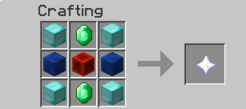
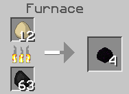
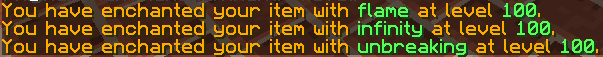

[[Fun_Plugins]]
== Recipes and Enchantments

In this chapter, you will learn how to make three new plugins. The first two will show how to create a new crafting recipe and a smelting recipe. The last one is how to have higher enchantments. Since you already know how to create a plugin, and now can easily guess the value required during plugin creation, this chapter will provide only the relevant code for the plugins.

This chapter and the two after it are mostly to show you the capabilities of the Bukkit API.

=== Crafting Recipe

Minecraft already has several predefined crafting recipes such as TBD. In some recipes, the configuration of the items matters. For example, TBD. These are called __shaped recipes__. In __shapeless recipes__, the placement of the items does not matter.

The end result of each crafting recipe is creation of a one or multiple item(s) or block(s). This plugin shows how to add a new shaped crafting recipe to the existing set of recipes.

Crafting recipe requires placement of ingredients in a 3x3 crafting table. Creating a new shaped recipe will require you to define the placement of these ingredients in the grid, one row at a time. The output item(s) or block(s) also need to be defined. <<onEnable_method_for_shaped_crafting_recipe>> shows how this can be specified in `onEnable` method of `MyPlugin.java`. Remember, you need to create the plugin following the steps explained in earlier chapters before making these edits.

[[onEnable_method_for_shaped_crafting_recipe]]
.onEnable method for shaped crafting recipe
====
[source,java]
----
@Override
public void onEnable() {
    getLogger().log(Level.INFO, "{0}.onEnable()", 
         this.getClass().getName());
    ShapedRecipe recipe = new ShapedRecipe( <1>
        new ItemStack(Material.NETHER_STAR, 1));
    recipe.shape("ded", "lnl", "ded"); <2>
    recipe.setIngredient('d', Material.DIAMOND_BLOCK) <3>
    recipe.setIngredient('e', Material.EMERALD)
    recipe.setIngredient('l', Material.LAPIS_BLOCK)
    recipe.setIngredient('n', Material.REDSTONE_BLOCK);
    getServer().addRecipe(recipe); <4>
}
----
====

<1> Creates a new `ShapedRecipe` Bukkit class where the output item will a single Nether Star. The exact list of materials is available at http://jd.bukkit.org/apidocs/org/bukkit/Material.html.
<2> Three rows of the crafting table are defined by three parameters in the `shape()` method. Each column in that row is defined by one character. And since a row has three columns, three characters are required to specify a row.
+
Any combination of characters can be used where each character represent a different ingredient. The mapping of each character to the actual ingredient is defined subsequently.
+
<3> The letters used in the recipe are mapped to the corresponding item using `setIngredient()` methods, one method call for each letter used in the recipe. For example, the letter ``e'' in the recipe signifies the item Emerald.
<4> The recipe is added to the server.

<<New_Crafting_Recipe>> shows the new crafting recipe in action. 

[[New_Crafting_Recipe]]
.New crafting recipe

The `org.bukkit.inventory.ShapelessRecipe` Bukkit class can be used to create a shapeless crafting recipe. The only difference between the two recipes is that there is no `shape()` method call. Only the ingredients and how many of them are required needs to be specified. This allows the specified number of items to be placed anywhere in the 3x3 grid to craft the output item.

[[onEnable_method_for_shapeless_crafting_recipe]]
.onEnable method for shapeless crafting recipe
====
[source,java]
----
@Override
public void onEnable() {
    getLogger().log(Level.INFO, "{0}.onEnable()", 
         this.getClass().getName());
    ShapelessRecipe recipe = new ShapelessRecipe( <1>
        new ItemStack(Material.DIAMOND, 1));
    recipe.setIngredient(5, Material.GRASS) <3>
    recipe.setIngredient(3, Material.DIRT);
    recipe.setIngredient(3, Material.PAPER);
    getServer().addRecipe(recipe); <4>
}
----
====

<<onEnable_method_for_shapeless_crafting_recipe>> shows how a diamond can be created using grass, paper, and dirt.

=== Smelting Recipe

Smelting is a method of producing refined goods. Smelting is done in __furnace blocks__ which takes one ``input'' ingredient that will be heated, one field for the fuel, and one ``output'' field for the final smelted product.

This plugin shows how to add a new smelting recipe. <<onEnable_method_for_smelting_recipe>> shows the `onEnable` method for `MyPlugin.java` for this plugin.

[[onEnable_method_for_smelting_recipe]]
.onEnable method for smelting recipe
====
[source,java]
----
@Override
public void onEnable() {
    getLogger().log(Level.INFO, "{0}.onEnable()", 
    this.getClass().getName());
    FurnaceRecipe recipe = new FurnaceRecipe( <1>
        new ItemStack(Material.DRAGON_EGG, 1), <2>
        Material.EGG <3>
    );
    getServer().addRecipe(recipe); <4>
}
----
====

<1> This recipe is a furnace recipe as identified by creating a new instance Bukkit-defined `FurnaceRecipe` class. The created recipe is stored in the `recipe` variable.
<2> This is the ``output'' item obtained from smelting. In this case, it is a Dragon Egg item. The second parameter defines the number of ``output'' items that will be obtained.
<3> This is the ``input'' ingredient that will be heated. In this case, it an Egg item. So one Egg item will be smelted to one Dragon Egg item.
<4> The recipe is added to the server.

<<New_Smelting_Recipe>> shows the new recipe in action. A stack of 16 eggs was put into the input slot, and four of them are already smelted. The four Dragon Eggs resulting from that are in the output slot at the right. The remaining 12 Eggs are still at the top and will be eventually smelted to Dragon Egg as well.

[[New_Smelting_Recipe]]
.New smelting recipe

=== Higher Enchantments

Enchantments can be added to armor or weapons to make them more powerful. However the level of enchantment is restricted. This plugin shows how higher enchantments can be enabled for the item currently held by the player. It shows that only for a small subset of enchantments. But similar mechanism may be applied to enable higher levels for other enchantments.

The plugin will introduce a new command that enables higher enchantment level. <<Tower_Builder>> provide more details about how to add new commands. The ``plugin.yml` required for this plugin is shown in <<plugin_yml_for_higher_enchantments>>. 

[[plugin_yml_for_higher_enchantments]]
.plugin.yml for higher enchantments
====
[source, yaml]
----
name: Enchantments
version: "1.0-SNAPSHOT"
author: Aditya Gupta
main: org.devoxx4kids.bukkit.plugins.enchantments.MyPlugin
<emphasis role="strong">commands:
   enchantment: <1>
      description: allows a higher enchantment level.
      usage: /enchantment <enchantment> <level> <2>
      aliases: ench</emphasis> <3>
----
====

Updated code is shown in bold.

<1> The command name is ``enchantment''. Note that the command name could not be ``enchant'' because that is a vanilla command that enchants items up to the normal limits.
<2> Usage requires to specify the enchantment and the level. The enchantment name should match the enchantment's in-game name, with underscores for spaces. The exact list of enchantment is shown at http://jd.bukkit.org/rb/apidocs/org/bukkit/enchantments/Enchantment.html.
<3> An alias for the command is ``ench''.

`onEnable()` method of `MyPlugin.java` needs to be updated and is shown in <<MyPlugin_for_higher_enchantments>>. In addition, `onCommand()` is added as well.

[[MyPlugin_for_higher_enchantments]]
.MyPlugin.java for higher enchantments
====
[source,java]
----
public class MyPlugin extends JavaPlugin {
    
    HashMap<String, Enchantment> enchantments = new HashMap(); <1>

    // This code is called after the server starts and after the /reload command
    @Override
    public void onEnable() {
        getLogger().log(Level.INFO, "{0}.onEnable()", 
        this.getClass().getName());
        enchantments.put("flame", Enchantment.ARROW_FIRE); <2>
        enchantments.put("infinity", Enchantment.ARROW_INFINITE);
        enchantments.put("knockback", Enchantment.KNOCKBACK);
        enchantments.put("fortune", Enchantment.LUCK);
        enchantments.put("blast_protection", Enchantment.PROTECTION_EXPLOSIONS);
        enchantments.put("unbreaking", Enchantment.DURABILITY);
    }

    // This code is called before the server stops and after the /reload command
    @Override
    public void onDisable() {
        getLogger().log(Level.INFO, "{0}.onDisable()", this.getClass().getName());
    }

    @Override
    public boolean onCommand(CommandSender sender, Command cmd, String label, String[] args) {
        if (!cmd.getName().equals("enchantment")) {
            return false;
        }
        if (!(sender instanceof Player)) {
            return false;
        }
        
        if (args.length != 2) { <3>
            sender.sendMessage(ChatColor.DARK_RED + cmd.getUsage());
            return false;
        }
        
        if (!enchantments.containsKey(args[0])) { <4>
            sender.sendMessage(ChatColor.RED + args[0] 
                + ChatColor.DARK_RED + " is not a supported enchantment!");
            return false;
        }
        
        int level;

        try{ <5>
            level = Integer.parseInt(args[1]);
        } catch (NumberFormatException nfe){
            sender.sendMessage(ChatColor.RED + args[1] 
                + ChatColor.DARK_RED + " is not a valid number!");
            return false;
        }
        
        ItemStack itemStack = ((Player) sender).getItemInHand(); <6>
        itemStack.addUnsafeEnchantment( <7>
            enchantments.get(args[0]), level); 

        ((Player) sender).sendMessage(ChatColor.GOLD <8>
            + "You have enchanted your item with " 
            + ChatColor.GREEN + args[0] 
            + ChatColor.GOLD + " at level " 
            + ChatColor.GREEN + level 
            + ChatColor.GOLD + ".");
        
        return true;
    }
}
----
====

<1> Create a `java.util.HashMap` class that will store the mapping between in-game and Bukkit name of enchantment
<2> `onEnable` method adds several mappings for in-game enchantment name to the Bukkit name of enchantment. The mappings shown here don't cover all of the enchantments, so all the other enchantments need to be added to make the command support them. The complete list of enchantments are liste at http://jd.bukkit.org/rb/apidocs/org/bukkit/enchantments/Enchantment.html.
<3> Checks that at least two parameters are specified, one for enchantment in-game name, and another one for the level. If not then a message is displayed to the player and further execution of the method is halted.
<4> Ensures that the first parameter is a valid enchantment. `containsKey` method ensures that the first command argument, identified by `args[0]` is in the `enchantments` map. If not, then a message is displayed to the user and further execution halted.
<5> Checks that the second argument, identified by args[1], is an integer. If it is not, a `NumberFormatException` is thrown, and the player is notified that their number is invalid.
<6> Gets the item player is holding by calling `getItemInHand()` Bukkit method on player.
<7> Sets the specified enchantment level. Note that `addUnsafeEnchantment` is used because it ignores level restrictions. `addEnchantment` would not allow you to make enchantments above the normal limits.
<8> Send the player a message telling them what enchantment they did and at what level. <<Enchantment_Output>> shows the output in the chat window.

[[Enchantment_Output]]
.HigherEnchantments chat output

The player in the above picture enchanted their item with Flame, Infinity, and Unbreaking, all at level 100.

=== Summary

In this chapter, you created three plugins. The first plugin added a new crafting recipe and we discussed how shaped and shapeless recipes can be created. The second plugin created a new smelting recipe. The last plugin added a new command to make higher enchantments.

The Java concepts learned in earlier chapters are applied and so the descriptions could be kept short. It shows how your overall Java knowledge is improving as well.

