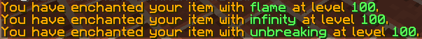
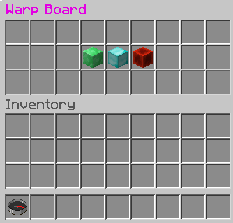

[[Fun_Plugins]]
== Fun Plugins

This chapter is targeted at readers who have gone through the previous chapters and would like to understand how the Bukkit API can be used to create some more fun plugins. Unlike earlier chapters, it neither provides a detailed process to generate the plugins, nor does it provides a detailed explanation of the source code. That makes it important to go through previous chapters first, because otherwise these plugins would not make much sense. However, each section discusses plugin's expected behavior, shares the source code, and provides a high level explanation of the code.

Lets have some fun!

=== Crafting Recipe

Minecraft already has several predefined crafting recipes. In some recipes, the configuration of the items matters. These are called __shaped recipes__. In __shapeless recipes__, the placement of the items does not matter. The end result of each crafting recipe is creation of a one or multiple item(s) or block(s). This plugin shows how to add a new shaped crafting recipe to the existing set of recipes.

Crafting recipe requires placement of ingredients in a 3x3 crafting table. Creating a new shaped recipe will require you to define the placement of these ingredients in the grid, and also define the output item(s) or block(s). <<onEnable_method_for_crafting_recipe>> shows how this can be specified in `onEnable` method of `MyPlugin.java`.

[[onEnable_method_for_crafting_recipe]]
.onEnable method for crafting recipe
====
[source,java]
----
@Override
public void onEnable() {
    getLogger().log(Level.INFO, "{0}.onEnable()", 
    this.getClass().getName());
    ShapedRecipe recipe = new ShapedRecipe( <1>
    new ItemStack(Material.NETHER_STAR, 1))
        .shape("ded", "lnl", "ded") <2>
        .setIngredient('d', Material.DIAMOND_BLOCK) <3>
        .setIngredient('e', Material.EMERALD)
        .setIngredient('l', Material.LAPIS_BLOCK)
        .setIngredient('n', Material.REDSTONE_BLOCK);
    getServer().addRecipe(recipe); <4>
}
----
====

<1> Creates a new `ShapedRecipe` where the output item will a Nether Star.
<2> Three rows of the crafting table are defined by three parameters in the `shape()` method. Any combination of characters can be used where each character represent a different ingredient. The mapping of each character to the actual ingredient is defined subsequently.
<3> The letters in the recipe are given items. For example, the letter ``e'' in the recipe signifies the item Emerald. The `setIngredient()` method lets you set which letter represents which item.
<4> The recipe is added to the server.

<<New_Crafting_Recipe>> shows the new crafting recipe.  

[[New_Crafting_Recipe]]
.New crafting recipe
image::images/new-crafting-recipe.PNG[]

The `org.bukkit.inventory.ShapelessRecipe` class can be used to create a shapeless crafting recipe.

=== Smelting Recipe

Smelting is a method of producing refined goods. Smelting is done in __furnace blocks__ which takes one ``input'' ingredient that will be heated, one field for the fuel, and one ``output'' field for the final smelted product.

This plugin shows how to add a new smelting recipe. <<onEnable_method_for_smelting_recipe>> shows the `onEnable` method for `MyPlugin.java` for this plugin.

[[onEnable_method_for_smelting_recipe]]
.onEnable method for smelting recipe
====
[source,java]
----
@Override
public void onEnable() {
    getLogger().log(Level.INFO, "{0}.onEnable()", 
    this.getClass().getName());
    FurnaceRecipe recipe = new FurnaceRecipe( <1>
        new ItemStack(Material.DRAGON_EGG, 1), <2>
        Material.EGG <3>
    );
    getServer().addRecipe(recipe); <4>
}
----
====

<1> This recipe will be a `FurnaceRecipe`, and the recipe variable is called `recipe`.
<2> This is the ``output'' item obtained from smelting. In this case, it is a Dragon Egg item. The second parameter defines the number of ``output'' items that will be obtained.
<3> This is the ``input'' ingredient that will be heated. In this case, it a Egg item.
<4> The recipe is added to the server.

<<New_Smelting_Recipe>> shows the new recipe in action. A stack of 16 eggs was put into the input slot, and four of them were smelted. The four Dragon Eggs resulting from that are in the output slot at the right. The remaining 12 Eggs are still at the top.

[[New_Smelting_Recipe]]
.New smelting recipe
image::images/new-smelting-recipe.png[]

=== Higher Enchantments

Enchantments can be added to armor or weapons to make them more powerful. However the level of enchantment is restricted. This plugin shows how higher enchantments can be enabled for the item currently held by the player. It shows that only for a small subset of enchantments. But similar mechanism may be applied to enable higher levels for other enchantments.

The plugin will introduce a new command that enables higher enchantment level. This is enabled by adding `plugin.yml` as shown in <<plugin_yml_for_higher_enchantments>>. <<Making_New_Commands>> provide more details about how to add new commands. 

[[plugin_yml_for_higher_enchantments]]
.plugin.yml for higher enchantments
====
[source, yaml]
----
name: Enchantments
version: "1.0-SNAPSHOT"
author: Aditya Gupta
main: org.devoxx4kids.bukkit.plugins.enchantments.MyPlugin
commands:
   enchantment: <1>
      description: allows a higher enchantment level.
      usage: /enchantment <enchantment> <level> <2>
      aliases: ench <3>
----
====

<1> The command name is ``enchantment''
<2> Usage requires to specify the enchantment and the level. The enchantment name should match the enchantment's in-game name, with underscores for spaces.
<3> Alias for the command is ``ench''

[[MyPlugin_for_higher_enchantments]]
.MyPlugin.java for higher enchantments
====
[source,java]
----
public class MyPlugin extends JavaPlugin {
    
    Map<String, Enchantment> enchantments = new HashMap<>(); <1>

    // This code is called after the server starts and after the /reload command

    @Override
    public void onEnable() {
        getLogger().log(Level.INFO, "{0}.onEnable()", 
        this.getClass().getName());
        enchantments.put("flame", Enchantment.ARROW_FIRE); <2>
        enchantments.put("infinity", Enchantment.ARROW_INFINITE); <2>
        enchantments.put("knockback", Enchantment.KNOCKBACK); <2>
        enchantments.put("fortune", Enchantment.LUCK); <2>
        enchantments.put("blast_protection", <2>
        Enchantment.PROTECTION_EXPLOSIONS);
        enchantments.put("unbreaking", Enchantment.DURABILITY); <2>
    }

    // This code is called before the server stops and after the /reload command
    @Override
    public void onDisable() {
        getLogger().log(Level.INFO, "{0}.onDisable()", this.getClass().getName());
    }

    @Override
    public boolean onCommand(CommandSender sender, Command cmd, String label, String[] args) {
        if (!cmd.getName().equals("enchantment")) {
            return false;
        }
        if (!(sender instanceof Player)) {
            return false;
        }
        
        if (args.length != 2) { <3>
            sender.sendMessage(ChatColor.DARK_RED + cmd.getUsage());
        }
        
        if (!enchantments.containsKey(args[0])) { <4>
            return false;
        }
        
        int level;

        try{ <5>
            level = Integer.parseInt(args[1]);
        } catch (NumberFormatException nfe){
            sender.sendMessage(ChatColor.RED + args[1] 
                + ChatColor.DARK_RED + " is not a valid number!");
            return false;
        }
        
        ItemStack itemStack = ((Player) sender).getItemInHand(); <6>
            itemStack.addUnsafeEnchantment( <7>
            enchantments.get(args[0]), level); 

        ((Player) sender).sendMessage(ChatColor.GOLD <8>
            + "You have enchanted your item with " 
            + ChatColor.GREEN + args[0] 
            + ChatColor.GOLD + " at level " 
            + ChatColor.GREEN + level 
            + ChatColor.GOLD + ".");
        
        return true;
    }
}
----
====

<1> Create a `java.util.Map` that will store the mapping between in-game and Bukkit name of enchantment
<2> `onEnable` method adds several mappings for in-game enchantment name to the Bukkit name of enchantment. The mappings shown here don't cover all of the enchantments, so all the other enchantments need to be added to make the command support all enchantments.
<3> Checks that at least two parameters are specified, one for enchantment in-game name, and another one for the level
<4> Ensures that the first parameter is an enchantment supported by this plugin
<5> Checks that the second parameter is an integer. If it is not, a `NumberFormatException` is thrown, and the player is notified that their number is invalid.
<6> Gets the item player is holding
<7> Sets the specified enchantment level. Note that `addUnsafeEnchantment` method is used which ignores level restrictions.
<8> Send the player a message telling them what enchantment they did and at what level. <<Enchantment_Output>> shows the output in the chat window.

[[Enchantment_Output]]
.HigherEnchantments chat output

The player in the above picture enchanted their item with Flame, Infinity, and Unbreaking, all at level 100.

=== Warp Board

This plugin will show how to create new inventory in your server.

This plugin is very useful for large servers. When a player joins the game, they are given a compass in their inventory that is renamed ``Warp Board'' in gold letters. When they right-click with it, it opens up an inventory with the same size as a small chest. The inventory contains three items:

. Emerald Block
. Diamond Block
. Redstone Block

When a player clicks on one of the icons, he/she gets teleported to a specific place. The player can also do the command `/warpboard` or `/wb` to open up the Warp Board. The Warp Board looks like as shown in <<WarpBoard_Minecraft_Inventory>>.

[[WarpBoard_Minecraft_Inventory]]
.Warp Board

The bottom inventory is the player's inventory, and the top inventory is the Warp Board. The compass is shown in the bottom left corner as part of player's inventory and the three items are shown in the Warp Board's inventory.

To make the plugin, use the Bukkit Recipe to create a new plugin. In `plugin.yml`, the `/warpboard` command will have to be registered as shown in <<WarpBoard_Registering_Command>>.

[[WarpBoard_Registering_Command]]
.Registering the /warpboard command
====
[source, yaml]
----
commands:
    warpboard:
        description: Opens up a Warp Board from which players can teleport to different places.
        usage: /warpboard
        aliases: wb
----
====

This code goes at the bottom of `plugin.yml`. It registers the `/warpboard` command with an alias: `/wb`. No arguments need to be specified to open the board.

Now, the command handler in `MyPlugin.java` needs to be updated. For that, you will first have to make a variable at the top of the class file, like <<WarpBoard_Inventory_Variable>>.

[[WarpBoard_Inventory_Variable]]
.WarpBoard inventory variable
====
[source,java]
----
public Inventory inv;
----
====

This variable will store the inventory that will be shown to the player.

Next, two new methods will have to be added to the bottom of the file, before the last `}`. They are shown in <<WarpBoard_MyPlugin_java_Methods>>.

[[WarpBoard_MyPlugin_java_Methods]]
.WarpBoard MyPlugin.java methods
====
[source,java]
----
@Override
public boolean onCommand(CommandSender sender, Command cmd, String label, String[] args) { <1>
    if (!(cmd.getName().equals("warpboard"))) {
        return false;
    }
    if(!(sender instanceof Player)){
        return false;
    }
        
    openGUI(((Player) sender));
        
    return true;
}
    
public void openGUI(Player p) { <2>
    ItemStack isEmerald = new ItemStack(Material.EMERALD_BLOCK); <3>
    ItemMeta imEmerald = isEmerald.getItemMeta();
    imEmerald.setDisplayName(ChatColor.GOLD + "Warp to " <4>
        + ChatColor.GREEN + "Emerald Land");
    isEmerald.setItemMeta(imEmerald);
        
    ItemStack isDiamond = new ItemStack(Material.DIAMOND_BLOCK);
    ItemMeta imDiamond = isDiamond.getItemMeta();
    imDiamond.setDisplayName(ChatColor.GOLD + "Warp to " 
        + ChatColor.BLUE + "Diamond Land");
    isDiamond.setItemMeta(im2);
    
    ItemStack isRedstone = new ItemStack(Material.REDSTONE_BLOCK);
    ItemMeta imRedstone = isRedstone.getItemMeta();
    imRedstone.setDisplayName(ChatColor.GOLD + "Warp to " 
        + ChatColor.RED + "Redstone Land");
    isRedstone.setItemMeta(imRedstone);
        
    inv = Bukkit.createInventory(p, 27, ChatColor.DARK_PURPLE <5>
        + "Warp Board"); 
    inv.setItem(12, isEmerald); <6>
    inv.setItem(13, isDiamond);
    inv.setItem(14, isRedstone);
    p.openInventory(inv); <7>
}
----
====

<1> This method is like all other `onCommand()` methods - it checks for the appropriate command name or one of its aliases. It also returns if the sender isn't a player because a command block or the console cannot open an inventory. A check for arguments is not required because no arguments are needed for this command.
<2> The bottom method, `openGUI(Player p)`, is where all the magic happens.
<3> Creates three new `ItemStack` variables, one each for emerald, diamond, and redstone block.
<4> Sets the name of the item to text like ``Warp to Emerald Land'', one for each block. The text ``Warp to'' is highlighted in gold color and the name of the element is highlighted in green, blue, and red color respectively.
<5> Create the inventory with the name ``Warp Board'' in purple letters.
<6> Set the three middle slots, identified by 12, 13, and 14, in the inventory to the previously created `ItemStack`s.
<7> Opens the inventory and show it to the player.

Lastly, a Listener will be created to check for the items being clicked on. Create a Listener, delete the constructor, and add in the code from <<WarpBoard_Listener_Methods>>.

[[WarpBoard_Listener_Methods]]
.WarpBoard Listener methods
====
[source, java]
----
@EventHandler
public void InventoryClick(InventoryClickEvent e) { <1>
    Player p = (Player) e.getWhoClicked();

    if (!e.getInventory().getTitle()
    .contains(ChatColor.DARK_PURPLE + "Warp Board")) {
        return;
    }
    e.setCancelled(true);

    if (e.getCurrentItem().getType() == Material.EMERALD_BLOCK) { <2>
        p.sendMessage(ChatColor.GOLD + "Warping to " 
            + ChatColor.GREEN + "Emerald Land");
        p.teleport(new Location(p.getWorld(), 0.5, 100, 0.5));
    } else if (e.getCurrentItem().getType() == Material.DIAMOND_BLOCK) {
        p.sendMessage(ChatColor.GOLD + "Warping to " 
            + ChatColor.BLUE + "Diamond Land");
        p.teleport(new Location(p.getWorld(), 100.5, 100, 0.5));
    } else if (e.getCurrentItem().getType() == Material.REDSTONE_BLOCK) {
        p.sendMessage(ChatColor.GOLD + "Warping to " 
            + ChatColor.RED + "Redstone Land");
        p.teleport(new Location(p.getWorld(), 200.5, 100, 0.5));
    }
}
    
@EventHandler
public void openCustomInventory(PlayerInteractEvent e){ <3>
    if(e.getAction() != Action.RIGHT_CLICK_AIR && e.getAction() != Action.RIGHT_CLICK_BLOCK){
        return;
    }
    if(!e.getItem().getItemMeta().getDisplayName()
        .equals(ChatColor.GOLD + "Warp Board")){
        return;
    }
    e.getPlayer().performCommand("warpboard"); <4>
}
    
@EventHandler
public void giveWarpBoardCompass(PlayerJoinEvent e){ <5>
    Player p = e.getPlayer();
    ItemStack is = new ItemStack(Material.COMPASS);
    ItemMeta im = is.getItemMeta();
    im.setDisplayName(ChatColor.GOLD + "Warp Board");
    is.setItemMeta(im);
    p.getInventory().setItem(0, is);
}
----
====

<1> Checks for an `InventoryClickEvent`, which happens when a player clicks something in an inventory.
<2> Three ``if'' statements check if the player is clicking on an Emerald, Diamond or Redstone Block. If the player is clicking on one of those then a message is shown telling them where they are warping to.
<3> Checks for an `PlayerInteractEvent`, which is called when a player interacts with the world.
<4> Checks for a player right-clicking with a compass renamed to ``Warp Board'' in gold letters. If that happens, it does the `/warpboard` command from the player who clicked with the compass.
<5> Checks for a `PlayerJoinEvent`, which happens when a player joins the server. Gives the player a compass when they join. It is called ``Warp Board'' in gold letters, which is impossible to legitimately obtain in Minecraft - you need plugins to do it for you. That way, players cannot craft Warp Boards. The compass is placed in the first slot of the player's hotbar.

Now, you can build the plugin, install it, and restart or reload your server for the changes to take place. You should start off with the compass mentioned in the beginning of this plugin's explanation. Right-click with it to open the Warp Board. Alternatively you can use the `/warpboard` command to open it. Warp to all the places and build things at each of those places. The items in the Warp Board are renamed to ``Warp to [Item Name] Land'', so you should build things out of their corresponding warp item. One example of a warp is shown in <<WarpBoard_Emerald_Land>> and it is used with the Emerald Land warp.

[[WarpBoard_Emerald_Land]]
.Emerald Land warpboard example
image::images/minecraft-emerald-land-warp.png[]

=== TNT Magnet

This next plugin is very explosive! 

Whenever a TNT block is placed, it turns into a TNT magnet. After 5 seconds, it will detonate, and all mobs around it will be teleported to it just before. In this way, you can destroy all mobs in an 8 block radius around the TNT.

In order to display a countdown timer in the chat console that shows ``TNT will explode in 5 seconds'', ``TNT will explode in 4 seconds'' and so on, we'll use `BukkitRunnable`. This class allows us to execute a piece of code at a later time, blow up TNT after 5 seconds in our case. This is called as __defining work__ in Bukkit. This can be easily achieved by making any class extend from `BukkitRunnable`. This code, or ``work'', may be scheduled to be executed repeatedly at a fixed interval, show a message every 1 second in our case. This is called as __scheduling work__ in Bukkit. This can be achieved by using any of the `run` methods in `BukkitRunnable`.

This plugin doesn't need anything in `MyPlugin.java` except for a line that registers the Listener. The Listener itself is pretty straight forward and is shown in <<TNTMagnet_Listener_Method>>.

[[TNTMagnet_Listener_Method]]
.TNTMagnet Listener methods
====
[source, java]
----
@EventHandler
public void explodeTNT(BlockPlaceEvent e) { <1>
    Block block = e.getBlock();
    
    if (block.getType() != Material.TNT) { <2>
        return;
    }

    e.getPlayer().sendMessage(ChatColor.GOLD + "You have placed a " <3>
        + ChatColor.RED + "TNT Magnet" + ChatColor.GOLD 
        + "! It will detonate in " + ChatColor.DARK_PURPLE 
        + "5 " + ChatColor.GOLD + "seconds.");
    
    new TNTTask(4, e.getPlayer(), block). <4>
    runTaskTimer(this.plugin, 0, 20); <5>
}
----
====

<1> The method is run on a `BlockPlaceEvent`, called when a block is placed by the player.
<2> If the block is not TNT, the method returns.
<3> `TNTTask` is a new class that defines the ``work'', showing a message with countdown timer and blowing up TNT in our case. The first parameter indicates how many times the task needs to be executed. Second parameter is the player and third parameter is the block where TNT is placed. This class will be explained more in <<TNTMagnet_Runnable>>.
<4> The `runTaskTimer()` method from `BukkitRunnable` schedules a task repeatedly until cancelled. It takes three parameters. The first parameter is the plugin that is scheduling the task. The second parameter is the ticks to wait before running the task, 0 means start without any delay in our case. The third parameter is the ticks to wait between runs, 20 ticks is 1 second and so wait 1 second between each subsequent run of the task.

One last file will have to be created for this plugin. It will be the `TNTTask` Runnable file that is used by the scheduler. It should look like <<TNTMagnet_Runnable>>.

[[TNTMagnet_Runnable]]
.TNTMagnet Runnable class
====
[source, java]
----
public class TNTTask extends BukkitRunnable { <1>

    private int counter; <2>
    Player player;
    Block block;

    public TNTTask(int counter, Player p, Block b) { <3>
        this.player = p;
        this.block = b;
        this.counter = counter;
    }

    @Override
    public void run() { <4>
        if (counter > 0) { <5>
            player.sendMessage(ChatColor.GOLD + "Detonating in "
            + ChatColor.DARK_PURPLE + counter-- + ChatColor.GOLD 
            + " seconds!");

            return;
        }
        player.sendMessage(ChatColor.GOLD + "Your " <6>
            + ChatColor.RED + "TNT Magnet " 
            + ChatColor.GOLD + "has detonated!");

        Entity bat = block.getWorld().spawnEntity(new Location <7>
            (block.getWorld(), block.getX() + 0.5, block.getY() + 0.5,
            block.getZ() + 0.5), EntityType.BAT);

        List<Entity> entitylist = ((LivingEntity) bat)
            .getNearbyEntities(4.0, 4.0, 4.0);

        bat.remove();

        for (int i = 0; i < entitylist.toArray().length; i++) { <8>
            entitylist.get(i).teleport(new Location(block.getWorld(),
            block.getX() + 0.5, block.getY() + 0.5, block.getZ() + 0.5));
        }

        block.setType(Material.AIR);

        TNTPrimed tnt = (TNTPrimed) block.getWorld().spawnEntity(
        new Location(block.getWorld(), block.getX() + 0.5,
        block.getY() + 0.5, block.getZ()), EntityType.PRIMED_TNT);

        tnt.setFuseTicks(0);

        this.cancel(); <9>
    }
}

----
====

<1> This class extends from `BukkitRunnable`.
<2> Three variables are created. The first one will be used to determine how many seconds are left until the TNT explodes. The other two will store the player who placed the TNT and the TNT itself.
<3> The player, block, and counter variables are set to the ones given in the constructor.
<4> The method `run()` in any BukkitRunnable is executed when the class is instantiated in the Listener.
<5> If the counter is greater than 0, the player is sent a message telling them how much time is remaining before their TNT Magnet explodes. The method also returns.
<6> If the method has not returned, the counter is equal to 0, and it is time for the TNT Magnet to explode. The player is sent a message telling them that their TNT Magnet has detonated.
<7> A bat is spawned at the location of the TNT, and its nearby entities are stored in a list. A bat is a good mob to spawn because it is so small you cannot see it outside the TNT. The bat is then removed.
<8> All the entities in the list are teleported to the TNT. This is done using a ``for'' loop that runs through the entire list. The TNT is then removed by setting it to AIR, and primed TNT is spawned there with no fuse, so it blows up automatically.
<9> `this.cancel()` cancels the task so it does not keep repeating forever.

To use this plugin, find a mob that you would like to blow up and place a TNT block next to it. After 5 seconds, if the mob hasn't moven out of range, it will be dead from the force of the explosion, especially if you have the BiggerTNTExplosions plugin installed.

More details about Bukkit Schedulers can be found at http://wiki.bukkit.org/Scheduler_Programming.

=== Rocket Launcher

This yet another fun plugin that will add a ``rocket launcher'' which throws explosive fireballs with 2.5 times the power of TNT. The rocket launcher will be a Diamond Horse Armor item by default, but you can change it to whatever you want. The plugin will also add a ``safety'' feature that lets you turn the rocket launcher on or off, so it doesn't shoot fireballs when you don't want it to.

First of all, like every other plugin, use the Bukkit Recipe to create a new plugin.

This plugin doesn't need anything in `MyPlugin.java` except for a line that registers a Listener. This line can be found in the plugins in previous chapters.

In the Listener, the code from <<RocketLauncher_Listener_Methods>> will have to be added. This code does all the work of firing fireballs and turning safety on/off.

[[RocketLauncher_Listener_Methods]]
.RocketLauncher Listener methods
====
[source, java]
----
Map<String, Boolean> safety = new HashMap<>(); <1>

@EventHandler
public void checkForNewPlayer(PlayerJoinEvent e){ <2>
    if (!(safety.containsKey(e.getPlayer().getName()))) {
        safety.put(e.getPlayer().getName(), true);
    }
}

@EventHandler
public void fireGun(PlayerInteractEvent e) {
    Player p = e.getPlayer();
    
    if(e.getAction() == Action.LEFT_CLICK_AIR |
    | e.getAction() == Action.LEFT_CLICK_BLOCK){ <3>
        
        if(e.getPlayer().getItemInHand().getType() 
        != Material.DIAMOND_BARDING){
            return;
        }
        
        if(safety.get(p.getName())){
            safety.put(p.getName(), false);
            p.sendMessage(ChatColor.AQUA + "Safety is now OFF.");
        } else {
            safety.put(p.getName(), true);
            p.sendMessage(ChatColor.AQUA + "Safety is now ON.");
        }
        
        return;
    }
    
    if (e.getAction() != Action.RIGHT_CLICK_AIR 
        && e.getAction() != Action.RIGHT_CLICK_BLOCK) { <4>
        return;
    }
    if (p.getItemInHand().getType() != Material.DIAMOND_BARDING ||
        safety.get(p.getName())) {
        return;
    }
        
    Fireball f = e.getPlayer().launchProjectile(Fireball.class);
    f.setIsIncendiary(false);
}

@EventHandler
public void makeBigExplosion(EntityExplodeEvent event) { <5>
    Entity e = event.getEntity();

    if (!(e instanceof Fireball)) {
        return;
    }
    Fireball f = (Fireball) e;
    if (f.isIncendiary()) {
        return;
    }
    World w = f.getWorld();
    w.createExplosion(f.getLocation(), 10.0F);
    event.setCancelled(true);
}
----
====

There are some important parts in this code:

<1> A `HashMap` is created in which each player's safety value is stored. `true` means the safety is on and `false` means the safety is off.
<2> This method is called when a player joins the server. It checks if the player has a value in the safety HashMap. If the player does not have a value in the HashMap, it gives the player a value of `true`, meaning the player's safety is on. Otherwise, it does nothing.
<3> If a player is left-clicking the air or a block, this part of the `fireGun()` method is run. If the item in the player's hand is not a Diamond Horse Armor (DIAMOND_BARDING), the method returns. Then, if the player's safety is on, it is now turned off, and the player is notified of that. If the player's safety is off, it is now turned on, and the player is sent a message about that as well.
<4> The two ``if'' statements after this mark are checking for a few conditions. They are checking whether the player is right-clicking, whether he/she is holding a Diamond Horse Armor, and whether the player's saftey is off. If all these conditions are true, a fireball is fired from the player's location, and it is not incendiary, meaning it doesn't make fire. This property is used to identify it as a rocket launcher fireball and not as any other fireball.
<5> Checks for an `EntityExplodeEvent`, which happens when an entity explodes. By default, the rocket laucher fireball makes a small explosion with a radius of 1 block when it hits the ground. This method makes the explosion larger. Since the method is run when any entity explodes, two ``if'' statements check whether the entity is a Fireball and whether it is incendiary. If both those conditions are true, an explosion with a radius of 10 blocks is made at the fireball's location. The event is also cancelled so that the original explosion is not made.

Now, build the plugin and install it into your server. Get a Diamond Horse Armor from your inventory, turn the safety off by left-clicking with it, and blow up whatever you want! <<RocketLauncher_Explosion>> shows the size of an explosion made by a rocket launcher.

[[RocketLauncher_Explosion]]
.RocketLauncher explosion
image::images/rocket-launcher-explosion.png[]

=== Summary

This chapter showed you some examples of fun plugins that can be made using the Bukkit API. New crafting and smelting recipes were added, extremely high enchantments were made, mobs were blown up with TNT magnets, a new inventory was made, and highly explosive rocket launchers were added.

After finishing these examples, try making some plugins yourself! A full documentation of the Bukkit API can be found at http://jd.bukkit.org/beta/apidocs/.
