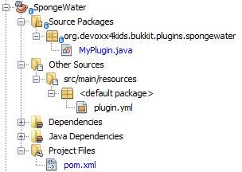

[[Sponge]]
== Sponge Water
In this chapter, we will make a plugin that makes removing water easier. When you place a sponge, it will replace all water directly adjacent to it with glass. It may look like it is building a structure and indeed it builds a shell of glass around it.

New structures can be built either with Listeners or commands. The plugin in this chapter will use a Listener, while the next chapter will utilize commands.

In the very early versions of Minecraft, sponges actually did absorb water. The sponges made an area of air around them to ward away water. This functionality was removed in later versions, so a lot of work was required if a player wanted to remove water. The only ways they could achieve that were very hard to do and usually did not work. This plugin will make sponges do what they used to do - absorb water.

=== Create the plugin

Like all other plugins, this one starts with the Bukkit Recipe. The information for plugin creation is quite similar to <<PlayerEntryExit_Plugin_Details_Image>>. <<SpongeWater_plugin_values>> shows the values that needs to be updated.

[[SpongeWater_plugin_values]]
.ThrowEgg plugin updated values
[options="header", cols="1,3"]
|====
| Field | Value
| Project Name | SpongeWater
| Package | org.devoxx4kids.bukkit.plugins.spongewater
|====

Click on `Finish' button to complete the plugin creation and open the project. The expanded directory should look like as shown in <<SpongeWater_Directory_Structure_Expanded>>.

[[SpongeWater_Directory_Structure_Expanded]]
.SpongeWater expanded directory structure

Like other plugins created so far, there is `org.devoxx4kids.bukkit.plugins.spongewater.MyPlugin` as the entry point to plugin, `plugin.yml` that defines plugin configuration, and `pom.xml` that defines instructions on how to build and install the plugin.

=== Register and create the Listener

First of all, a Listener will have to be registered for this plugin. The code for registering the Listener needs to be specified in `onEnable()` method of `MyPlugin.java` and can be found in <<SpongeWater_Registering_Listener>>. You know how to add code to `onEnable()` method. If you've forgotten then refresh your memory by referring to similar section from previous chapters.

[[SpongeWater_Registering_Listener]]
.Register the SpongeWater Listener
====
[source, java]
----
getServer()
    .getPluginManager()
    .registerEvents(new SpongeListener(this), 
        this);
----
====

Unlike the last plugins, instead of creating a default instance using `new SpongeListener()`, we are passing `this` as the parameter to the constructor. `this` is a Java keyword and refers to the _current object_, which is an instance of the `MyPlugin.java` class in our case. This allows the Listener to use the methods from `MyPlugin.java`, especially the plugin's logger.

Click on the stop sign next to the line in <<SpongeWater_Registering_Listener>> and choose the option `Create class "SpongeListener" with constructor "SpongeListener(org.devoxx4kids.bukkit.plugins.spongewater.MyPlugin)" in pakage org.devoxx4kids.bukkit.plugins.spongewater` to create the Listener class. This is shown <<SpongeWater_Creating_Listener>>.

[[SpongeWater_Creating_Listener]]
.Creating the SpongeWater Listener
image::images/netbeans-create-plugin-sponge-water-create-listener.png[]

A new Java source file is generated and opened in NetBeans main window.

=== Add event handlers

By default, the Listener doesn't do anything, so lets add functionality for the sponges to work. The code from <<SpongeWater_Listener_Method>> will have to be added to the newly generated Listener class.

[[SpongeWater_Listener_Method]]
.SpongeWater Listener methods
====
[source, java]
----
@EventHandler
public void absorbWater(BlockPlaceEvent event) { <1>
    Block eventblock = event.getBlock(); <2>
    World world = eventblock.getWorld();
    if (eventblock.getType() != Material.SPONGE) {
        return;
    }

    plugin.getLogger().info("Sponge place detected."); <3>

    int radius = 1; <4>

    int x = eventblock.getX();
    int y = eventblock.getY();
    int z = eventblock.getZ();

    int waterBlocksFound = 0;

    for (int xx = x - radius; xx <= x + radius; xx++) { <5>
        for (int yy = y - radius; yy <= y + radius; yy++) {
            for (int zz = z - radius; zz <= z + radius; zz++) {
                Block block = world.getBlockAt(xx, yy, zz);
                if (block.getType() == Material.WATER 
                || block.getType() == Material.STATIONARY_WATER) {
                    block.setType(Material.GLASS);
                    waterBlocksFound++;
                }
            }
        }
    }
    plugin.getLogger().log(Level.INFO, 
    "Replaced {0} water blocks with glass.", waterBlocksFound); <6>
}
----
====

As you can realize by now, a Listener class has one or more event handlers, each identified by a Java method marked with `@EventHandler`. Lets understand this ode now.

<1> Using `BlockPlaceEvent` Bukkit class as the Java method parameter ensures that this method is called whenever a block is placed by the player. As explained earlier, the name of the method does not matter, and just placing the `@EventHandler` annotation above the method is sufficient.
<2> Two variables are created, `eventBlock` to store the event's block and `world` to store the event's world. If the block is not a Sponge, then the method returns without doing anything because this method is looking only for sponges. If the block is a Sponge, the method continues.
<3> A message is logged in the console saying that a sponge has been placed.
<4> A few variables are created. `radius` is initialized with a value of 1 and indicates the radius of blocks that will be converted into glass. Three more variables, `x`, `y`, and `z` are created to store the block's position. One last variable, `waterBlocksFound`, is created to log the number of water blocks that were converted into glass.
<4> We learned about for loops in earlier chapters. Java allows _nesting_ of for loops, or using another for loop within a for loop. The first for loop is called as _outside for loop_ and the second for loop is called as _inner for loop_. This allows the inner for loop to be executed for each iteration of the outside for loop. In this case, there are three nested for loop.
+
Three loops allow to go through all the blocks in a one-block radius around the sponge. If they find a water block, it is turned into a glass. The `waterBlocksFound` is also incremented each time. Note `++` operator is used to auto-increment the value of `waterBlocksFound`.
<5> A message is logged in the server console that states the number of water blocks found and turned into Glass.

=== Install and verify

This plugin is now complete! Build it and install it to your server to use it. You can change the `radius` variable to whatever you want the radius to be. It's a good idea to keep it under 4 because otherwise you could become trapped in the glass. You have to be under five blocks away from a block to place something on it, so if you are too close, the glass could be placed where you are standing, trapping you.

[[SpongeWater_Minecraft_Output]]
.SpongeWater sponges in water
image::images/netbeans-create-plugin-sponge-water-minecraft-output.png[]

<<SpongeWater_Minecraft_Output>> shows what happens if you put multiple sponges in a row. The yellow blocks are sponges, and they are surrounded by transparent glass. The glass is surrounded by blue water.

=== Summary

This chapter showed how you can use sponges to remove water from the world. When a sponge was placed, it turned all water in a one-block radius into glass. In the next chapter, you will use commands to make towers of any block and any height.  

We also learned about `this` keyword in Java and nested for loops.

