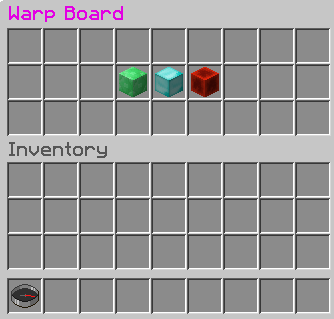
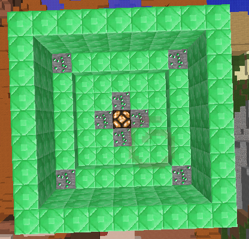

[[Warp_Board]]
== Warp Board

This is the last plugin that we will make in this book. The plugin will show you how to add a custom inventory with three clickable items. Each click will teleport you to a different place. It will be called a Warp Board.

=== Warp Board

This plugin is very useful for large servers. When a player joins the game, they are given a compass in their inventory that is renamed ``Warp Board'' in gold letters. When they right-click with it, it opens up an inventory with the same size as a small chest. The inventory contains three items:

. Emerald Block
. Diamond Block
. Redstone Block

When a player clicks on one of the icons, he/she gets teleported to a specific place. The player can also do the command `/warpboard` or `/wb` to open up the Warp Board. The Warp Board looks like as shown in <<WarpBoard_Minecraft_Inventory>>.

[[WarpBoard_Minecraft_Inventory]]
.Warp Board

The bottom inventory is the player's inventory, and the top inventory is the Warp Board. The compass is shown in the bottom left corner as part of player's inventory and the three items are shown in the Warp Board's inventory.

=== Registering the command

First thing is to use the Bukkit Recipe and create a new plugin. Choose the plugin name as `WarpBoard` and the package name as `org.devoxx4kids.bukkit.plugins.warpboard`.

In `plugin.yml`, the `/warpboard` command will have to be registered. Complete `plugin.yml` is shown in <<WarpBoard_Registering_Command>> and the updated portions are in bold.

[[WarpBoard_Registering_Command]]
.Registering the /warpboard command
====
[source, yaml]
name: WarpBoard
version: "1.0-SNAPSHOT"
author: Your Name
main: org.aditya.bukkit.plugins.warpboard.MyPlugin
commands:
    warpboard:
        description: Opens up a Warp Board from which players can teleport to different places.
        usage: /warpboard
        aliases: wb
====

It registers the `/warpboard` command with an alias: `/wb`. No arguments are needed to open the board.

=== Adding command functionality

Now, the command handler in `MyPlugin.java` needs to be updated. For that, you will first have to make a variable at the top of the class file, like <<WarpBoard_Inventory_Variable>>.

[[WarpBoard_Inventory_Variable]]
.WarpBoard inventory variable
====
[source,java]
----
public Inventory inv;
----
====

This variable will store the inventory that will be shown to the player.

Next, two new methods will have to be added to the bottom of the file, before the last `}`. They are shown in <<WarpBoard_MyPlugin_java_Methods>>.

[[WarpBoard_MyPlugin_java_Methods]]
.WarpBoard MyPlugin.java methods
====
[source,java]
----
@Override
public boolean onCommand(CommandSender sender, 
                         Command cmd, 
                         String label, 
                         String[] args) { <1>
    if (!(cmd.getName().equals("warpboard"))) {
        return false;
    }
    if(!(sender instanceof Player)){
        return false;
    }
        
    openGUI(((Player) sender));
        
    return true;
}
    
public void openGUI(Player p) { <2>
    ItemStack isEmerald = new ItemStack(Material.EMERALD_BLOCK); <3>
    ItemMeta imEmerald = isEmerald.getItemMeta();
    imEmerald.setDisplayName(ChatColor.GOLD + "Warp to " <4>
        + ChatColor.GREEN + "Emerald Land");
    isEmerald.setItemMeta(imEmerald);
        
    ItemStack isDiamond = new ItemStack(Material.DIAMOND_BLOCK);
    ItemMeta imDiamond = isDiamond.getItemMeta();
    imDiamond.setDisplayName(ChatColor.GOLD + "Warp to " 
        + ChatColor.BLUE + "Diamond Land");
    isDiamond.setItemMeta(imDiamond);
    
    ItemStack isRedstone = new ItemStack(Material.REDSTONE_BLOCK);
    ItemMeta imRedstone = isRedstone.getItemMeta();
    imRedstone.setDisplayName(ChatColor.GOLD + "Warp to " 
        + ChatColor.RED + "Redstone Land");
    isRedstone.setItemMeta(imRedstone);
        
    inv = Bukkit.createInventory(p, 27, ChatColor.DARK_PURPLE <5>
        + "Warp Board"); 
    inv.setItem(12, isEmerald); <6>
    inv.setItem(13, isDiamond);
    inv.setItem(14, isRedstone);
    p.openInventory(inv); <7>
}
----
====

<1> This method is like all other `onCommand()` methods - it checks for the appropriate command name or one of its aliases. It also returns if the sender isn't a player because a command block or the console cannot open an inventory. A check for arguments is not required because no arguments are needed for this command. If every thing looks good then it invokes another method and pass the player as a parameter.
<2> The second method, `openGUI(Player p)`, is where all the magic happens.
<3> Creates three new `ItemStack` variables, one each for emerald, diamond, and redstone block. `ItemStack` is used to create a stack of items. Different metadata can be attached to each stack, such as display name and enchantment of different levels.
<4> Sets the name of the item to text like ``Warp to Emerald Land'', one for each block. The text ``Warp to'' is highlighted in gold color and the name of the element is highlighted in green, blue, and red color respectively.
<5> Create the inventory with the name ``Warp Board'' in purple letters. The first parameter identifies the holder of the inventory, the player in this case. The second parameter defines the size of the inventory, must be a multiple of 9. Third and the last parameter is the title of the inventory that is displayed when it is viewed.
<6> Set the three middle slots, identified by 12, 13, and 14, in the inventory to the previously created `ItemStack`s.
<7> Opens the inventory and show it to the player.

=== Create the Listener and add event handlers

Lastly, a Listener will be created to check for the items being clicked on. Create a Listener by clicking on the stop sign and selecting the appropriate option. Add event handler code from <<WarpBoard_Listener_Methods>> to the Listener.

[[WarpBoard_Listener_Methods]]
.WarpBoard Listener methods
====
[source, java]
----
@EventHandler
public void giveWarpBoardCompass(PlayerJoinEvent e){ <1>
    Player p = e.getPlayer();
    ItemStack is = new ItemStack(Material.COMPASS);
    ItemMeta im = is.getItemMeta();
    im.setDisplayName(ChatColor.GOLD + "Warp Board");
    is.setItemMeta(im);
    p.getInventory().setItem(0, is);
}

@EventHandler
public void InventoryClick(InventoryClickEvent e) { <2>
    Player p = (Player) e.getWhoClicked(); <3>

    if (!e.getInventory().getTitle() <4>
        .contains(ChatColor.DARK_PURPLE + "Warp Board")) {
        return;
    }
    e.setCancelled(true);

    if (e.getCurrentItem().getType() == Material.EMERALD_BLOCK) { <5>
        p.sendMessage(ChatColor.GOLD + "Warping to " 
            + ChatColor.GREEN + "Emerald Land");
        p.teleport(new Location(p.getWorld(), 0.5, 100, 0.5));
    } else if (e.getCurrentItem().getType() == Material.DIAMOND_BLOCK) {
        p.sendMessage(ChatColor.GOLD + "Warping to " 
            + ChatColor.BLUE + "Diamond Land");
        p.teleport(new Location(p.getWorld(), 100.5, 100, 0.5));
    } else if (e.getCurrentItem().getType() == Material.REDSTONE_BLOCK) {
        p.sendMessage(ChatColor.GOLD + "Warping to " 
            + ChatColor.RED + "Redstone Land");
        p.teleport(new Location(p.getWorld(), 200.5, 100, 0.5));
    }
}
    
@EventHandler
public void openCustomInventory(PlayerInteractEvent e){ <6>
    if(e.getAction() != Action.RIGHT_CLICK_AIR && 
        e.getAction() != Action.RIGHT_CLICK_BLOCK){
        return;
    }
    if(!e.getItem().getItemMeta().getDisplayName()
        .equals(ChatColor.GOLD + "Warp Board")){
        return;
    }
    e.getPlayer().performCommand("warpboard");
}
----
====

<1> Checks for a `PlayerJoinEvent`, which happens when a player joins the server. Gives the player a compass when they join. It is called ``Warp Board'' in gold letters, which is impossible to legitimately obtain in Minecraft - you need plugins to do it for you. That way, players cannot craft Warp Boards. The compass is placed in the first slot of the player's hotbar.
<2> This event handler is called when the player clicks a slot in inventory. The server generates an event and this is captured as `InventoryClickEvent` in Bukkit.
<3> Player who clicked on the inventory is obtained in `p` variable.
<4> If the clicked inventory is not our ``Warp Board'' inventory then further execution of the method is halted by using a `return` statement.
<5> We learned about `if' statements in earlier chapters. They are useful if you want some statements to execute when a particular condition is met. Java extends the `if` statements and also provide _if-else_ statements. The `else` part is immediately after the code statements of `if` block, and is followed by another set of statements which are executed if the condition is not met. In addition, the `else` statement may be combined with an additional `if` statement. This allows to create a sequence of sophisticated `if` and `else-if` blocks and execute certain piece of code based upon different conditions.
+
Three `if' and `else-if` statements check if the player is clicking on an Emerald, Diamond or Redstone Block. If the player is clicking on one of those then a message is shown telling them where they are warping to.
+
<6> This event handler is called when the player interacts with an object and is captured as `PlayerInteractEvent` Bukkit class. Checks for a player right-clicking with a compass renamed to ``Warp Board'' in gold letters. If that happens, it does the `/warpboard` command from the player who clicked with the compass. Note, a command is issued from the event handler here using the `performCommand()` method.

=== Verify that it works

Now, you can build the plugin, install it, and restart or reload your server for the changes to take place. You should start off with the compass mentioned in the beginning of this plugin's explanation. Right-click with it to open the Warp Board. Alternatively you can use the `/warpboard` command to open it. Warp to all the places and build things at each of those places. The items in the Warp Board are renamed to ``Warp to [Item Name] Land'', so you should build things out of their corresponding warp item. One example of a warp is shown in <<WarpBoard_Emerald_Land>> and it is used with the Emerald Land warp.

[[WarpBoard_Emerald_Land]]
.Emerald Land warpboard example

=== Summary

This chapter showed you one last plugin that can be made with Bukkit. You added a Warp Board that lets you teleport to different places, and you also added a command and a compass to open it. In addition we also learned about if-else statements in Java.

This is the last plugin that will be explained in this book, but you can try making some plugins yourself! <<Bukkit_javadoc_links>> provide a complete summary of where to find complete Bukkit API for different builds.
