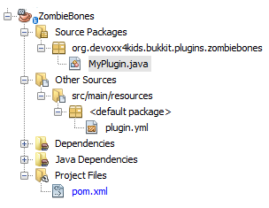
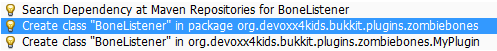
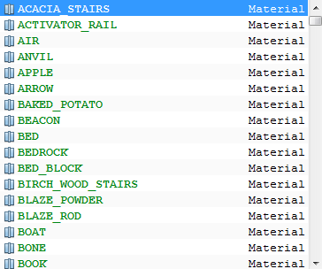
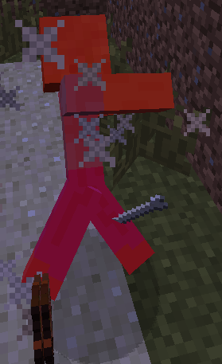
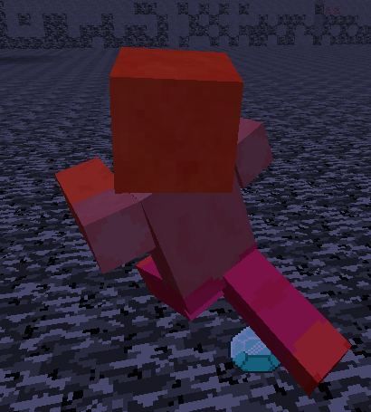

[[Zombies]]
== Zombies Dropping Bones

Normally, in Minecraft, zombies are the most common hostile mob, and they are also probably the most complicated. For example, they can wear armor and hold items/blocks. They also drop a lot of items. Normally, they drop rotten flesh, and sometimes they drop other items like carrots and potatoes. In this chapter, we will make a new plugin that makes them drop bones as well.

=== Create the plugin

As always, our first step is to create the plugin using Bukkit Recipe. The exact steps to use the recipe are explained in earlier chapters. The information that you enter in the plugin creation will be very similar to <<PlayerEntryExit_Plugin_Details_Image>>. <<ZombieBones_plugin_values>> shows the values that needs to be updated.

[[ZombieBones_plugin_values]]
.BlockMoney plugin updated values
[options="header", cols="1,3"]
|====
| Field | Value
| Project Name | ZombieBones
| Package | org.devoxx4kids.bukkit.plugins.zombiebones
|====

Click on `Finish' button to complete the plugin creation and open the project. The expanded directory should look like as shown in <<ZombieBones_Expanded_Directory_Structure>>.

[[ZombieBones_Expanded_Directory_Structure]]
.ZombieBones expanded directory structure

Notice the initial structure of the plugins created so far is quite similar to the plugins created in earlier chapters. This directory has `org.devoxx4kids.bukkit.plugins.zombiebones.MyPlugin` class which is the entry point of the plugin, `plugin.yml` that defines plugin configuration, and `pom.xml` that defines instructions on how to build and install the plugin.

=== Register and create the Listener

Now, the plugin needs a Listener. Like Player Entry/Exit and Block Money, add a line in the `onEnable()` method in `MyPlugin.java` as shown in <<Registering_ZombieBones_Listener>>. It is similar to the listener registration lines in previous plugins. Remember you need to create empty lines by placing your curson before `}` and pressing Enter key and then add the code there.

[[Registering_ZombieBones_Listener]]
.Registering the ZombieBones Listener
====
[source,java]
----
getServer()
  .getPluginManager()
  .registerEvents(new BoneListener(), 
    this);
----
====

This line registers the Listener, just like in previous chapters. Note that the name of the Listener is different, to match the purpose of this plugin.

Click on the stop sign to show the drop-down menu in <<ZombieBones_Listener_Creation>>. Select the option that says `Create class 'BoneListener' in package org.devoxx4kids.bukkit.plugins.zombiebones`.

[[ZombieBones_Listener_Creation]]
.Creating the ZombieBones Listener

NetBeans create a new Java source file, calls it `BoneListener.java`, opens it in the main window and it should look like as in <<ZombieBones_Listener>>.

[[ZombieBones_Listener]]
.ZombieBones Listener
====
[source, java]
----
package org.devoxx4kids.bukkit.plugins.zombiebones;

import org.bukkit.event.Listener;

class BoneListener implements Listener {

    public BoneListener() {
    }

}
----
====

Note that the constructor does not take any parameters here.

=== Add event handlers

A listener needs to have an event handler. Since we are dropping bones when a zombie dies, so we will look for an event when the zombie dies. Instead of throwing a specific event for when zombie dies, Bukkit throws an event when an entity dies. This simplifies to catch one event for all entity deaths and then find out which of the entity has died. We'll catch that event and then perform the needed action, i.e. drop bones instead of rotten flesh. 

Only one method will have to be added and it looks like <<Listener_method_for_ZombieBones>>.

[[Listener_method_for_ZombieBones]]
.Listener method for ZombieBones
====
[source, java]
----
@EventHandler <1>
public void dropBones(EntityDeathEvent e) {
    if (e.getEntityType() != EntityType.ZOMBIE){ <2> 
        return;
    }
    Location location = e.getEntity().getLocation(); <3>
    World world = e.getEntity().getWorld(); <4>
        
    Random random = new Random(); <5>
    int howManyBones = random.nextInt(3); <6>
        
    world.dropItem(location, new ItemStack(Material.BONE, howManyBones)); <7>
}
----
====

This method has some important parts:

<1> As in plugins created so far, `@EventHandler` marks the method `dropBones` as listener. The method is called when an entity dies, an event generated by Minecraft server, and is identified by a Bukkit-defined `EntityDeathEvent` parameter to this method. The parameter `e` provides information about the died entity such as how much EXP should be dropped from this death, or you can even set this value by calling `setDroppedExp` method and giving an integer value.
<2> This class represents an entity death and it could be pig, sheep, horse, or any other entity. Our purpose is to call this method only when this event is thrown for a zombie. This can be verified by comparing if the entity that throws the event is indeed a zombie.
+
Java allows comparison of two values of similar types using `==` and `!=`. The two values need to be same type but the symbols work for different types. For example, two integer values can be compared or two float values can be compared but an integer and a float value cannot be compared with each other.
+ 
`e.getEntityType()` provides type of the entity that caused this event to occur. This value is compared with `EntityType.ZOMBIE` which is a predefined type in the Bukkit API for a zombie in the game. If the entity in said event is not equal to a zombie then the method does not need to perform any other actions. This is achieved by using `return` statement, meaning that this method does not execute any further.
<3> If the entity is indeed a zombie then the method does not stop and continues executing other statements after the `return` statement. The location, or the x, y, and z coordinates of the entity are stored in `location` variable. Note that instead of storing the value of x, y, and z coordinates separately, they are stored in `Location` class. This is another class defined by the Bukkit API.
<4> The world in which the entity resides is stored in `world` variable and defined by Bukkit-defined `World` class.
<5> Lets make this method somewhat more interesting by dropping a random number of bones. This can be achieved by using `Random` class from Java. A new instance of the class can be created using `new Random();`. 
<6> A random number is always generated higher than 0 but an upper limit of 3 can be specified by passing that value in the parentheses after `nextInt`. This number is used to determine how many bones should be dropped, and so the variable is aptly named `howManyBones`.
<7> The bones are then dropped at zombie's location by calling `dropItem` method and specifyig the previously stored locations and creating a stack of bones using Bukkit-defined `ItemStack` class.

[NOTE]
====
You can remove the part that says `BONE` and press `Ctrl + SPACE` to show you a list of all the blocks/items the zombie can drop. Scroll through the list until you find the one that you want. Some of the names will be confusing (for example, diamond horse armor is called DIAMOND_BARDING). <<Control_Space_Item_List>> shows what the list of items looks like. You can also do the same thing for the part that says `ZOMBIE` if you want a different mob to drop bones.
====

[[Control_Space_Item_List]]
.List of items from Ctrl + SPACE

Lastly, zombies do rare drops of potato, carrot, and ingot iron. A rare drop usually drops about 2.5% of the time. We will update our method so that zombies drop diamonds 2.5% of the time.

To add the rare drop, the code in <<ZombieBones_Listener_Rare_Drop>> must be added to `dropBones` event handler. Place your cursor at the end of the line `world.dropItem(location, new ItemStack(Material.BONE, howManyBones));` and press Enter key to make some space to add code. Type or copy the code from <<Listener_method_for_ZombieBones>> in this newly created space.

[[ZombieBones_Listener_Rare_Drop]]
.Rare drops Listener method for ZombieBones
====
[source, java]
----
if(random.nextInt(200) < 5){ <1>
    world.dropItem(location, new ItemStack(Material.DIAMOND, 1));
}
----
====

As earlier, `random.nextInt(200)` will generate a random number between 0 and 200. `<` is a predefined Java symbol to compare two integers and returns true if the number on the left hand side is less than the number on the right hand side. In our case, the ``if'' statement checks if the random number is less than 5. If so then a diamond is dropped. 5 out of 200 makes it 2.5% of the times the diamon is dropped.

Just like `<`, `>` returns true if the left hand side is greater than the right side. Together `<` and `>` are part of a group called _equality operators_.

This is all you need to add to make diamonds a rare drop of zombies. Feel free to change diamonn to some other material or change the percentage of time the rare drop is dropped.

The finished Listener should look like <<Finished_ZombieBones_Listener>>.

[[Finished_ZombieBones_Listener]]
.Finished ZombieBones Listener
====
[source, java]
----
package org.devoxx4kids.bukkit.plugins.zombiebones;

import java.util.Random;
import org.bukkit.Location;
import org.bukkit.Material;
import org.bukkit.World;
import org.bukkit.entity.EntityType;
import org.bukkit.event.EventHandler;
import org.bukkit.event.Listener;
import org.bukkit.event.entity.EntityDeathEvent;
import org.bukkit.inventory.ItemStack;

class BoneListener implements Listener {

    public BoneListener() {
    }

    @EventHandler
    public void dropBones(EntityDeathEvent e) {
        if(e.getEntityType() != EntityType.ZOMBIE){
            return;
        }
        Location location = e.getEntity().getLocation();
        World world = e.getEntity().getWorld();
        
        Random random = new Random();
        int i = random.nextInt(3);
        
        world.dropItem(location, new ItemStack(Material.BONE, i));
        if(random.nextInt(200) < 5){
            world.dropItem(location, new ItemStack(Material.DIAMOND, 1));
        }
    }
}

----
====

Wow, that's a lot of code! Feel free to take some time and reread the sections if any portion is not clear.

=== Install and verify

Like the other plugins, you will have to build the plugin by clicking on `Build' menu item before it can be used. If it successfully builds, it should output the message in <<Building_ZombieBones>>.

[[Building_ZombieBones]]
.Building the ZombieBones plugin
====
[source, text]
....
[antrun:run]
Executing tasks
     [copy] Copying 1 file to C:\Users\Aditya\Desktop\craftbukkit\plugins
Executed tasks
------------------------------------------------------------------------
BUILD SUCCESS
------------------------------------------------------------------------
....
====

Now, whenever you see a zombie and need some bones, you can kill it and get some! <<Zombie_Dropping_Bones>> shows a red-colored zombie dead on the floor. The white thing in the middle of the image is a bone that was dropped by the zombie.

[[Zombie_Dropping_Bones]]
.Zombie dropping a bone

NOTE: Sometimes, the zombie will drop ``ghost items'', which are items that cannot be picked up. If all of the dropped items are ghost items, you will just have to spawn and kill another zombie.

<<Zombie_Dropping_Diamonds>> shows a zombie dropping diamonds as its rare drop.

[[Zombie_Dropping_Diamonds]]
.Zombie dropping a diamond

=== Summary

In this chapter, we explored example of another Event Handler. `EntityDeathEvent` was used to make zombies drop bones instead of rotten flesh. We also learned some basic Java concepts such as stopping sequential execution of a method using return, random number generation, and comparing two values for less than or greater than using equality operators.

In the next chapter, you will see more examples of Listeners by making a plugin that enlarges TNT explosions.
